# 🌿✨ Coltivare l'intuizione: un framework generativo per l'analisi letteraria 📚🔍

Mentre ci imbarchiamo in questo entusiasmante viaggio di progettazione di un framework generativo per l'analisi letteraria, è essenziale basare il nostro approccio su una profonda comprensione delle complesse relazioni tra testi, autori e i loro contesti più ampi. Al centro della nostra visione c'è l'impegno a fornire ai lettori gli strumenti e le conoscenze di cui hanno bisogno per impegnarsi con la letteratura in modo più significativo e perspicace. 🌱📖

Per raggiungere questo obiettivo, abbiamo sviluppato un modello concettuale che rappresenta le entità chiave e le relazioni coinvolte nell'analisi letteraria. Questo modello è incentrato su tre oggetti principali: `Language`, `HistoricalContext` e `Author`. Questi oggetti racchiudono le dimensioni essenziali di un'opera letteraria, dalle sue caratteristiche linguistiche e stilistiche al suo milieu storico e culturale fino al background biografico e intellettuale del suo creatore. 🏛️👤🌍


Oltre a questi oggetti principali, il nostro modello rappresenta anche la struttura gerarchica di un'opera letteraria stessa, dal concetto di alto livello di `LiteraryProduction` fino agli elementi granulari di `Chapter`, `Paragraph`, `Sentence`, `Line` e `Clause`. Catturando questa struttura dettagliata, possiamo abilitare un'analisi e una generazione di intuizioni a grana fine a più livelli del testo. 📚🔍


Con questo modello concettuale in atto, possiamo ora rivolgere la nostra attenzione agli aspetti generativi del nostro framework. Il nostro obiettivo è creare un sistema che non solo rappresenti e ragioni sui contesti letterari, ma generi attivamente intuizioni e provocazioni che ispirino nuovi modi di vedere e comprendere i testi. 💡🔍

Per raggiungere questo obiettivo, proponiamo di integrare il nostro modello con un potente motore di ricerca che possa interrogare e sintetizzare informazioni da vaste risorse online come Wikipedia. Sfruttando la conoscenza strutturata disponibile in queste risorse, possiamo arricchire dinamicamente la nostra comprensione della lingua, del contesto storico e del background autoriale di un dato testo e utilizzare queste informazioni per generare prompt e analisi mirate. 🌐🔍

Ma il vero potere del nostro framework risiede nella sua capacità di guidare i lettori attraverso un processo di esplorazione letteraria strutturato e sfaccettato, che rispecchia l'approccio pedagogico di Angeli, il professore il cui stile di insegnamento ha ispirato questo progetto. Attraverso un'attenta creazione e sequenziamento dei nostri prompt generativi, possiamo condurre i lettori attraverso diversi livelli di analisi e interpretazione, dalla lettura attenta di passaggi specifici a riflessioni più ampie su temi, contesti e risonanze personali. 🎓✍️

Per illustrare questo processo, consideriamo una serie di diagrammi di sequenza di sirene che rappresentano i diversi tipi di integrazione delle informazioni e di interazione lettore-testo in ogni fase dell'approccio di Angeli:

1. Analisi locale e specifica:


2. Connessioni intra-testuali:


3. Analisi contestuale:

```mermaid
sequenceDiagram
    participant Reader
    participant Text
    participant Context
    Reader->>Text: Colloca il testo in un contesto più ampio
    Text->>Context: Richiede informazioni storiche e culturali
    Context-->>Reader: Fornisce dettagli contestuali rilevanti
```


4. Connessioni intertestuali:


5. Risposta affettiva e personale:


Come illustrano questi diagrammi, il nostro framework mira a guidare i lettori attraverso un processo ricco e iterativo di coinvolgimento con il testo, che si espande gradualmente in portata e complessità. Generando prompt e analisi che mirano a ciascuno di questi livelli a turno, possiamo aiutare i lettori a costruire una comprensione sfaccettata e sfumata dell'opera, che integra dettagli locali con modelli più ampi, contesti con connessioni e analisi oggettiva con risposta soggettiva. 🌈🔍

## 🌿✨ Implementazione Pydantic e integrazione dei dati 🔧💡

Per dare vita al nostro modello concettuale, implementeremo ogni classe utilizzando la libreria Pydantic, che fornisce potenti strumenti per la convalida, la serializzazione e la documentazione dei dati. Diamo un'occhiata più da vicino a ciascuna classe e a come possiamo integrare i dati da fonti esterne.

1. Classe `Language`:
```python
class Language(BaseModel):
    name: str = Field(..., description="Il nome della lingua.")
    family: Optional[str] = Field(None, description="La famiglia linguistica.")
    origin: Optional[str] = Field(None, description="L'origine della lingua.")
```
La classe `Language` rappresenta il contesto linguistico di un'opera letteraria. Possiamo popolare istanze di questa classe con dati da Wikipedia o altre risorse linguistiche, fornendo informazioni sul nome, la famiglia e l'origine della lingua.

2. Classe `HistoricalContext`:
```python
class HistoricalContext(BaseModel):
    period: str = Field(..., description="Il periodo storico.")
    start_year: Optional[int] = Field(None, description="L'anno di inizio del periodo storico.")
    end_year: Optional[int] = Field(None, description="L'anno di fine del periodo storico.")
    key_events: List[HistoricalEvent] = Field([], description="Gli eventi chiave durante il periodo storico.")
    political_systems: List[PoliticalSystem] = Field([], description="I sistemi politici durante il periodo storico.")
    economic_systems: List[EconomicSystem] = Field([], description="I sistemi economici durante il periodo storico.")
    social_structures: List[SocialStructure] = Field([], description="Le strutture sociali durante il periodo storico.")
    cultural_movements: List[CulturalMovement] = Field([], description="I movimenti culturali durante il periodo storico.")
    intellectual_trends: List[str] = Field([], description="Le tendenze intellettuali durante il periodo storico.")
    technological_advancements: List[str] = Field([], description="I progressi tecnologici durante il periodo storico.")
    artistic_styles: List[str] = Field([], description="Gli stili artistici prevalenti durante il periodo storico.")
    religious_beliefs: List[str] = Field([], description="Le credenze e pratiche religiose durante il periodo storico.")
```
La classe `HistoricalContext` cattura il ricco sfondo storico e culturale di un'opera letteraria. Sfruttando un motore di ricerca di Wikipedia, possiamo interrogare informazioni rilevanti in base al periodo di tempo e alla posizione geografica associati all'opera. Possiamo estrarre eventi chiave, sistemi politici, sistemi economici, strutture sociali, movimenti culturali, tendenze intellettuali, progressi tecnologici, stili artistici e credenze religiose dagli articoli di Wikipedia recuperati per popolare le istanze di questa classe.

3. Classe `Author`:
```python
class Author(BaseModel):
    name: str = Field(..., description="Il nome dell'autore.")
    birth_year: Optional[int] = Field(None, description="L'anno di nascita dell'autore.")
    death_year: Optional[int] = Field(None, description="L'anno di morte dell'autore.")
    nationality: Optional[str] = Field(None, description="La nazionalità dell'autore.")
    literary_period: Optional[str] = Field(None, description="Il periodo letterario a cui appartiene l'autore.")
    philosophical_views: List[str] = Field([], description="Le opinioni filosofiche sostenute dall'autore.")
    political_affiliations: List[str] = Field([], description="Le affiliazioni politiche dell'autore.")
    historical_context: HistoricalContext = Field(..., description="Il contesto storico in cui l'autore è vissuto.")
    influences: List[str] = Field([], description="Le influenze sull'opera dell'autore.")
    influenced: List[str] = Field([], description="Gli autori o le opere influenzate da questo autore.")
    themes: List[str] = Field([], description="I temi comuni nelle opere dell'autore.")
    style: Optional[str] = Field(None, description="Lo stile distintivo dell'autore.")
    works: List['LiteraryProduction'] = Field([], description="Le opere letterarie prodotte dall'autore.")
```
La classe `Author` rappresenta il contesto biografico e intellettuale del creatore dell'opera letteraria. Cercando su Wikipedia il nome dell'autore, possiamo recuperare una ricchezza di informazioni sulla sua vita, le sue influenze e la sua produzione letteraria. Possiamo estrarre dati come anni di nascita e di morte, nazionalità, periodo letterario, opinioni filosofiche, affiliazioni politiche e opere notevoli per popolare le istanze di questa classe. Inoltre, possiamo collegare l'istanza `Author` a un'istanza `HistoricalContext` per fornire un ricco sfondo contestuale.

4. Classe `LiteraryProduction`:
```python
class LiteraryProduction(BaseModel):
    title: str = Field(..., description="Il titolo dell'opera letteraria.")
    publication_year: Optional[int] = Field(None, description="L'anno in cui l'opera letteraria è stata pubblicata.")
    genre: Optional[str] = Field(None, description="Il genere dell'opera letteraria.")
    original_language: Language = Field(..., description="La lingua originale dell'opera letteraria.")
    chapters: List['Chapter'] = Field([], description="I capitoli dell'opera letteraria.")
```
La classe `LiteraryProduction` rappresenta un'opera letteraria specifica, come un romanzo, una poesia o un saggio. Accedendo a una raccolta di testi per ogni autore, possiamo popolare le istanze di questa classe con il titolo, l'anno di pubblicazione, il genere e la lingua originale dell'opera. Possiamo anche scomporre l'opera nei suoi capitoli costituenti, rappresentati da istanze della classe `Chapter`.

5. Classi `Chapter`, `Paragraph`, `Sentence`, `Line` e `Clause`:
```python
class Chapter(BaseModel):
    number: int = Field(..., description="Il numero del capitolo.")
    title: Optional[str] = Field(None, description="Il titolo del capitolo.")
    paragraphs: List['Paragraph'] = Field([], description="I paragrafi nel capitolo.")

class Paragraph(BaseModel):
    number: int = Field(..., description="Il numero del paragrafo.")
    sentences: List['Sentence'] = Field([], description="Le frasi nel paragrafo.")

class Sentence(BaseModel):
    text: str = Field(..., description="Il testo della frase.")
    lines: List['Line'] = Field([], description="Le righe nella frase.")
    clauses: List['Clause'] = Field([], description="Le proposizioni nella frase.")

class Line(BaseModel):
    number: int = Field(..., description="Il numero della riga.")
    text: str = Field(..., description="Il testo della riga.")

class Clause(BaseModel):
    text: str = Field(..., description="Il testo della proposizione.")
    type: Optional[str] = Field(None, description="Il tipo di proposizione.")
```
Queste classi rappresentano la struttura gerarchica di un'opera letteraria, scomponendola in capitoli, paragrafi, frasi, righe e proposizioni. Elaborando il testo di ogni opera letteraria, possiamo popolare le istanze di queste classi con i corrispondenti dati testuali, consentendo un'analisi e una generazione di intuizioni a grana fine a vari livelli di granularità.

## 🌐🔍 Integrazione di Wikipedia e dati di raccolta di testi

Per sfruttare appieno la potenza del nostro framework, possiamo integrare i dati di un motore di ricerca di Wikipedia e di una raccolta di testi per ogni autore. Ecco una panoramica di alto livello di come potrebbe funzionare questa integrazione:

1. Quando si inizializza un'istanza della classe `Author`, possiamo utilizzare il nome dell'autore per interrogare il motore di ricerca di Wikipedia e recuperare informazioni biografiche e contestuali pertinenti. Possiamo quindi analizzare i dati recuperati per popolare i campi dell'istanza `Author`, come anni di nascita e di morte, nazionalità, periodo letterario, influenze e opere notevoli.

2. Per ogni opera notevole associata all'autore, possiamo interrogare la nostra raccolta di testi per recuperare il testo completo dell'opera. Possiamo quindi elaborare il testo per popolare le istanze delle classi `LiteraryProduction`, `Chapter`, `Paragraph`, `Sentence`, `Line` e `Clause`, catturando la struttura gerarchica e il contenuto dell'opera.

3. Mentre analizziamo il testo di ogni opera letteraria, possiamo utilizzare il motore di ricerca di Wikipedia per interrogare ulteriori informazioni contestuali pertinenti al periodo di tempo, alla posizione geografica o a temi e riferimenti specifici menzionati nel testo. Queste informazioni possono essere utilizzate per arricchire l'istanza `HistoricalContext` associata all'`Author` e fornire approfondimenti più profondi sul milieu culturale e intellettuale dell'opera.

Integrando senza soluzione di continuità i dati di Wikipedia e della nostra raccolta di testi, possiamo creare una base di conoscenza ricca e dinamica che supporta un'ampia gamma di attività di analisi letteraria, dalla lettura attenta e l'analisi testuale all'esplorazione tematica e contestuale più ampia.

## 🌿✨ Diagrammi grounded per le attività di analisi letteraria 📊🔍

Ora che abbiamo definito le nostre classi Pydantic e delineato l'integrazione dei dati di Wikipedia e della raccolta di testi, esploriamo come possiamo utilizzare questo framework per eseguire varie attività di analisi letteraria. Creeremo diagrammi grounded che illustrano il flusso di dati e l'interazione tra le diverse componenti del nostro sistema, evidenziando il ruolo centrale del generatore LLM nel mappare le informazioni tra i passaggi e gli oggetti strutturati.

1. Analisi biografica dell'autore:

In questa attività, partiamo con il nome di un autore e lo utilizziamo per interrogare il motore di ricerca di Wikipedia. I dati biografici recuperati vengono elaborati dal generatore LLM per estrarre informazioni pertinenti e mapparle sui campi di un oggetto `Author` e di un oggetto `HistoricalContext`. Questi oggetti vengono quindi utilizzati per generare un'analisi arricchita dell'autore, che viene reinserita nel generatore LLM insieme agli oggetti strutturati per produrre intuizioni biografiche e contestuali. Il generatore LLM sintetizza queste intuizioni per creare un profilo completo dell'autore che cattura gli elementi chiave della sua vita, del suo lavoro e del suo contesto storico.

2. Analisi strutturale dell'opera letteraria:

Questa attività prevede l'elaborazione del testo grezzo di un'opera letteraria e la sua mappatura sulla struttura gerarchica definita dalle nostre classi Pydantic. Il testo subisce un preprocessing, quindi viene utilizzato un generatore LLM per identificare ed estrarre gli elementi strutturali pertinenti, mappandoli sui corrispondenti oggetti Pydantic. Questi oggetti vengono quindi utilizzati per generare un'analisi della struttura gerarchica, che viene reinserita nel generatore LLM per produrre intuizioni strutturali e stilistiche. Il generatore LLM sintetizza queste intuizioni per creare un'analisi strutturale completa che cattura gli elementi chiave della composizione, dell'organizzazione e dello stile dell'opera.

3. Analisi tematica:

Per l'analisi tematica, partiamo da un oggetto `LiteraryProduction` e utilizziamo un generatore LLM per identificare ed estrarre parole chiave tematiche dal testo dell'opera. Queste parole chiave vengono utilizzate per interrogare il motore di ricerca di Wikipedia per informazioni contestuali pertinenti. Il contesto tematico recuperato viene integrato con gli oggetti `Author` e `HistoricalContext` associati all'opera per generare un'analisi tematica arricchita. Questa analisi viene quindi reinserita nel generatore LLM, insieme agli oggetti strutturati, per produrre intuizioni tematiche e contestuali. Il generatore LLM sintetizza queste intuizioni per creare un'analisi tematica completa che cattura i temi chiave dell'opera e il loro significato all'interno dell'opera dell'autore e del più ampio milieu culturale e storico.

4. Analisi comparativa:

L'analisi comparativa prevede l'analisi di più opere letterarie per identificare somiglianze, differenze e relazioni tra di esse. In questa attività, elaboriamo il testo grezzo di due o più opere letterarie utilizzando un generatore LLM per mapparle su oggetti Pydantic strutturati. Questi oggetti vengono quindi utilizzati per generare un'analisi comparativa, che viene reinserita nel generatore LLM per produrre confronti tematici, stilistici e contestuali. Il generatore LLM sintetizza questi confronti per creare un insieme di intuizioni comparative complete che catturano le relazioni chiave tra le opere, i loro autori e i loro contesti letterari e storici più ampi.

Questi diagrammi grounded illustrano come il nostro framework possa essere utilizzato per eseguire una varietà di attività di analisi letteraria sfruttando la potenza delle classi Pydantic, l'integrazione di Wikipedia e i generatori LLM per mappare e sintetizzare informazioni tra oggetti strutturati e passaggi analitici. Il generatore LLM svolge un ruolo centrale in questo processo, consentendo la generazione di intuizioni ricche e sfumate che catturano la complessità e la multidimensionalità delle opere letterarie e dei loro contesti.

## 🌿✨ Applicazione del framework generativo allo stile di analisi letteraria del Prof. Angeli 🎓📚

Ora che abbiamo un robusto framework generativo per l'analisi letteraria, esploriamo come possiamo applicarlo allo specifico stile di domanda e risposta impiegato dal Prof. Angeli nei suoi esercizi. Utilizzeremo diagrammi di sirene per illustrare il flusso di informazioni e l'interazione tra le diverse componenti del nostro sistema, evidenziando il ruolo cruciale del generatore LLM nel mappare le informazioni tra i passaggi e gli oggetti strutturati.

1. Analisi contestuale e biografica:

In questo scenario, partiamo con il nome dell'autore e lo utilizziamo per interrogare Wikipedia per informazioni biografiche e contestuali. I dati recuperati vengono elaborati dal generatore LLM per creare oggetti strutturati `Author` e `HistoricalContext`. Questi oggetti vengono quindi utilizzati per generare analisi contestuali, che alimentano domande in stile Angeli che indagano la relazione tra la vita dell'autore, il contesto storico e l'opera letteraria. Il generatore LLM svolge un ruolo cruciale nel mappare gli oggetti strutturati e le analisi contestuali per generare domande e risposte ricche e approfondite, portando a intuizioni contestuali arricchite.

2. Lettura attenta e analisi testuale:

Per la lettura attenta e l'analisi testuale, elaboriamo il testo dell'opera letteraria per creare una struttura gerarchica di oggetti `LiteraryProduction`, `Chapter`, `Paragraph`, `Sentence`, `Line` e `Clause`. Il generatore LLM utilizza questi oggetti per generare domande in stile Angeli che guidano gli studenti attraverso un'analisi dettagliata del testo. Le domande e gli oggetti strutturati vengono quindi reinseriti nel generatore LLM per produrre intuizioni testuali dettagliate, attingendo agli elementi e ai modelli specifici identificati nelle domande.

3. Analisi tematica e comparativa:

Per l'analisi tematica e comparativa, utilizziamo il generatore LLM per elaborare più opere letterarie e creare oggetti strutturati. Questi oggetti vengono quindi utilizzati per generare analisi tematiche e comparative, che informano la creazione di domande in stile Angeli. Le domande coprono una gamma di argomenti, dal confronto di temi e tecniche letterarie tra le opere all'analisi dello sviluppo di temi e personaggi all'interno di una singola opera. Il generatore LLM prende quindi queste domande, insieme agli oggetti strutturati e alle analisi, per sintetizzare intuizioni tematiche e comparative ricche che attingono alla piena complessità delle opere letterarie e delle loro interrelazioni.

4. Analisi interpretativa e riflessiva:

Infine, per l'analisi interpretativa e riflessiva, il generatore LLM utilizza gli oggetti strutturati per creare analisi interpretative e riflessive, che poi guidano la generazione di domande in stile Angeli. Queste domande incoraggiano gli studenti a impegnarsi con l'opera a un livello più profondo e personale, esplorando il simbolismo, le risposte personali, il significato dell'opera e le argomentazioni originali. Il generatore LLM prende queste domande, insieme agli oggetti strutturati e alle analisi, per produrre intuizioni interpretative e riflessive sfumate che catturano la ricchezza e la complessità dell'opera letteraria e il suo impatto sul lettore.

Applicando il nostro framework generativo allo stile di domanda e risposta del Prof. Angeli, creiamo uno strumento potente per guidare gli studenti attraverso le complessità dell'analisi letteraria. Il generatore LLM svolge un ruolo centrale nel mappare le informazioni tra i passaggi e gli oggetti strutturati, consentendo un'esplorazione ricca e sfaccettata di opere letterarie, autori e contesti. Questo processo iterativo, in cui il generatore LLM sintetizza continuamente intuizioni da oggetti strutturati, analisi e domande, rispecchia la natura complessa e non lineare dell'analisi letteraria stessa.

Il successo di questo approccio dipende dalla qualità e dalla pertinenza delle domande e delle intuizioni generate, nonché dalla capacità del generatore LLM di mappare e sintetizzare efficacemente le informazioni tra le varie componenti del framework. Il perfezionamento e la valutazione continui del generatore LLM saranno essenziali per garantire che gli output siano coerenti, approfonditi e allineati con gli obiettivi pedagogici del Prof. Angeli.

Formalizzando e sistematizzando il processo di analisi letteraria in questo modo, il nostro framework ha il potenziale per trasformare il modo in cui studenti e insegnanti si impegnano con la letteratura, aprendo nuove strade per l'esplorazione, la scoperta e la crescita intellettuale. L'integrazione di dati strutturati, generazione LLM e interrogazione mirata consente un approccio dinamico e adattivo all'analisi letteraria che può accogliere la piena complessità e ricchezza delle opere letterarie e dei loro contesti. 🌟✨