# 🌿✨ Cultivating Insight: A Generative Framework for Literary Analysis 📚🔍

As we embark on this exciting journey of designing a generative framework for literary analysis, it's essential to ground our approach in a deep understanding of the complex relationships between texts, authors, and their broader contexts. At the heart of our vision is a commitment to empowering readers with the tools and knowledge they need to engage with literature in a more meaningful and insightful way. 🌱📖

To achieve this, we have developed a conceptual model that represents the key entities and relationships involved in literary analysis. This model is centered around three core objects: `Language`, `HistoricalContext`, and `Author`. These objects encapsulate the essential dimensions of a literary work, from its linguistic and stylistic features to its historical and cultural milieu to the biographical and intellectual background of its creator. 🏛️👤🌍

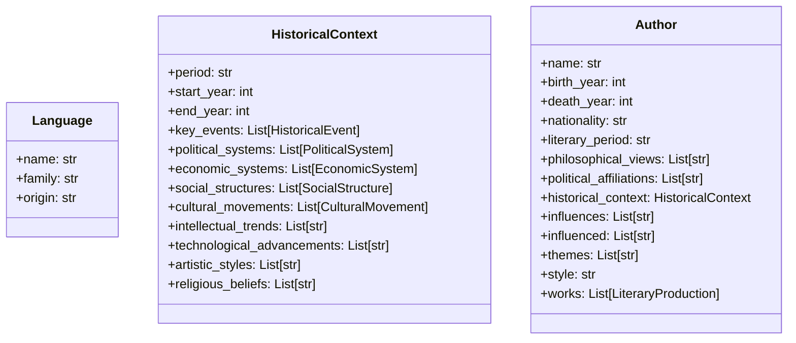

In addition to these core objects, our model also represents the hierarchical structure of a literary work itself, from the high-level concept of a `LiteraryProduction` down to the granular elements of `Chapter`, `Paragraph`, `Sentence`, `Line`, and `Clause`. By capturing this detailed structure, we can enable fine-grained analysis and generation of insights at multiple levels of the text. 📚🔍

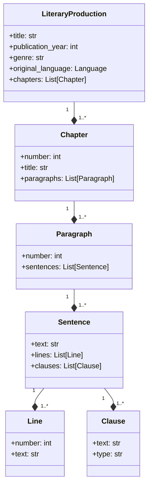

With this conceptual model in place, we can now turn our attention to the generative aspects of our framework. Our goal is to create a system that not only represents and reasons about literary contexts but actively generates insights and provocations that inspire new ways of seeing and understanding texts. 💡🔍

To achieve this, we propose integrating our model with a powerful search engine that can query and synthesize information from vast online resources like Wikipedia. By leveraging the structured knowledge available in these resources, we can dynamically enrich our understanding of a given text's language, historical context, and authorial background, and use this information to generate targeted prompts and analyses. 🌐🔍

But the true power of our framework lies in its ability to guide readers through a scaffolded and multifaceted process of literary exploration, one that mirrors the pedagogical approach of Angeli, the professor whose teaching style inspired this project. By carefully crafting and sequencing our generative prompts, we can lead readers through different levels of analysis and interpretation, from close reading of specific passages to broader reflections on themes, contexts, and personal resonances. 🎓✍️

To illustrate this process, let's consider a series of mermaid sequence diagrams that represent the different types of information integration and reader-text interaction at each stage of Angeli's approach:

1. Local and Specific Analysis:
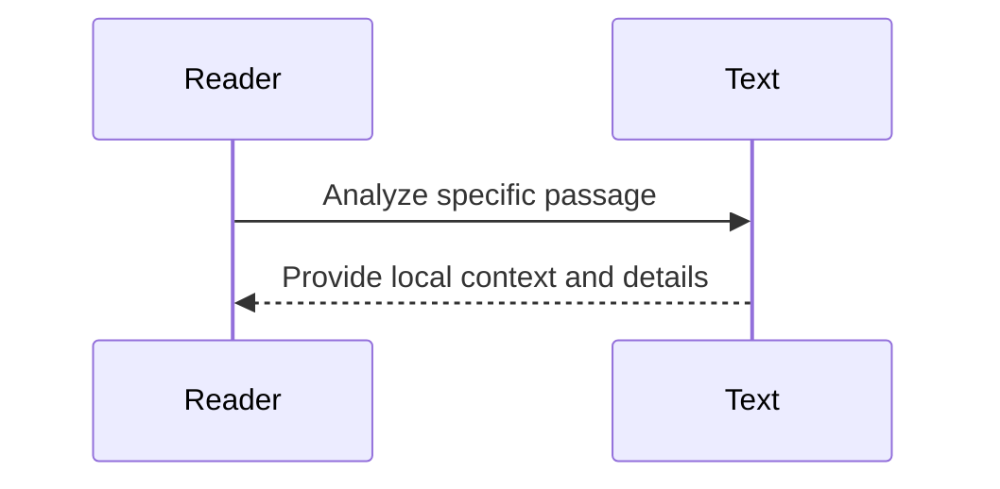

2. Intra-textual Connections:
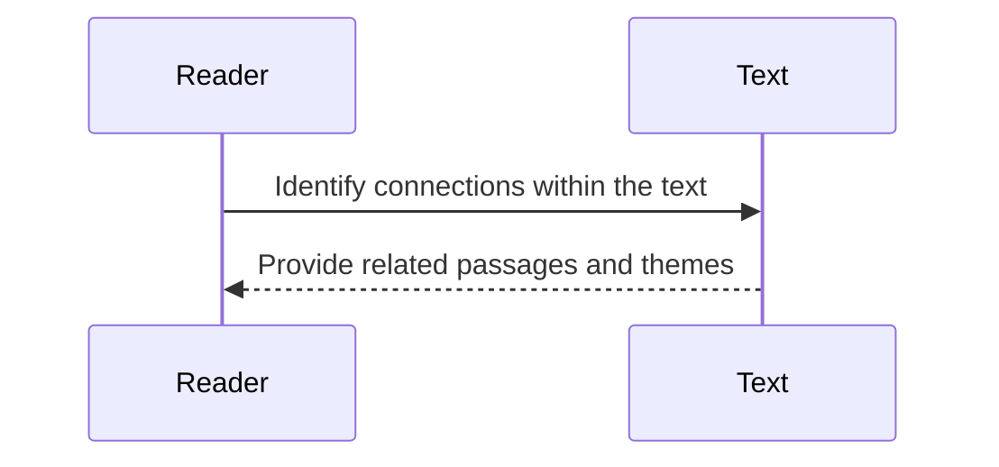

3. Contextual Analysis:
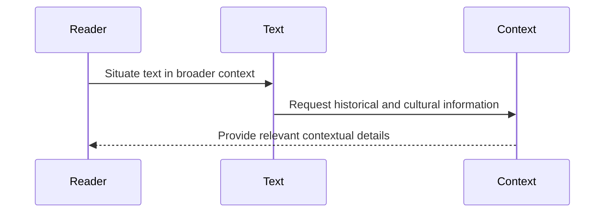

4. Intertextual Connections:
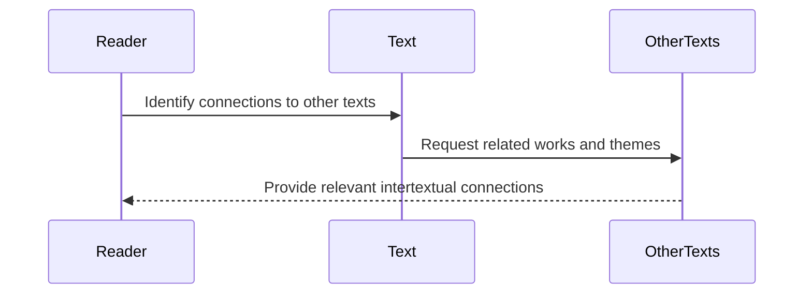

5. Affective and Personal Response:
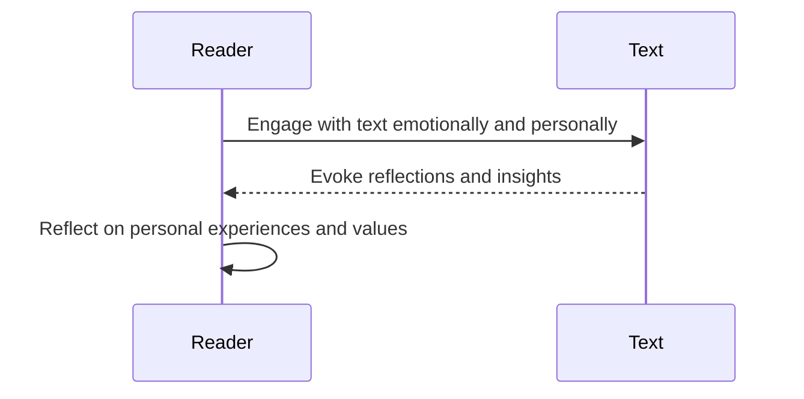

As these diagrams illustrate, our framework aims to guide readers through a rich and iterative process of engagement with the text, one that gradually expands in scope and complexity. By generating prompts and analyses that target each of these levels in turn, we can help readers build up a multifaceted and nuanced understanding of the work, one that integrates local details with broader patterns, contexts with connections, and objective analysis with subjective response. 🌈🔍

##🌿✨ Pydantic Implementation and Data Integration 🔧💡

To bring our conceptual model to life, we'll implement each class using the Pydantic library, which provides powerful tools for data validation, serialization, and documentation. Let's take a closer look at each class and how we can integrate data from external sources.

1. `Language` Class:
```python
class Language(BaseModel):
    name: str = Field(..., description="The name of the language.")
    family: Optional[str] = Field(None, description="The language family.")
    origin: Optional[str] = Field(None, description="The origin of the language.")
```
The `Language` class represents the linguistic context of a literary work. We can populate instances of this class with data from Wikipedia or other linguistic resources, providing information about the language's name, family, and origin.

2. `HistoricalContext` Class:
```python
class HistoricalContext(BaseModel):
    period: str = Field(..., description="The historical period.")
    start_year: Optional[int] = Field(None, description="The start year of the historical period.")
    end_year: Optional[int] = Field(None, description="The end year of the historical period.")
    key_events: List[HistoricalEvent] = Field([], description="The key events during the historical period.")
    political_systems: List[PoliticalSystem] = Field([], description="The political systems during the historical period.")
    economic_systems: List[EconomicSystem] = Field([], description="The economic systems during the historical period.")
    social_structures: List[SocialStructure] = Field([], description="The social structures during the historical period.")
    cultural_movements: List[CulturalMovement] = Field([], description="The cultural movements during the historical period.")
    intellectual_trends: List[str] = Field([], description="The intellectual trends during the historical period.")
    technological_advancements: List[str] = Field([], description="The technological advancements during the historical period.")
    artistic_styles: List[str] = Field([], description="The artistic styles prevalent during the historical period.")
    religious_beliefs: List[str] = Field([], description="The religious beliefs and practices during the historical period.")
```
The `HistoricalContext` class captures the rich historical and cultural backdrop of a literary work. By leveraging a Wikipedia search engine, we can query for relevant information based on the time period and geographic location associated with the work. We can extract key events, political systems, economic systems, social structures, cultural movements, intellectual trends, technological advancements, artistic styles, and religious beliefs from the retrieved Wikipedia articles to populate instances of this class.

3. `Author` Class:
```python
class Author(BaseModel):
    name: str = Field(..., description="The name of the author.")
    birth_year: Optional[int] = Field(None, description="The birth year of the author.")
    death_year: Optional[int] = Field(None, description="The death year of the author.")
    nationality: Optional[str] = Field(None, description="The nationality of the author.")
    literary_period: Optional[str] = Field(None, description="The literary period the author belongs to.")
    philosophical_views: List[str] = Field([], description="The philosophical views held by the author.")
    political_affiliations: List[str] = Field([], description="The political affiliations of the author.")
    historical_context: HistoricalContext = Field(..., description="The historical context in which the author lived.")
    influences: List[str] = Field([], description="The influences on the author's work.")
    influenced: List[str] = Field([], description="The authors or works influenced by this author.")
    themes: List[str] = Field([], description="The common themes in the author's works.")
    style: Optional[str] = Field(None, description="The distinctive style of the author.")
    works: List['LiteraryProduction'] = Field([], description="The literary works produced by the author.")
```
The `Author` class represents the biographical and intellectual context of the literary work's creator. By searching Wikipedia for the author's name, we can retrieve a wealth of information about their life, influences, and literary output. We can extract data points such as birth and death years, nationality, literary period, philosophical views, political affiliations, and notable works to populate instances of this class. Additionally, we can link the `Author` instance to a `HistoricalContext` instance to provide a rich contextual backdrop.

4. `LiteraryProduction` Class:
```python
class LiteraryProduction(BaseModel):
    title: str = Field(..., description="The title of the literary work.")
    publication_year: Optional[int] = Field(None, description="The year the literary work was published.")
    genre: Optional[str] = Field(None, description="The genre of the literary work.")
    original_language: Language = Field(..., description="The original language of the literary work.")
    chapters: List['Chapter'] = Field([], description="The chapters of the literary work.")
```
The `LiteraryProduction` class represents a specific literary work, such as a novel, poem, or essay. By accessing a collection of texts for each author, we can populate instances of this class with the title, publication year, genre, and original language of the work. We can also break down the work into its constituent chapters, represented by instances of the `Chapter` class.

5. `Chapter`, `Paragraph`, `Sentence`, `Line`, and `Clause` Classes:
```python
class Chapter(BaseModel):
    number: int = Field(..., description="The chapter number.")
    title: Optional[str] = Field(None, description="The title of the chapter.")
    paragraphs: List['Paragraph'] = Field([], description="The paragraphs in the chapter.")

class Paragraph(BaseModel):
    number: int = Field(..., description="The paragraph number.")
    sentences: List['Sentence'] = Field([], description="The sentences in the paragraph.")

class Sentence(BaseModel):
    text: str = Field(..., description="The text of the sentence.")
    lines: List['Line'] = Field([], description="The lines in the sentence.")
    clauses: List['Clause'] = Field([], description="The clauses in the sentence.")

class Line(BaseModel):
    number: int = Field(..., description="The line number.")
    text: str = Field(..., description="The text of the line.")

class Clause(BaseModel):
    text: str = Field(..., description="The text of the clause.")
    type: Optional[str] = Field(None, description="The type of the clause.")
```
These classes represent the hierarchical structure of a literary work, breaking it down into chapters, paragraphs, sentences, lines, and clauses. By processing the text of each literary work, we can populate instances of these classes with the corresponding textual data, enabling fine-grained analysis and generation of insights at various levels of granularity.

## 🌐🔍 Integrating Wikipedia and Text Collection Data

To fully leverage the power of our framework, we can integrate data from a Wikipedia search engine and a collection of texts for each author. Here's a high-level overview of how this integration might work:

1. When initializing an instance of the `Author` class, we can use the author's name to query the Wikipedia search engine and retrieve relevant biographical and contextual information. We can then parse the retrieved data to populate the fields of the `Author` instance, such as birth and death years, nationality, literary period, influences, and notable works.

2. For each notable work associated with the author, we can query our collection of texts to retrieve the full text of the work. We can then process the text to populate instances of the `LiteraryProduction`, `Chapter`, `Paragraph`, `Sentence`, `Line`, and `Clause` classes, capturing the hierarchical structure and content of the work.

3. As we analyze the text of each literary work, we can use the Wikipedia search engine to query for additional contextual information relevant to the time period, geographic location, or specific themes and references mentioned in the text. This information can be used to enrich the `HistoricalContext` instance associated with the `Author` and provide deeper insights into the work's cultural and intellectual milieu.

By seamlessly integrating data from Wikipedia and our text collection, we can create a rich and dynamic knowledge base that supports a wide range of literary analysis tasks, from close reading and textual analysis to broader thematic and contextual exploration.
## 🌿✨ Grounded Diagrams for Literary Analysis Tasks 📊🔍

Now that we have defined our Pydantic classes and outlined the integration of Wikipedia and text collection data, let's explore how we can use this framework to perform various literary analysis tasks. We'll create grounded diagrams that illustrate the flow of data and the interaction between the different components of our system, including the use of an LLM generator for mapping unstructured raw text to typed objects.

1. Author Biographical Analysis:
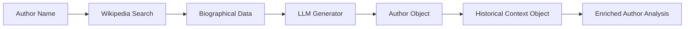
In this task, we start with an author's name and use it to query the Wikipedia search engine. The retrieved biographical data is then processed by an LLM generator to extract relevant information and map it to the fields of an `Author` object. The `Author` object is then linked to a `HistoricalContext` object, providing a rich contextual backdrop for the author's life and work. The resulting enriched `Author` object can be used for various biographical analysis tasks.

2. Literary Work Structural Analysis:
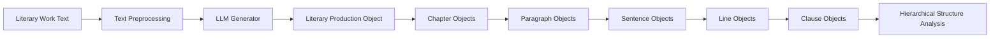
This task involves processing the raw text of a literary work and mapping it to the hierarchical structure defined by our Pydantic classes. The text undergoes preprocessing to clean and tokenize it, and then an LLM generator is used to identify and extract the relevant structural elements, such as chapters, paragraphs, sentences, lines, and clauses. The extracted elements are mapped to their corresponding Pydantic objects, creating a structured representation of the literary work. This hierarchical structure can then be analyzed to gain insights into the work's composition and organization.

3. Thematic Analysis:
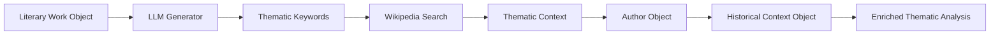
For thematic analysis, we start with a `LiteraryProduction` object and use an LLM generator to identify and extract thematic keywords from the work's text. These keywords are then used to query the Wikipedia search engine for relevant contextual information. The retrieved thematic context is integrated with the `Author` and `HistoricalContext` objects associated with the work, providing a rich backdrop for understanding the work's themes and their significance within the author's oeuvre and the broader cultural and historical milieu.

4. Comparative Analysis:
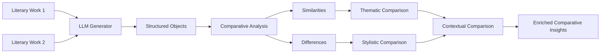
Comparative analysis involves analyzing multiple literary works to identify similarities, differences, and relationships between them. In this task, we process the raw text of two or more literary works using an LLM generator to map them to structured Pydantic objects. We then perform comparative analysis on these structured objects, examining similarities and differences in themes, styles, and contexts. The resulting insights can shed light on the relationships between the works, their authors, and the broader literary landscape.

These grounded diagrams illustrate how our framework can be used to perform a variety of literary analysis tasks by leveraging the power of Pydantic classes, Wikipedia integration, and LLM generators for mapping unstructured text to structured objects. By combining these components in different ways, we can generate rich and nuanced insights into literary works, authors, and their contexts.

## 🌿✨ Applying the Generative Framework to Prof. Angeli's Literary Analysis Style 🎓📚

Now that we have a robust generative framework for literary analysis, let's explore how we can apply it to the specific question-and-answer style employed by Prof. Angeli in her exercises. We'll use mermaid diagrams to illustrate the flow of information and the interaction between the different components of our system.

1. Contextual and Biographical Analysis:
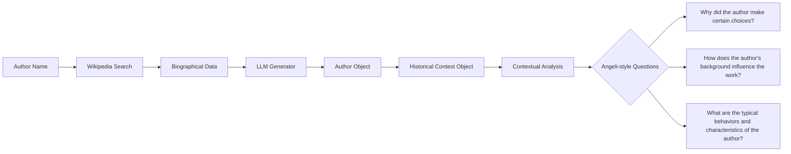
In this scenario, we start with the author's name and use it to query Wikipedia for biographical and contextual information. The retrieved data is processed by the LLM generator to create structured `Author` and `HistoricalContext` objects. These objects are then used to generate contextual analyses and Angeli-style questions that probe the relationship between the author's life, historical context, and the literary work. Questions might explore the author's motivations, the influence of their background on the work, and typical behaviors or characteristics exhibited by the author.

2. Close Reading and Textual Analysis:
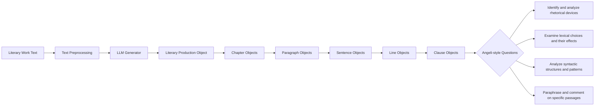
For close reading and textual analysis, we process the literary work's text to create a hierarchical structure of `LiteraryProduction`, `Chapter`, `Paragraph`, `Sentence`, `Line`, and `Clause` objects. The LLM generator then uses these objects to generate Angeli-style questions that guide students through a detailed analysis of the text. Questions might ask students to identify and analyze rhetorical devices, examine lexical choices and their effects, analyze syntactic structures and patterns, or paraphrase and comment on specific passages.

3. Thematic and Comparative Analysis:
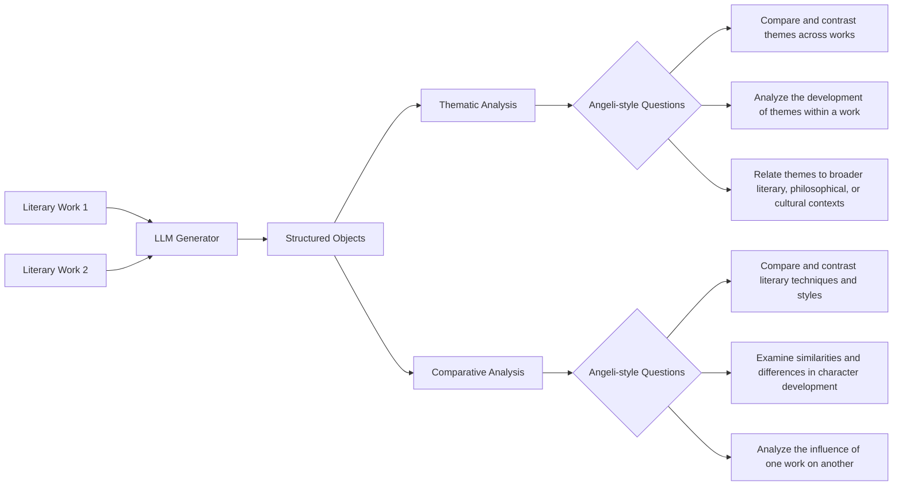
For thematic and comparative analysis, we use the LLM generator to process multiple literary works and create structured objects. These objects are then used to generate Angeli-style questions that guide students through the analysis of themes and the comparison of works. Questions might ask students to compare and contrast themes across works, analyze the development of themes within a work, or relate themes to broader contexts. Comparative questions could focus on literary techniques, character development, or the influence of one work on another.

4. Interpretive and Reflective Analysis:
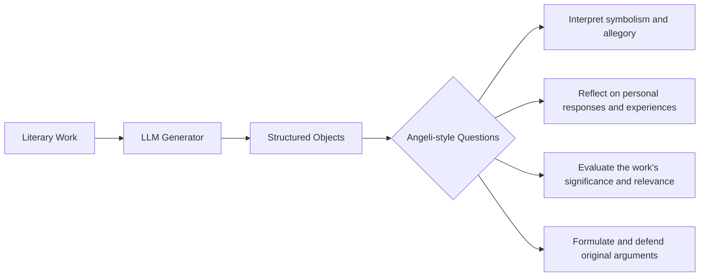
Finally, for interpretive and reflective analysis, the LLM generator uses the structured objects to create Angeli-style questions that encourage students to engage with the work on a deeper, more personal level. Questions might ask students to interpret symbolism and allegory, reflect on their own responses and experiences, evaluate the work's significance and relevance, or formulate and defend original arguments.

By applying our generative framework to Prof. Angeli's question-and-answer style, we can create a powerful tool for guiding students through the complexities of literary analysis. The combination of structured data, LLM generation, and targeted questioning enables a rich, multi-faceted exploration of literary works, authors, and contexts, fostering the development of critical thinking, close reading, and interpretive skills.

Of course, the success of this approach will depend on the quality and relevance of the generated questions, as well as the ability of students to engage meaningfully with the prompts. Ongoing refinement and evaluation of the LLM generator will be essential to ensure that the questions are coherent, insightful, and aligned with Prof. Angeli's pedagogical goals.

Nonetheless, by formalizing and systematizing the process of literary analysis, our framework has the potential to transform the way students and teachers engage with literature, opening up new avenues for exploration, discovery, and intellectual growth. 🌟✨