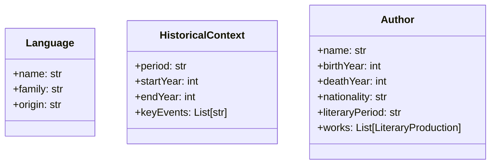
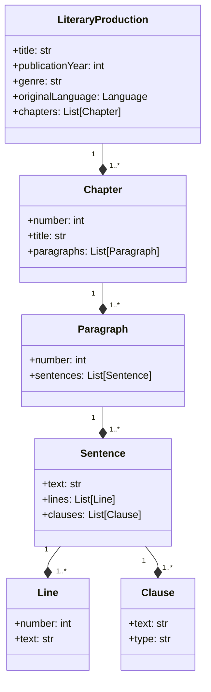
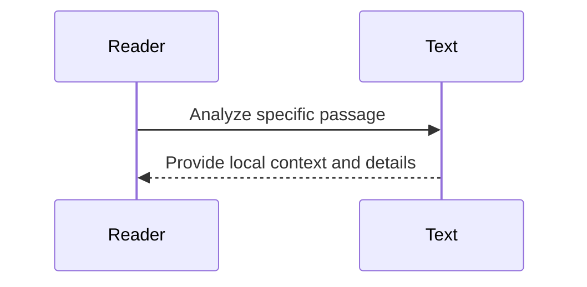
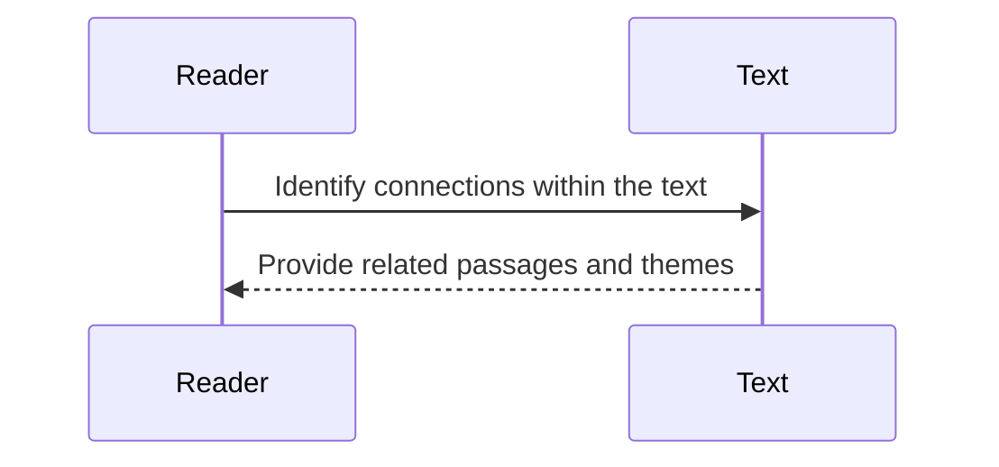
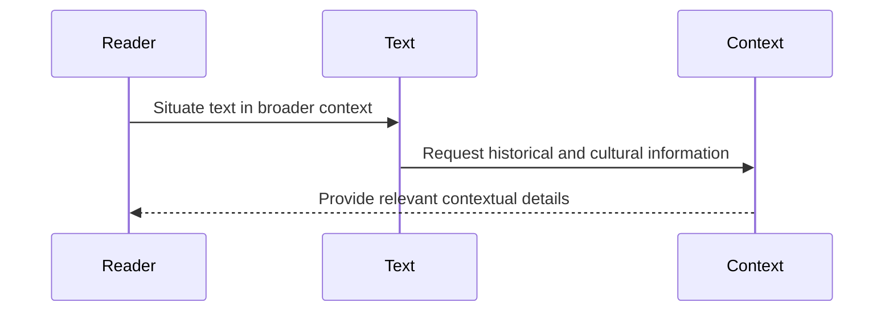
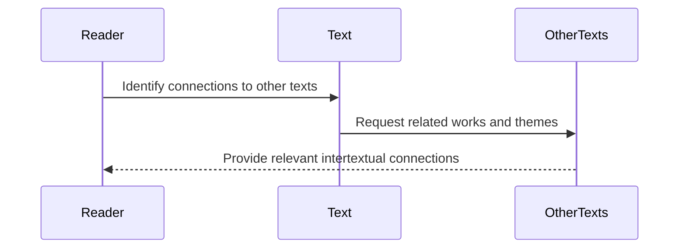
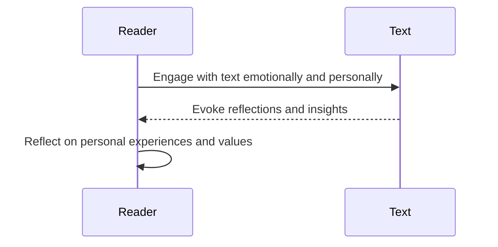

🌿✨ Cultivating Insight: A Generative Framework for Literary Analysis 📚🔍

As we embark on this exciting journey of designing a generative framework for literary analysis, it's essential to ground our approach in a deep understanding of the complex relationships between texts, authors, and their broader contexts. At the heart of our vision is a commitment to empowering readers with the tools and knowledge they need to engage with literature in a more meaningful and insightful way. 🌱📖

To achieve this, we have developed a conceptual model that represents the key entities and relationships involved in literary analysis. This model is centered around three core objects: Language, HistoricalContext, and Author. These objects encapsulate the essential dimensions of a literary work, from its linguistic and stylistic features to its historical and cultural milieu to the biographical and intellectual background of its creator. 🏛️👤🌍

In addition to these core objects, our model also represents the hierarchical structure of a literary work itself, from the high-level concept of a LiteraryProduction down to the granular elements of Chapters, Paragraphs, Sentences, Lines, and Clauses. By capturing this detailed structure, we can enable fine-grained analysis and generation of insights at multiple levels of the text. 📚🔍

With this conceptual model in place, we can now turn our attention to the generative aspects of our framework. Our goal is to create a system that not only represents and reasons about literary contexts, but actively generates insights and provocations that inspire new ways of seeing and understanding texts. 💡🔍

To achieve this, we propose integrating our model with a powerful search engine that can query and synthesize information from vast online resources like Wikipedia. By leveraging the structured knowledge available in these resources, we can dynamically enrich our understanding of a given text's language, historical context, and authorial background, and use this information to generate targeted prompts and analyses. 🌐🔍

But the true power of our framework lies in its ability to guide readers through a scaffolded and multifaceted process of literary exploration, one that mirrors the pedagogical approach of Angeli, the professor whose teaching style inspired this project. By carefully crafting and sequencing our generative prompts, we can lead readers through different levels of analysis and interpretation, from close reading of specific passages to broader reflections on themes, contexts, and personal resonances. 🎓✍️

To illustrate this process, let's consider a series of mermaid sequence diagrams that represent the different types of information integration and reader-text interaction at each stage of Angeli's approach:

1. Local and Specific Analysis:

2. Intra-textual Connections:

3. Contextual Analysis:

4. Intertextual Connections:

5. Affective and Personal Response:

As these diagrams illustrate, our framework aims to guide readers through a rich and iterative process of engagement with the text, one that gradually expands in scope and complexity. By generating prompts and analyses that target each of these levels in turn, we can help readers build up a multifaceted and nuanced understanding of the work, one that integrates local details with broader patterns, contexts with connections, and objective analysis with subjective response. 🌈🔍

Of course, realizing this vision will require a significant amount of further research and development. We will need to refine our conceptual model, build out our knowledge base and search capabilities, and experiment with different natural language processing techniques for generating meaningful and coherent prompts. But by grounding our approach in a deep understanding of the literary analysis process, and by drawing inspiration from the pedagogical wisdom of teachers like Angeli, we believe that we can create a truly transformative tool for engaging with literature. 💡📚

Ultimately, our goal is to empower readers to become active and insightful explorers of the literary landscape, equipped with the knowledge, skills, and dispositions they need to make sense of even the most complex and challenging texts. By providing a dynamic and generative framework for analysis, we hope to cultivate a more vibrant and participatory culture of reading, one that celebrates the joys of interpretation and the endless possibilities of meaning. 🌟✨

So let us embrace this exciting challenge, and work together to build a future in which every reader can experience the thrill of discovery and the satisfaction of understanding that comes from deep and sustained engagement with the world of books. With curiosity, creativity, and a commitment to the power of literature, we can open up new horizons of insight and appreciation for generations to come. 📖🔍🌿