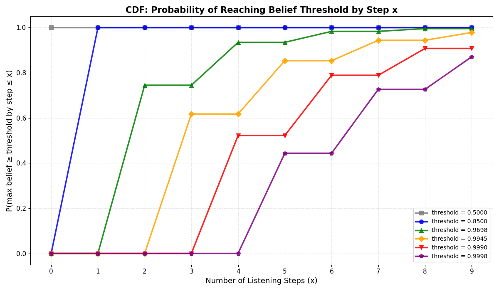

# Learning World Models from Agentic Traces

### tags: @vision @abstractions

## Introduction
With this blogpost I want to start demystifying the relationship between LLMs and agency. Like many others, I got my first aha moment with language models thanks to AI Dungeon. I had already worked on LSTMs for text generation during my internships at AWS a few years prior, but the relatively coherent ability of GPT-2 to simulate a dungeon-crawling video game was too interesting to ignore.

For those who missed it, AI Dungeon was a simple GPT-wrapper that allowed users to develop a narrative from the perspective of the main character of a fantasy world. You could choose between some pre-made backstories (or write your own) that would be included in the LLM's prompt, the LLM would then simulate a sort of dungeon master that would present the scene to the user, who in turn would describe their character's behavior provoking the next scene. Of course the general understanding was that having the model pretrained on a large amount of fantasy books and RPG manuals, an initial story prompt, and the user input were enough for the model to autocomplete something somehow cohesive.

In retrospect, what I find prescient was how the human-GPT alternation ended up creating an agentic boundary. The simple trick of anchoring human inputs to the presumably consistent protagonist's actions was enough for the generations to be naturally interpreted as the environment's responses to those inputs. While surprising, this boundary was quite feeble. It was far too easy for the human to modify the state of the environment by simply stating facts as part of its actions, and the AI would way too often attempt to take actions on the protagonist's behalf. A failure mode that is still common when using base-models as assistants.

Nonetheless, we had a clear example that LLMs could be used as world models of potentially infinite reinforcement learning environments. Given that the duality between world modeling and agency is a professional rabbit hole I can't seem to escape, I want to take the chance to present a collection of important results about learning in partially observable environments that have rarely been connected to the philosophy of LLMs. The first idea I want to communicate is that the classical dichotomies of reinforcement learning between model-free and model-based and between MDPs and POMDPs are unphysical and generally a distraction.

Agency is a general property of a specific class of dynamical systems that impose a precise information theoretic constraint on the state space, effectively partitioning the system into an agent and an environment. Under this view the actually relevant dichotomy is whether the bidirectional information bottleneck between the agent and the environment allows synchronization of their states for the semi-infinite future. In such a system an agent equipped with a correct world model is guaranteed after a finite number of interactions to obtain an internal state that is synchronized to the environment generator latent state, i.e. that is equivalently predictive of the system's future for all future steps. From my perspective both the Markovian and model-based dichotomies are special cases of the synchronizability perspective.

Any environment that is synchronizable can be recast as an alternative belief-MDP problem based on the agent's predictions of the environment state. It can be easily demonstrated that the solution to this alternative problem is equivalent to the original POMDP problem when the agent's hidden state is informationally equivalent to the environment generator latent state. Because of this equivalence, learning an optimal model-free policy mapping history to behavior implicitly must learn a synchronizable world model of the environment, and conversely, learning an optimal world model of the environment produces a representation that is informationally sufficient to learn an optimal model-free policy.

When an environment is instead non-synchronizable, there is a decoupling between what is and what can be understood. This was the general domain of early POMDP algorithms that moved the focus of representation from states to beliefs. In this situation the equivalence between latent states and predictive models cannot be established, hence we cannot provably create an alternative decision problem whose solution is optimal for the original problem, nor can we learn an informationally sufficient model of the environment from any finite amount of data. When the true environment generator model is somehow available we can derive an upper bound on what can be learned from experience by tracking the information in the belief process generated by conditioning the generator model on the history of interactions. In this scenario any alternative predictive model is at best informationally equivalent to this belief process, hence any alternative decision problem is bounded by the belief-MDP.

How is this perspective about reinforcement learning related to language models? First of all it gives us an information theoretic language to describe the joint agent-environment dynamics as a stochastic process, specifically the language we use to describe and develop autoregressive transformer models. Second, it tells us the limits of what we can expect an LLM agent to learn in a specific environment, potentially driving their design. I will argue throughout the blogpost that the ability of LLMs to implicitly internalize world models from agentic traces is what makes them a powerful substrate for building agents. A corollary of this interpretation is that the modern success of assistant-models that use sophisticated chat-templates and various regimes of gradient-masking is due to the precise reinforcement of this agentic boundary. Similarly, many of the systematic failures of modern LLM agents can be traced to the laser-focus of post-training techniques on optimal Markovian decision making overshadowing the world modeling and belief synchronization aspects.

Because the full formalization of my theoretical claims vastly exceeds both what can be considered acceptable for a blogpost and, honestly, the empirical results I currently have, for this post we will make a few simplifying assumptions. First we will assume that the tokenization of the language model perfectly corresponds with the environment's observation and action space, and second we will derive a phenomenological theory that in many cases will inevitably conflate mixed belief states with the true underlying causal structure. While I do not have a solution for the second problem other than changing the environment, I promise a follow-up relaxing the tokenization assumption and extending the theory to the common scenario where both observations and actions are composed of multiple tokens.
<!--
We will start with a few toy examples to ground the discussion about synchronizable and non-synchronizable environments. After developing a theoretical intuition of how the latent structure of each environment can be used to develop interesting policies for each scenario, we will see in practice how transformers trained to predict agentic traces will respectively learn to approximate the generator or the belief process. We will then proceed to train deep reinforcement learning agents either using these frozen representations or from scratch, and show that optimal predictions give representations that are optimal for decision making and that optimal decision making gives representations that are optimal for prediction.

After a hopefully solid empirical introduction we will formalize the problem in depth using some results from Computational Mechanics linking autoregressive stochastic processes and POMDPs. From that characterization we will focus on a few recent theoretical discoveries about the Transformer architecture that justify their use as sufficient approximators of the environment. With this theoretical baggage we will be able to appreciate what an LLM must learn when trained to predict agentic traces. Finally we will discuss the relationship between goal-directedness, state coverage and world model accuracy.

[here we need to reorganize the promises because we are now using an alteranted order - when we speak about the examples we should say we solve them both in closed form using belifs and empirically with transformers] -->

### The POMDP Frame or When is a System Agentic?

We start by asking in what sense a dynamical system can be said to be agentic, and what latent structure can be recovered from the system’s measurable behavior when this assumption holds.
Agency developed historically as a model of what separates humans from the rest of physical matter, and more recently as a model of what makes a system intelligent. Being humans, we inherently perceive a separation between what we are as a mind, the agent, and the thing-in-itself we live in, the environment. This dualism seems to clash with our understanding of reality as a local physical process, yet it is reconciled in modern science as a conditional independence, or causal, structure that appears when we measure the world at a coarse enough scale. If we zoom out sufficiently, we can see how the states inside the agent are causally independent of the states in the environment given the information that leaks in at the boundary between them. We can think of this as the agent’s perceptual channel. Conversely, we can see how the state of the world is conditionally independent of what goes on inside the agent given the information that leaks out at the boundary, which we can call the causal or action channel.

Make the physical example concrete. Imagine a room with a robotic arm at a keyboard connected to an Atari console, a Raspberry Pi running the controller, and a camera watching the Atari’s monitor. We can leave the robot in the room until it learns to play the game at the best of its capacity, the we start measuring.
If all we can monitor in that room are keypress events and camera frames, those two streams are our entire window into the dynamics at this resolution. Continuous time effectively unfolds in turns: a keypress is an action, the game produces pixels as a response, and the cycle repeats.

Given these measurements, we could be tempted to build a complete bottom-up model of the room, starting from silicon steering electrons through transistors, up to the motor drivers and linkages that move the arm, and down again to the specific software implementation of the game and the hardware it runs on. That would be a daunting task, and it would change if the same behavioral input were generated by a different robot or if the game were implemented on different hardware. Thankfully, none of these details change the coarse-grained causal boundary between agent and environment. Given the keys that were pressed, the game’s next internal update does not depend on the Pi’s microstate; given the pixels that hit the camera, the Pi’s next update does not depend on the game’s microphysics. The decomposition between agent and environment gives us the structure to describe a stochastic generator of the measurement process that is invariant to the microscopic details of the system.

In this sense, it is useful to speak about an agentic system when its measurable behavior can be decomposed into two components: actions and observations, each defining a clear causal boundary, or Markov blanket, between the environment and the agent. In this section, we formally derive the POMDP frame as a decomposition of an autoregressive stochastic process into two stationary components. This setup allows us to connect the dots with our understanding of LLMs as approximators of autoregressive stochastic processes, yielding insights into what an LLM trained on agentic traces would learn.

### Agentic Traces as an Autoregressive Stochastic Process

To make our discussion formal, we review the general language of POMDPs to define the agent–environment interaction. In practice modelling a system as a POMDP corresponds to assuming a specific decomposition of the observable process, or agentic-trace, $Z$ into a sequence of turns $Z = \{z_1, z_2, \ldots, z_T\}$, where each turn $z_t \in \mathcal{Z}$ is a tuple $(a_t, o_t)$ of an action $a_t$ and an observation $o_t$. Intuitively the action $a_t$ in $\mathcal{A}$ defines the component of the observable turn that is causally controlled by the agent, while the observation $o_t$ in $\mathcal{O}$ defines the component that is causally controlled by the environment conditioned on the agent behavior. The sets $\mathcal{A}$ and $\mathcal{O}$ decompose the degrees of freedom of $z \in \mathcal{Z}$ into the product $\mathcal{A} \times \mathcal{O}$.

Then we assume that the probability of the next joint turn $z_{t+1} = (a_{t+1}, o_{t+1})$ is only conditioned on the current environment and agent hidden states, respectively $s_t$ and agent's $\hat{s}_{t}$, and the agent's parameters $\theta$, defining a joint stochastic process with emissions $P(z_{t+1} \mid s_t, \hat{s}_{t}; \theta)$ whose temporal dynamics are modeled by the recurrent transition $P(s_{t+1}, \hat{s}_{t+1} \mid s_t, \hat{s}_{t}, z_{t+1}; \theta)$. Or explicitly with respect to actions and observations $P(a_{t+1}, o_{t+1} \mid s_t, \hat{s}_{t}; \theta)$. In a POMDP it is possible to further decompose this joint process into the environment's emission kernel $P(o_{t+1} \mid s_t, a_{t+1})$ and its emission-conditioned transition kernel, $P(s_{t+1} \mid s_t, a_{t+1}, o_{t+1})$, together with the agent's policy $\pi(a_{t+1} \mid \hat{s}_{t}; \theta_{\pi})$ and the agent's state transition kernel $\mathcal{M}(\hat{s}_{t+1} \mid \hat{s}_{t}, a_{t+1}, o_{t+1}; \theta_{\mathcal{M}})$, with parameters $\theta = (\theta_{\pi}, \theta_{\mathcal{M}})$.

In full generality the environment transition $P(s_{t+1} \mid s_t, a_{t+1}, o_{t+1})$ can have support on multiple next states for a given $(s_t,a_{t+1},o_{t+1})$. When we restrict attention to models where for each triple $(s_t,a_{t+1},o_{t+1})$ there is at most one $s_{t+1}$ with nonzero probability, the environment update becomes unifilar in the sense of computational mechanics: once $s_t$, $a_{t+1}$, and the realized $o_{t+1}$ are known, the next state $s_{t+1}$ lies on a single causal branch consistent with that symbol. This unifilar structure at the turn scale is the class we will focus on in the next sections when discussing synchronization and belief processes.

The emission of the next turn decomposes into agent action selection and environment observation emission:

$$
P(z_{t+1} \mid s_t, \hat{s}_{t}; \theta) = P(a_{t+1}, o_{t+1} \mid s_t, \hat{s}_{t}; \theta) = \pi(a_{t+1} \mid \hat{s}_{t}; \theta_{\pi}) \cdot P(o_{t+1} \mid s_t, a_{t+1}).
$$

This is the interface where the agent proposes $a_{t+1}$ and the environment commits to a symbol $o_{t+1}$ that will also drive the update of its hidden state.

Given the emitted turn, both hidden states update according to their respective transition kernels:

$$
P(s_{t+1}, \hat{s}_{t+1} \mid s_t, \hat{s}_{t}, z_{t+1}; \theta) = P(s_{t+1} \mid s_t, a_{t+1}, o_{t+1}) \cdot \mathcal{M}(\hat{s}_{t+1} \mid \hat{s}_{t}, a_{t+1}, o_{t+1}; \theta_{\mathcal{M}}).
$$

Combining emission and transition dynamics, the complete joint update for each turn $z_{t+1} = (a_{t+1}, o_{t+1})$ becomes:

$$
P(z_{t+1}, s_{t+1}, \hat{s}_{t+1} \mid s_t, \hat{s}_{t}; \theta) = P(z_{t+1} \mid s_t, \hat{s}_{t}; \theta) \cdot P(s_{t+1}, \hat{s}_{t+1} \mid s_t, \hat{s}_{t}, z_{t+1}; \theta).
$$

Which expands to the full factorization $P(a_{t+1}, o_{t+1}, s_{t+1}, \hat{s}_{t+1} \mid s_t, \hat{s}_{t}; \theta)$:

$$
\pi(a_{t+1} \mid \hat{s}_{t}; \theta_{\pi}) \cdot P(o_{t+1} \mid s_t, a_{t+1}) \cdot P(s_{t+1} \mid s_t, a_{t+1}, o_{t+1}) \cdot \mathcal{M}(\hat{s}_{t+1} \mid \hat{s}_{t}, a_{t+1}, o_{t+1}; \theta_{\mathcal{M}}).
$$

For a complete trajectory $Z = \{z_1, z_2, \ldots, z_T\}$ with $z_t = (a_t, o_t)$, the joint probability over all turns and hidden states given the agent parameters $\theta$ is:

$$
P(Z, s_{1:T}, \hat{s}_{1:T} \mid \theta) = P(s_1, \hat{s}_1) \cdot P(z_1 \mid s_1, \hat{s}_1; \theta) \cdot \prod_{t=1}^{T-1} P(z_{t+1}, s_{t+1}, \hat{s}_{t+1} \mid s_t, \hat{s}_{t}; \theta).
$$

For a given agent, marginalizing over the hidden states gives the observable sequence probability:

$$
P(Z \mid \theta) = \sum_{s_{1:T}, \hat{s}_{1:T}} P(s_1, \hat{s}_1) \cdot P(z_1 \mid s_1, \hat{s}_1; \theta) \cdot \prod_{t=1}^{T-1} P(z_{t+1}, s_{t+1}, \hat{s}_{t+1} \mid s_t, \hat{s}_{t}; \theta).
$$

With the latest formulation we can effectively define the likelihood of our data conditional on a generative model that can be compartmentalized into a parametrized agent and a stationary environment, that is an agentic system.

### Synchronizable Environments and Minimal Predictive Models

In the previous section we decomposed the turn process into an environment channel and an agent channel, with hidden states $s_t$ and $\hat{s}_t$ and an internal agent update

$$
\mathcal{M}(\hat{s}_{t+1} \mid \hat{s}_t, a_{t+1}, o_{t+1}; \theta_{\mathcal M})
$$

Intuitively $\hat{s}_t$ is whatever summary of the past the agent carries forward in time. The environment state $s_t$ is whatever summary of the past the generator carries forward. The information theoretic relationship between these two chains is the core of synchronization.

A useful way to look at this relationship is through the mutual information

$$
I(S_t ; \hat{S}_t) = H(S_t) - H(S_t \mid \hat{S}_t)
$$

measured under the stationary joint distribution induced by a fixed policy and world model. At one extreme we have $I(S_t ; \hat{S}_t) = 0$. In that regime the agent’s internal state is independent of the environment state. Whatever memory the agent carries is either pure noise or only about its own past actions. From the environment’s point of view the agent is blind; from the agent’s point of view the world has no latent structure that can be tracked.

At the opposite extreme the conditional entropy $H(S_t \mid \hat{S}_t)$ vanishes. In that regime $\hat{s}_t$ determines $s_t$ almost surely, and the two chains become informationally equivalent:

$$
H(S_t \mid \hat{S}_t) = 0
\quad\Longleftrightarrow\quad
S_t = f(\hat{S}_t) \ \text{a.s.}
$$

for some measurable $f$. Here the agent has compressed its entire interaction history into an internal state that is as informative about the world’s latent as the world’s own state. This is the information theoretic sense in which the agent has synchronized to the environment.

Of course the agent never sees $s_t$ directly. The only way to build up this relationship is through the turn process $Z_{1:t}$, with observations leaking information about $S_t$ through the environment kernel and $\mathcal{M}$ steering that information into $\hat{S}_t$. If the agent implements an optimal predictive model of the process, its internal state should also be a sufficient statistic of the history for predicting future observations under all future actions:

$$
P(o_{t+1:\infty} \mid a_{t+1:\infty}, z_{1:t})
=
P(o_{t+1:\infty} \mid a_{t+1:\infty}, \hat{s}_t)
$$

This condition implies that $\hat{s}_t$ sits at the intersection of two constraints. It must be a function of the past, $\hat{s}_t = g(z_{1:t})$, and it must capture exactly the information about the past that matters for forecasting the future. Among all such sufficient summaries there is a minimal one in an information theoretic sense, obtained by identifying histories that induce identical conditional futures. The quotient of histories by this relation gives a finite set of predictive states, and the resulting stochastic automaton is the $\varepsilon$-transducer of the process.

The environment generator we wrote in terms of $s_t$ is another presentation of the same process. Under the unifilar assumption at the turn scale and the requirement that different generator states induce different conditional futures, there exists a unique minimal unifilar generator. Computational mechanics tells us that this minimal generator is isomorphic to the history-based $\varepsilon$-transducer: its states can be relabelled by the predictive equivalence classes of histories without changing the induced process. In that regime an optimal predictive agent that learns the $\varepsilon$-transducer from data is, up to an invertible change of coordinates, learning the minimal generator of the environment.

Synchronization then becomes the statement that the agent’s internal chain $\hat{S}_t$ has converged to this minimal predictive chain and, through it, to the environment generator. Formally we can track the conditional entropy of the environment state given the observable history,

$$
H(S_t \mid Z_{1:t})
$$

and ask whether it vanishes in the long run. If the environment is synchronizable, there exists a finite random time $\tau$ such that for almost every agentic trace the posterior $P(s_t \mid z_{1:t})$ concentrates on a single generator state for all $t \ge \tau$. At that point the belief over $S_t$ becomes a delta, the predictive equivalence class of the history coincides with a single generator state, and the internal state of any optimal predictive agent can be mapped to $s_t$ without loss of information.

This has a concrete decision theoretic consequence. Consider a reward function on generator transitions

$$
R(s_t,a_t,s_{t+1})
$$

and the corresponding MDP whose states are the latent $s_t$. We can also write a belief-MDP whose states are beliefs $b_t(s) = P(s_t = s \mid z_{1:t})$, and a predictive-state MDP whose states are the causal states of the $\varepsilon$-transducer. In a synchronizable environment these three decision problems are equivalent in the strong sense that after synchronization

$$
b_t \Rightarrow \delta_{s_t}, \qquad \xi_t \leftrightarrow s_t
$$

almost surely, and any optimal policy written as a function of histories, of beliefs, of predictive states or of latent states induces the same distribution over agentic traces and the same optimal value. The belief-MDP is not an approximation here, it is just a reparametrization of the latent MDP restricted to the observable interface.

In this picture the role of $\mathcal{M}$ is to implement the dynamical law of the minimal predictive model. An optimal world model at the agent level is one whose internal chain $\hat{S}_t$ is sufficient for prediction and whose update

$$
\hat{s}_{t+1} \sim \mathcal{M}(\cdot \mid \hat{s}_t, a_{t+1}, o_{t+1})
$$

matches the unifilar update of the $\varepsilon$-transducer. When the environment is synchronizable and the agent has enough data to identify that structure, the information theoretic optimum $H(S_t \mid \hat{S}_t) = 0$ is reachable. The agent’s state becomes a sufficient statistic for both prediction and control and is informationally equivalent to the generator state. The shrine problem will give a concrete example of this regime, where one or two turns are enough for the agent to collapse its uncertainty and track the hidden phase of the environment exactly.

### Learning to Please the Gods Studying a Drunken Pythia

We start with a lightweight toy example inspired by the identity-not channel in computational mechanics. In the channel there are two modes. In the identity mode the output matches the input. In the not mode the output flips the input. The mode itself toggles every turn. The agent chooses the input each turn, so the evolution is controlled in the simple sense that what happens next depends both on the hidden mode and on the agent's current act.

*On a mountain there is a shrine to two gods, one loyal and one a trickster. The statue has two plates, one marked offering and one marked nothing, and an omen returned after each turn is the only public signal of which god currently guards the shrine. The loyal god returns offering with blessing and nothing with curse, while the trickster returns nothing with blessing and offering with curse; after each turn the satisfied guardian departs and the other takes the watch. An old and drunken pythia serves the shrine by choosing between offering and nothing at random. She has done this for decades and still does not understand the pattern. To make matters worse, after one hundred turns the gods go on vacation for a week, the shrine falls silent, and when it returns it simply begins glowing again, ready for offering, and there is no way to know which guardian has come back to the post.
She no longer knows whether blessing means the loyal god who mirrors the act or the trickster who inverts it, so she gave up trying to reason it out. We study the problem from the perspective of her disciple, who has observed this behavior for years and will soon take over. She wants to please the gods as well as possible and asks what can be inferred from the drunken policy to recover the correct strategy.*

We use the shrine as a toy environment. Each turn is a pair $z_t = (a_t, o_t)$ with $a_t \in \{0,1\}$ the act (offering or nothing) and $o_t \in \{0,1\}$ the omen (blessing or curse). The shrine has a hidden two-mode state $s_t \in \{0,1\}$, read as loyal versus trickster. Saying the update is controlled means the next omen is produced from the current act together with the current guardian, and the guardian for the next turn is determined by what just happened. In compact form,

$$
s_t = \mathbb{1}[a_{t-1} = o_{t-1}], \qquad o_t = a_t \oplus s_t.
$$

Here $s_t=0$ is loyal and $s_t=1$ is trickster, so $o_t=a_t$ under loyal and $o_t\neq a_t$ under trickster. This also implies the period-2 alternation $s_t=\neg s_{t-1}$ since $o_{t-1}=a_{t-1}\oplus s_{t-1}$.

Inputs alone do not suffice and outputs alone do not suffice. The joint pair $(a_{t-1}, o_{t-1})$ fixes the mode for the step, and once the turn $(a_t, o_t)$ is realized the environment updates unifilarly. This matches the agentic trace view above. The agent proposes $a_t$. The shrine emits $o_t$ given $s_t$ and $a_t$. The minimal predictive latent the model must carry is the phase $s_t$.

To keep runs independent we add a renewal. After one hundred turns the gods leave for a week and the shrine falls silent. When the shrine restarts it simply begins glowing again, ready for offering, and the guarding mode is drawn as $s_0 \sim \text{Bernoulli}(1/2)$. That draw sets the phase for the new epoch. We can interpret the renewal as a reset of the environment, and study each epoch as an episode in the RL sense associating positive rewards to blessings and negative rewards to curses. Within an epoch the one-step joint history $(a_{t-1}, o_{t-1})$ together with the current act is sufficient to predict $o_t$ and to update the belief about the phase $s_t$. Because the state updates deterministically this is enough for the agent's belief to remain synchronized with the environment for the duration of the epoch.

When the dynamics are considered at the episode level it is easy to understand the synchronizable nature of the environment for all subsequences of action-observation pairs of length greater than one. At the beginning of each epoch the agent is completely uncertain about the phase $s_0$, but after processing a single turn $z_1$ the belief immediately converges to the correct generator value. To see this concretely we write out the generative model and trace how beliefs evolve.

The emission kernel is deterministic given state and action:

$$
P(o_t \mid s_t, a_t) = \mathbb{1}[o_t = a_t \oplus s_t]
$$

and the transition kernel is deterministic, the state simply alternates:

$$
P(s_{t+1} \mid s_t) = \mathbb{1}[s_{t+1} = 1 - s_t]
$$

Let $b_t = P(s_t = 0 \mid z_{1:t})$ denote the agent's belief that the loyal god is guarding. At the start of an epoch no observations have been made, so $b_0 = 1/2$. After observing a turn $(a_1, o_1)$ the belief updates by Bayes. Since the emission is deterministic, observing $a_1 = o_1$ is only possible under the loyal god, and observing $a_1 \neq o_1$ is only possible under the trickster. In either case the posterior is zero or one. A single turn is enough to synchronize, and thereafter the belief depends only on the most recent turn.

The following table enumerates all possible observation histories of length at most one, their associated beliefs, the entropy of the belief $H(b_t) = -b_t \log_2 b_t - (1-b_t) \log_2 (1-b_t)$ measuring the agent's uncertainty, the expected reward for each action, and the predictive probabilities of blessing ($o_{t+1} = 0$) conditional on each action. Let $R(\text{blessing}) = +1$ and $R(\text{curse}) = -1$.

| $(a_t, o_t)$ | $b_{t+1}$ | $H(b_{t+1})$ | $\mathbb{E}[R \mid a{=}0]$ | $\mathbb{E}[R \mid a{=}1]$ | $P(o{=}0 \mid a{=}0)$ | $P(o{=}0 \mid a{=}1)$ |
|--------------|-----------|--------------|---------------------------|---------------------------|----------------------|----------------------|
| $\emptyset$ (start) | $1/2$ | $1$ | $0$ | $0$ | $1/2$ | $1/2$ |
| $(0, 0)$ | $1$ | $0$ | $+1$ | $-1$ | $1$ | $0$ |
| $(1, 1)$ | $1$ | $0$ | $+1$ | $-1$ | $1$ | $0$ |
| $(0, 1)$ | $0$ | $0$ | $-1$ | $+1$ | $0$ | $1$ |
| $(1, 0)$ | $0$ | $0$ | $-1$ | $+1$ | $0$ | $1$ |

The table makes visible that all histories partition into exactly three equivalence classes based on their predictive content. The first class contains only the empty history at epoch start with maximum uncertainty. The second class contains the two turns where act equals omen, $(0,0)$ and $(1,1)$, corresponding to the loyal god now guarding with zero uncertainty. The third class contains the two turns where act differs from omen, $(0,1)$ and $(1,0)$, corresponding to the trickster with zero uncertainty. The last two columns show the predictive state representation: the probability of blessing under each action. These predictive probabilities cluster into the same three classes as the beliefs, $(1/2, 1/2)$, $(1, 0)$, and $(0, 1)$, which is no coincidence. In a synchronizable environment the belief process and the predictive state process are informationally equivalent.

Once synchronized the optimal policy is trivial: always offer when $b = 1$ (loyal), always nothing when $b = 0$ (trickster). At $b = 1/2$ both actions have zero expected reward, so the first turn is a coin flip that reveals the phase. The disciple studying the pythia's notebook has enough information to recover these equivalence classes and, from them, the optimal policy.

### Non Synchronizable Environments and Belief Processes

The synchronizable case is the happy one where an optimal predictive agent can eventually turn its internal state into a sufficient statistic for the generator state. Information theoretically this meant that in the limit $H(S_t \mid \hat{S}_t)$ could be driven to zero and the minimal predictive model lined up with the minimal generator.

Non synchronizable environments are those where this never happens. The interaction still generates a joint process over $(S_t, Z_{1:t})$, but even an optimal predictor fed the entire history cannot reduce the conditional entropy of the generator below a strictly positive floor,

$$
\lim_{t \to \infty} H(S_t \mid Z_{1:t}) = h_{\text{res}} > 0
$$

The environment keeps some of its structure permanently hidden behind the observation channel. There are generator states that are observationally indistinguishable in the strong sense that no finite history of actions and observations can tell them apart with certainty. From the point of view of an agent living at the turn interface, these latent distinctions might as well not exist.

In this regime the natural latent object to track is not $S_t$ but the belief over $S_t$ induced by the generator model. Given a prior $b_0$ and a fixed environment kernel, each history $z_{1:t}$ maps to a belief

$$
b_t(s) = P(s_t = s \mid z_{1:t})
$$

and the belief update is again unifilar at the turn scale,

$$
b_{t+1} = F(b_t, a_{t+1}, o_{t+1})
$$

Unlike the synchronizable case the belief never collapses to a delta. Instead it wanders inside the simplex of distributions over $\mathcal{S}$ and its residual entropy mirrors the residual uncertainty of the generator. The information theoretic limit is now

$$
I(S_t ; Z_{1:t}) = H(S_t) - h_{\text{res}} < H(S_t)
$$

and there is no way for the agent’s internal chain $\hat{S}_t$ to carry more information about $S_t$ than the belief itself. Even an optimal world model cannot do better than being a sufficient statistic for this belief process.

The phenomenological construction via predictive equivalence still goes through. We can again collapse histories $z_{1:t}$ and $z'_{1:t'}$ that induce the same conditional futures under all possible action sequences, and we again obtain a finite or countable set of causal states $\xi_t$. Each causal state represents an equivalence class of histories that are indistinguishable in terms of what they imply about future observations. The $\varepsilon$-transducer built from these classes is still the minimal sufficient predictive model of the agentic trace.

What changes is the way this phenomenological object relates to the generator. In the synchronizable case each causal state corresponded to a single generator state almost surely. Here each causal state corresponds instead to a whole subset of generator states that remain forever entangled under the observation channel. The map from generator states to causal states becomes many-to-one: different $s$ that induce the same conditional futures share the same predictive state. The best we can do is to track their mixture.

From the generator side this mixture is exactly the belief $b_t$. From the history side it is the causal state $\xi_t$. Computational mechanics lets us identify the two: in finite POMDPs with stationary dynamics the belief process induced by the exact filter and the causal-state process induced by predictive equivalence generate the same $\sigma$-algebra over futures. An optimal predictor that learns the $\varepsilon$-transducer from data is therefore, up to relabelling, learning the reachable portion of the belief simplex and its unifilar dynamics.

Control now lives on this epistemic state space rather than on the generator itself. Given a belief $b_t$ and a reward function on generator transitions, the expected one-step reward of an action $a_{t+1}$ is

$$
\mathbb{E}[R_{t+1} \mid b_t, a_{t+1}]
=
\sum_{s_t,s_{t+1}} b_t(s_t)\, P(s_{t+1} \mid s_t, a_{t+1})\, R(s_t,a_{t+1},s_{t+1})
$$

and the Bellman equations can be written entirely in terms of beliefs. The resulting belief-MDP is fully observed and well-posed. Its states are either explicit beliefs $b_t$ or implicit predictive states $\xi_t$ that are information equivalent to those beliefs. An optimal policy for this belief-MDP is the best that any agent can do given the observational constraints of the environment.

The gap is that this optimal policy is only approximate with respect to the latent generator. A hypothetical controller that could see $S_t$ directly and act on the underlying MDP might achieve a strictly higher return, because it could condition its actions on distinctions that the observation channel never reveals. The difference between these two optima is precisely the value lost to $h_{\text{res}} > 0$.

From the point of view of representation learning the message is clean. In non synchronizable environments the latent structure that an optimal predictor can hope to recover is the belief process, not the generator. The minimal world model is the $\varepsilon$-transducer on predictive states, and this is equivalent to the reachable region of the belief simplex seen through the exact filter. Any internal state $\hat{S}_t$ that is sufficient for prediction and updated unifilarly at the turn scale must factor through this process. The tiger chamber we study next is an example where this belief dynamics lives on a thin, explicitly enumerable lattice inside the simplex, making the gap between generator and phenomenology very concrete.

### My Years as a Drop-Rate Analyst in the Tiger Gacha Dungeon

The second problem we are going to use is the Tiger Problem from Cassandra et al (1994). The state dynamics are even simpler than in the shrine problem since the state is fixed for the duration of the episode, but due to a noisy emission kernel the belief dynamics and their relationship to the expected reward are not trivial at all.

*In a dungeon there is a chamber with two identical doors. Behind one waits a tiger, behind the other a chest of gold. The tiger makes no sound and the doors give no indication. An adventurer can press their ear to the stone and listen; the acoustics carry a faint hint of which side holds danger, though the echo misleads roughly one time in six. Listening costs torchlight and time. Opening a door ends the expedition, gold meaning triumph and tiger meaning the evident alternative.
A young bag-carrier has spent years hauling equipment through this chamber, watching adventurers make their choices. Some were reckless and opened a door on instinct. Some were cautious, listening several times before committing. A few seemed to know exactly when they had heard enough. She wrote down every action and every outcome in a worn notebook. After enough expeditions she no longer carries bags. She sits at the dungeon's entrance and advises those who ask. The question we study is what structure in her notebook could support such advice, and whether a model trained on these varied records could learn when to listen and when to act.*

Each turn is a pair $z_t = (a_t, o_t)$ with $a_t \in \{\text{listen}, \text{open-left}, \text{open-right}\}$ the action and $o_t$ the observation. When listening the observation is a noisy hint $o_t \in \{\text{hear-left}, \text{hear-right}\}$. When opening a door the observation is terminal $o_t \in \{\text{gold}, \text{tiger}\}$ and the episode ends. The chamber has a hidden state $s \in \{L, R\}$ indicating which door conceals the tiger, drawn uniformly at the start of each episode and fixed for its duration.

The emission kernel for listening is noisy. The acoustics report the correct side with probability $p = 0.85$:

$$
P(o_t = \text{hear-left} \mid s = L, a_t = \text{listen}) = 0.85, \qquad P(o_t = \text{hear-left} \mid s = R, a_t = \text{listen}) = 0.15
$$

and symmetrically for hear-right. Opening a door is deterministic: if the tiger is behind the chosen door the adventurer meets the tiger, otherwise gold.

$$
P(o_t = \text{tiger} \mid s, a_t = \text{open-}d) = \mathbb{1}[s = d], \qquad P(o_t = \text{gold} \mid s, a_t = \text{open-}d) = \mathbb{1}[s \neq d]
$$

The transition kernel is trivial since the state never changes:

$$
P(s_{t+1} \mid s_t) = \mathbb{1}[s_{t+1} = s_t]
$$

The reward structure encodes the cost of information and the asymmetry between success and failure. Each listen costs $-1$ in torchlight and time. Opening the correct door yields $+10$ gold. Opening the tiger's door yields $-100$ in the evident consequences. Episodes last at most $L_{\max} = 10$ turns; if the adventurer has not opened a door by then the expedition ends with the accumulated listening cost.

The key difference from the shrine is that no finite history can reveal the hidden state with certainty. Each listen provides evidence but the noise ensures that $P(s \mid z_{1:t})$ never reaches zero or one. The agent cannot synchronize with the environment before the episode ends. Instead it must maintain a belief distribution over states and decide when the accumulated evidence justifies the risk of acting. This is an optimal stopping problem: gather information until the expected value of opening exceeds the expected value of listening further, accounting for the cost of each additional observation.

The pathological simplicity of this example and the finite episode length allow for a closed-form exploration of the belief space. Since opening a door is always terminal, the space of possible action sequences is small: any valid sequence consists of zero or more listens followed by a terminal action. For $x$ listens before acting, the number of distinct observation sequences is $2^x$, corresponding to the possible combinations of hear-left and hear-right. The total number of distinct histories up to length $L_{\max}$ is therefore $\sum_{x=0}^{L_{\max}} 2^x = 2^{L_{\max}+1} - 1$.

For each observation sequence we can compute the posterior belief over states using Bayes' rule. Let $k$ denote the number of hear-left observations in a sequence of length $x$. The belief that the tiger is on the left is:

$$
b(L) = P(s = L \mid k, x) = \frac{p^k (1-p)^{x-k}}{p^k (1-p)^{x-k} + (1-p)^k p^{x-k}}
$$

Notice that the belief depends only on the count $k$, not on the order of observations. This means many distinct sequences map to the same belief, giving rise to a finite set of belief states at each depth. The number of distinct beliefs after $x$ listens is $x + 1$, corresponding to $k \in \{0, 1, \ldots, x\}$.

Given a belief $b(L)$, the expected reward of opening each door is:

$$
\mathbb{E}[R \mid \text{open-right}] = b(L) \cdot 10 + b(R) \cdot (-100) = 110 \cdot b(L) - 100
$$
$$
\mathbb{E}[R \mid \text{open-left}] = b(L) \cdot (-100) + b(R) \cdot 10 = -110 \cdot b(L) + 10
$$

A rational agent chooses the door with higher expected reward. When $b(L) > 0.5$ the agent opens the right door (tiger likely on left), and when $b(L) < 0.5$ the agent opens the left door. At $b(L) = 0.5$ both actions yield the same catastrophic expected reward of $-45$.

The following table enumerates all observation sequences up to length 3, showing how beliefs and expected rewards evolve with evidence:

| $x$ | seq | $P(\text{seq})$ | $P(\text{seq} \mid L)$ | $P(\text{seq} \mid R)$ | $b(L)$ | $b(R)$ | $H(b)$ | $\mathbb{E}[R \mid \text{argmax}]$ | $\mathbb{E}[R \mid \text{total}]$ |
|-----|-----|-----------------|------------------------|------------------------|--------|--------|--------|-----------------------------------|-----------------------------------|
| 0 | $\emptyset$ | — | — | — | 0.500 | 0.500 | 1.000 | -45.0 | -45.0 |
| 1 | L | 0.500 | 0.850 | 0.150 | 0.850 | 0.150 | 0.610 | -6.5 | -7.5 |
| 1 | R | 0.500 | 0.150 | 0.850 | 0.150 | 0.850 | 0.610 | -6.5 | -7.5 |
| 2 | LL | 0.372 | 0.722 | 0.022 | 0.970 | 0.030 | 0.195 | +6.7 | +4.7 |
| 2 | LR | 0.128 | 0.128 | 0.128 | 0.500 | 0.500 | 1.000 | -45.0 | -47.0 |
| 2 | RL | 0.128 | 0.128 | 0.128 | 0.500 | 0.500 | 1.000 | -45.0 | -47.0 |
| 2 | RR | 0.372 | 0.022 | 0.722 | 0.030 | 0.970 | 0.195 | +6.7 | +4.7 |
| 3 | LLL | 0.309 | 0.614 | 0.003 | 0.995 | 0.005 | 0.049 | +9.4 | +6.4 |
| 3 | LLR | 0.064 | 0.108 | 0.019 | 0.850 | 0.150 | 0.610 | -6.5 | -9.5 |
| 3 | LRL | 0.064 | 0.108 | 0.019 | 0.850 | 0.150 | 0.610 | -6.5 | -9.5 |
| 3 | LRR | 0.064 | 0.019 | 0.108 | 0.150 | 0.850 | 0.610 | -6.5 | -9.5 |
| 3 | RLL | 0.064 | 0.108 | 0.019 | 0.850 | 0.150 | 0.610 | -6.5 | -9.5 |
| 3 | RLR | 0.064 | 0.019 | 0.108 | 0.150 | 0.850 | 0.610 | -6.5 | -9.5 |
| 3 | RRL | 0.064 | 0.019 | 0.108 | 0.150 | 0.850 | 0.610 | -6.5 | -9.5 |
| 3 | RRR | 0.309 | 0.003 | 0.614 | 0.005 | 0.995 | 0.049 | +9.4 | +6.4 |

Several patterns emerge from the table. First, sequences with equal counts of L and R (such as LR and RL at $x=2$) return the belief to $0.5$, yielding the worst possible expected reward. Second, the belief after $x$ listens with $k$ hear-lefts equals the belief after 1 listen when the net evidence $2k - x$ equals $\pm 1$. For instance, LLR and LRL at $x=3$ both give $b(L) = 0.85$, matching the belief after a single L at $x=1$. Third, the most likely sequences are the consistent ones (LLL, RRR) because they align with one state being true.

Now that we have developed an intuition for how the number of listens influences the distribution over beliefs, we can evaluate different policies for this environment. The simplest approach is a fixed-length policy that listens for exactly $x$ steps and then opens the door favored by the current belief.

| $L_{max}$ | Card($L_{max}$) | Card($\leq L_{max}$) | $\mathbb{E}[R \mid \text{act}]$ | Listen cost | $\mathbb{E}[R \mid \text{policy}]$ | $\mathbb{E}[R \mid \text{tiebreak}]$ | $\mathbb{E}[\text{steps}]$ |
|-----|-----------------|----------------------|--------------------------------|-------------|-----------------------------------|--------------------------------------|----------------------------|
| 0 | 1 | 1 | -45.00 | 0 | -45.00 | - | - |
| 1 | 2 | 3 | -6.50 | -1 | -7.50 | - | - |
| 2 | 3 | 5 | -6.50 | -2 | -8.50 | +1.06 | 2.25 |
| 3 | 4 | 7 | +3.32 | -3 | +0.32 | - | - |
| 4 | 5 | 9 | +3.32 | -4 | -0.68 | +2.98 | 4.10 |
| 5 | 6 | 11 | +7.07 | -5 | +2.07 | - | - |
| 6 | 7 | 13 | +7.07 | -6 | +1.07 | +2.63 | 6.04 |
| 7 | 8 | 15 | +8.67 | -7 | +1.67 | - | - |
| 8 | 9 | 17 | +8.67 | -8 | +0.67 | +1.36 | 8.02 |
| 9 | 10 | 19 | +9.38 | -9 | +0.38 | - | - |
| 10 | 11 | 21 | +9.38 | -10 | -0.62 | - | - |

The column $|\mathcal{B}_x|$ shows the number of distinct beliefs reachable after exactly $x$ listens, and $|\mathcal{B}_{\leq x}|$ shows the cumulative count. The fixed-length policy trades higher listening costs for more information, but counterintuitively we see sharp drops in expected reward at even values of $x$. This happens because even-length sequences can produce perfectly contradictory evidence (LR, LLRR, etc.) that resets the belief to $0.5$, triggering the catastrophic $-45$ expected reward.

The tiebreak columns show a simple modification: if the belief lands exactly at $0.5$, listen once more before acting. This adaptive policy dramatically improves performance at even $x$, with the best tiebreak policy at $x=4$ achieving $\mathbb{E}[R] = +2.98$ compared to the best fixed policy at $x=5$ with $\mathbb{E}[R] = +2.07$. The improvement comes from avoiding the $-45$ trap at the cost of an occasional extra listen.

An interesting consequence of this enumeration is that although beliefs are continuous in principle, the finite observation structure induces a countable set of reachable beliefs. At each depth $x$ there are exactly $x+1$ distinct belief values, corresponding to the possible net evidence levels. This discretization means we can think of the agent as navigating a finite belief-MDP even though the underlying environment is non-synchronizable.

Driven by this observation, we can ask how a variable-length policy based on reaching a specific confidence threshold would perform. Instead of committing to a fixed number of listens, the agent listens until $\max(b(L), b(R)) \geq \theta$ and then acts, with a fallback to forced action at $L_{\max}$ if the threshold is never reached.

| Threshold | $\mathbb{E}[R]$ | $\mathbb{E}[\text{steps}]$ | $P(\text{timeout})$ |
|-----------|-----------------|----------------------------|---------------------|
| 0.5000 | -45.00 | 0.00 | 0.0000 |
| 0.8500 | -7.50 | 1.00 | 0.0000 |
| 0.9698 | +3.94 | 2.68 | 0.0011 |
| 0.9945 | +4.87 | 4.19 | 0.0214 |
| 0.9990 | +3.89 | 5.47 | 0.1290 |

The threshold policy achieves substantially higher expected reward than any fixed-length policy. The best threshold ($\theta = 0.9945$, corresponding to three consistent observations) yields $\mathbb{E}[R] = +4.87$, more than double the best fixed policy. The gain comes from adapting the stopping time to the actual evidence: consistent sequences stop early, while contradictory sequences continue gathering information rather than acting on ambiguous beliefs.

The plot shows the cumulative probability of reaching each confidence threshold by step $x$. Lower thresholds (0.85, 0.97) are reached quickly and with high probability. Higher thresholds (0.999, 0.9998) require more steps and may not be reached within the episode limit, leading to timeouts where the agent is forced to act on insufficient evidence. The optimal threshold balances the benefit of higher confidence against the cost of additional listening and the risk of timeout.

The core tension in this environment is now clear. The agent cannot synchronize with the hidden state, so it must reason about its uncertainty. But the belief space is structured: only certain confidence levels are reachable, and the transitions between them follow deterministic rules given the observation. An optimal policy exploits this structure by conditioning its stopping decision on the current belief rather than on a fixed schedule. The bag-carrier's notebook, if it contains traces from adventurers with varied strategies, encodes exactly this belief structure. A model trained on such traces would need to learn the mapping from observation histories to beliefs and from beliefs to optimal stopping decisions.

### Learning from a Dataset of Agentic Traces
[TODO: since we moved a lot up we will not have to justify anymoer the psr / belief / tranduscer equivalence because basically we are going to besaying yo remember that trick of the transducer we used in the synchronization section to express teh analogy between the psr and the tranduscer and the generator belief process and the unifilarity conditions for synchronization that is exactly the specificaiton we have when train on agentic traces with a transformer ]

What does a strong autoregressive model have to encode to predict our traces. Recall the emission decomposition

$$
P(z_{t+1}\mid s_t,\hat{s}_{t})=\pi(a_{t+1}\mid \hat{s}_{t})\cdot P(o_{t+1}\mid s_t,a_{t+1})
$$

A good next turn predictor trained on $Z$ must internalize a predictive latent that is sufficient for after factors. Its internal state $h_{\theta_G}(z_{<t})$ needs to behave like a predictive state $q_t$: enough information about the history to produce the next action and to forecast the next observation in response to that action. Under unifilarity and stationarity this predictive latent aligns with the causal state of the $\varepsilon$-transducer at the level of turns.

Finally, what does this mean for a transformer trained on sequences of turns. In practice each turn is a tuple $z_t=(a_t,o_t)$. The natural training target is two step: first predict the action, then predict the observation given that action and the history. Concretely the model estimates

$$
P(a_{t+1}\mid z_{\le t}) \quad \text{and} \quad P(o_{t+1}\mid a_{t+1}, z_{\le t})
$$

The internal state right after emitting $a_{t+1}$ is a sufficient statistic of the agent side $\hat s_t$ for the purpose of the policy. The internal state right after receiving $o_{t+1}$ is a sufficient statistic of the environment branch $s_{t+1}$ for the purpose of predicting the next observation. This boundary effect also explains a mild separability we observe in practice. A single shared head can support both factors, but the logits factor by conditioning order: action logits depend mostly on the agent slice of the predictive state, observation logits condition further on the realized action and align with the environment slice. That is the concrete story of what a transformer trained on these sequences has learned. It has learned a predictive state that simultaneously supports an action policy and a world model at the level of turns, and it updates that state at the two natural boundaries of the turn, first at action time and then at observation time.

### Empirical Section
[todo: There will be training of transformer on pythia data  tiger problems and probes towards hidden state as well as reinforcement learning experimetnts starting from random, pretrained-frozen, pretraiend fionetuned models. We should be able to show that we can easily reach optimal behavior from pretrained world models and optimal wolrd models from pretrained policies.
Status: alll experiments done with pythia]
 

### Transformers as Sufficient Approximator

At this point we know what the right phenomenological model class is. For a stationary agent–environment process over turns, the best predictive summarizer of history is an unifilar sufficient process: a latent chain whose state is a sufficient statistic of the past for predicting the future, and whose update is deterministic given the current state and the next emitted symbol. The belief process over $(s_t,\hat s_t)$ is of this type. The history-based $\varepsilon$-transducer is of this type. In the finite-state unifilar case, belief states synchronize onto the generator and the causal states of the $\varepsilon$-transducer are information-equivalent to the belief states.

The remaining question is whether a transformer trained on turn sequences lands in this same class. For sequences shorter than its context window, it does.

A decoder-only transformer with finite vocabulary and context window implements a deterministic map

$$
z_{\le t} \longmapsto h_t(z_{\le t})\in\mathbb R^d
$$

from discrete histories to continuous hidden states. Under mild assumptions on initialization and training this map is almost surely injective over the space of prompts (Nikolaou et al., 2025). Once the map is injective, the hidden state and the history generate the same $\sigma$-algebra: each can be recovered from the other by some, possibly very ugly, measurable function. In particular, $h_t$ is already a sufficient statistic of $z_{\le t}$ for any property of the history, including prediction of future turns. This is true before training and after any finite amount of training; sufficiency here is a structural property of the architecture, not something that appears only in a convergence limit.

The latent update is unifilar as well. Given the current hidden state $h_t$ and the new turn $z_{t+1}$, the forward computation of the transformer returns a unique next state

$$
h_{t+1}=F(h_t,z_{t+1})
$$

There is no stochasticity inside the network; all randomness lives in sampling the next turn from the output distribution. Restricted to histories within its context window the transformer therefore defines an unifilar latent process over $(h_t)$ driven by the observed turns.

So the hidden process of a well-defined transformer on sequences of length at most $K$ is an unifilar sufficient approximator of the agentic trace distribution. We are back in the same model class as the belief chain and the $\varepsilon$-transducer. In that class, the computational mechanics story applies: there is a unique minimal unifilar sufficient presentation, and any other unifilar sufficient presentation factors through it by a many-to-one map. Concretely, there exists a coarse-graining

$$
\phi:\ h_t\mapsto \text{causal state}
$$

such that the induced causal-state process has the same predictive content as the history and evolves with the correct unifilar update. The transformer latent chain is then a higher dimensional invertible refinement that contains the minimal world model as a quotient.

The output heads tie this factorization back to behavior. For the action channel we have

$$
\ell_t^a = W_a h_t + b_a,\qquad P(a_{t+1}\mid z_{\le t}) = \mathrm{softmax}(\ell_t^a),
$$

and similarly for observations. These affine plus softmax maps pick out the predictive directions in latent space and collapse away null directions along which next-turn behavior does not change. The causal-state quotient identifies hidden states that are equivalent under all such predictive tests.

Seen this way, auxiliary losses that explicitly train a latent transition model in representation space, such as next-latent prediction (Teoh et al., 2025), are best read as regularizers on a structure that is already there. They do not create belief states or unifilarity. The transformer is already an unifilar sufficient approximator of the agent–environment process and already contains the minimal $\varepsilon$-transducer up to coarse-graining. What these losses can do is encourage the network to choose a simpler coordinate system on its latent process, in which the embedded world model and its update look more like a small recurrent dynamics and less like an arbitrary invertible encoding of the full history.

### Goal Directedness and State Coverage

Until now we only assumed a stationary behavioral policy, without any interpretation of its meaning or of how much of the environment’s causal structure it reveals. We now focus on how the agent’s parameters could have come to be in an optimal way, and study the relationship between behavioral policies and the environment state coverage they induce.

In general an agent’s actions are interpreted as goal directed, that is we read the behavior as an attempt to lead the world toward desired states. We formalize reward as a function on action-conditioned state transitions

$$
R:\mathcal S\times\mathcal A\times\mathcal S\to\mathbb R,\qquad (s_t,a_t,s_{t+1})\mapsto R(s_t,a_t,s_{t+1})
$$

which can equivalently be seen as a function on the edges of the transducer graph. For discrete reward classes, this induces an edge coloring.

Given parameters $\theta=(\theta_\pi,\theta_{\mathcal M})$ we interpret the agent's policy as its best attempt to maximize expected return over agent–environment traces $Z$:

$$
J(\theta)=\mathbb E_{Z\sim P(Z\mid\theta)}\Big[\sum_{t=1}^T R(s_t,a_t,s_{t+1})\Big]
$$

Learning becomes a dynamical process over parameter space, with an update operator $\Phi:\Theta\to\Theta$ and $\theta_{k+1}=\Phi(\theta_k)$. For example, gradient ascent

$$
\Phi(\theta)=\theta+\eta\nabla_\theta J(\theta)
$$

or any other optimization scheme. The reinforcement learning problem seeks a fixed point $\theta^*\in\Theta$ satisfying

$$
\theta^*=\lim_{k\to\infty}\Phi^{(k)}(\theta_0)=\arg\max_{\theta\in\Theta} J(\theta)
$$

Since $\theta=(\theta_\pi,\theta_{\mathcal M})$, we make explicit that optimization operates over the agent's policy and world model:

$$
(\theta_{\pi}^{\ast},\theta_{\mathcal{M}}^{\ast})=\arg\max_{\theta_{\pi},\theta_{\mathcal{M}}}
\ \mathbb E_{Z\sim P(Z\mid \theta_{\pi},\theta_{\mathcal{M}})}\Big[\sum_{t=1}^T R(s_t,a_t,s_{t+1})\Big]
$$

with trajectories generated by $\pi(\cdot\mid\cdot;\theta_{\pi})$ and $\mathcal{M}(\cdot\mid\cdot;\theta_{\mathcal{M}})$, while the environment kernels $P(o_{t+1}\mid s_t,a_{t+1})$ and $P(s_{t+1}\mid s_t,a_{t+1},o_{t+1})$ are fixed. In practice we settle for local optima or stationary points with $|\theta_{k+1}-\theta_k|<\epsilon$.

Since we are interested in stationary policies and the environment channel is stationary by construction, we focus on the long-run behavior induced by a given policy when it exists. The short answer to what the agent must understand is well known. By the Good Regulator connection, to implement reward maximizing behavior the agent requires a sufficient representation of the environment hidden states on the portion of state space actually visited by the policy that achieves the optimum. We keep the PSR and belief-state view to relate the agent's internal state $\hat s_t$ and the environment state $s_t$. Since the reward $R(s_t,a_t,s_{t+1})$ is a function of the transition, a world model that predicts the environment's response and updates belief consistently with that transition can also predict reward and support optimal action.

Not all states have nonzero probability under the policy of interest. Given an initial state distribution $P(s_0)$, a policy $\pi$ may visit only a subset of states. We call this the coverage of the policy. Formally,

$$
\mathcal S^\pi=\{s\in\mathcal S:\exists t\ \Pr_\pi(s_t=s\mid P(s_0))>0\}
$$

When a stationary distribution exists we write

$$
d^\pi(s)=\lim_{t\to\infty}\Pr_\pi(s_t=s)
$$

Two related measures quantify breadth and uncertainty of visitation,

$$
H_\pi(S_t)=-\sum_{s} \Pr_\pi(s_t=s)\log \Pr_\pi(s_t=s),\qquad
H_\pi(S_{t+1}\mid S_t,A_t)
$$

Because the turn process is unifilar at this scale, the conditional entropy $H_\pi(S_{t+1}\mid S_t,A_t)$ concentrates the uncertainty into the leftover branches consistent with the emitted observation. Intuitively it counts how many outcome branches remain possible after fixing $(S_t,A_t)$, up to the identification that different observations can still map to the same next state.

These definitions let us state the target for an optimal world model without referencing reward. The world model with parameters $\theta_{\mathcal{M}}$ is trained to predict the next observation given action and internal state. Let $\hat P(o_{t+1}\mid a_{t+1},\hat{s}_{t};\theta_{\mathcal{M}})$ be its emission. The objective is

$$
\mathcal L_{\mathcal{M}}(\theta_{\mathcal{M}})
=\mathbb E_{h_t,a_{t+1}} \Big[ D_{KL}\big( P(o_{t+1}\mid a_{t+1},h_t)\ |\ \hat P(o_{t+1}\mid a_{t+1},\hat{s}_{t};\theta_{\mathcal{M}}) \big) \Big]
$$

implemented as cross entropy,

$$
\mathcal L_{\mathcal{M}}(\theta_{\mathcal{M}})
=-\mathbb E_{h_t,a_{t+1},o_{t+1}}\big[\log \hat P(o_{t+1}\mid a_{t+1},\hat{s}_{t};\theta_{\mathcal{M}})\big]
$$

Given an accurate world model $\theta_{\mathcal M}^*$, policy optimization becomes

$$
\theta_{\pi}^{\ast}=\arg\max_{\theta_{\pi}}\ \mathbb E_{Z\sim P(Z\mid \theta_{\pi},\theta_{\mathcal{M}}^{\ast})}\Big[\sum_{t=1}^T R(s_t,a_t,s_{t+1})\Big]
$$

The principle is simple. Accurate state estimation enables optimal decision making.

Training the world model purely on on-policy data induces a clear importance-sampling relationship between the learned model and the policy. The data distribution is the one induced by $\pi$, so the learned predictor is most accurate on transitions with high probability under $\pi$ and can be weakly constrained on counterfactual branches. In other words, the effective model focuses on $\mathcal S^\pi$ and on the action branches actually tried. This is why coverage matters. Exploration strategies expand $\mathcal S^\pi$ and, in stochastic environments, can raise $H_\pi(S_t)$, which tightens the world model on more of the transition graph. Uniform random actions and $\varepsilon$-greedy policies guarantee coverage in the sense that every action branch receives nonzero probability, although they do not guarantee maximum state entropy.

Three common regimes make this trade-off explicit.

* Exploration. During training the agent balances exploitation with the discovery of rewarding states, expanding $\mathcal S^\pi$ and improving constraints on the model.
* Multi-policy learning. When one agent solves multiple tasks in the same environment, overlapping coverage sets make it natural to decouple reward from the world model and reuse a shared predictive representation.
* Goal-directed policies. When reward encodes only the desirability of a final state, the policy family lives on a common transition graph and searches for short paths between nodes of that graph.

When the learning objective requires coverage, the world model must approach a sufficient statistic of the environment, so that its internal state supports any policy defined on the transition graph. The same boundary logic from agentic traces applies. After emitting $a_{t+1}$ the internal state is sufficient for action selection. After ingesting $o_{t+1}$ it is sufficient for predicting future observations and for scoring the colored edge $(s_t,a_t,s_{t+1})$.

### Conclusion

I see in those rooms the first spurs of the ubiquitous turn-based behavior of today's chat-based assistants. The navigation of imaginary dungeons has been replaced with charting of the assistant's internal world, conveniently reshaped by RLHF to be as explorable as possible for humans.My understanding now is that if a model trained on predicting text in novels learns to produce agentic traces, maybe it is because the novels themselves are just entertaining agentic traces.