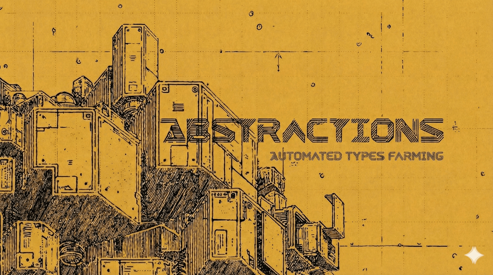
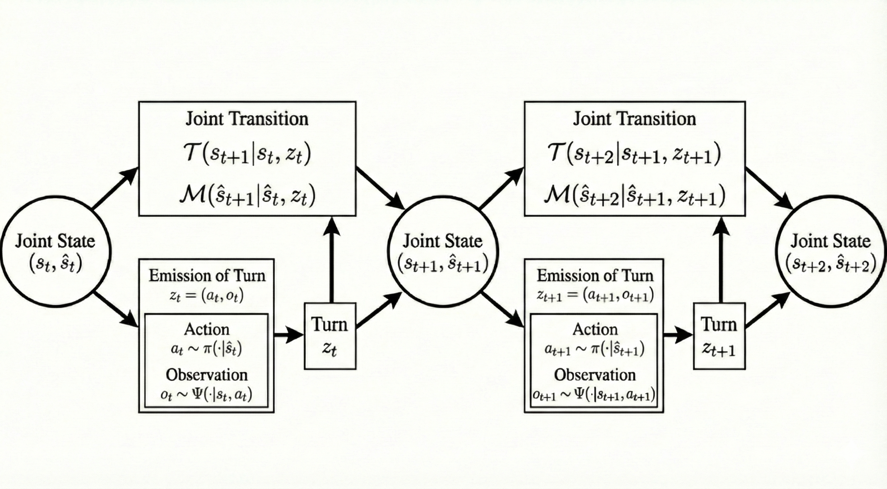

# Learning World Models from Agentic Traces

### tags: @vision @abstractions

## Introduction

With this blogpost I want to start demystifying the relationship between LLMs and agency. Like many others, I got my first aha moment with language models thanks to AI Dungeon. I had already worked on LSTMs for text generation during my internships at AWS a few years prior, but the relatively coherent ability of GPT-2 to simulate a dungeon-crawling video game was too interesting to ignore. 

Of course the general understanding was that having the model pretrained on a large amount of fantasy books and RPG manuals, an initial story prompt, and the user input were enough for the model to autocomplete something somehow cohesive. In retrospect, what I find prescient was how the human-GPT alternation ended up creating an agentic boundary. The simple trick of anchoring human inputs to the presumably consistent protagonist's actions was enough for the generations to be naturally interpreted as the environment's responses to those inputs. While surprising, this boundary was quite feeble. It was far too easy for the human to modify the state of the environment by simply stating facts as part of its actions, and the AI would way too often attempt to take actions on the protagonist's behalf.

Nonetheless, we had a clear example that LLMs could be used as world models of potentially infinite reinforcement learning environments. Given that the duality between world modeling and agency is a rabbit hole I can't seem to escape, I will argue that the ability of language models to implicitly internalize world models from agentic traces is what makes them a powerful substrate for building agents. A corollary of this interpretation is that the modern success of assistant-models that use sophisticated chat-templates and various regimes of gradient-masking is due to the precise reinforcement of this agentic boundary. Similarly, many of the systematic failures of modern LLM agents can be traced to the laser-focus of post-training techniques on optimal Markovian decision making overshadowing the world modeling aspect. 

We will start with a few toy examples to ground the discussion and show how transformers implicitly learn world models from agentic traces. Then we will formalize the problem in depth using some results from Computational Mechanics linking autoregressive stochastic processes and Partially Observable Markov Decision Processes (POMDPs). Finally we will discuss the relationship between goal directedness, state coverage and world model accuracy.

### Learning to Please the Gods Studying a Drunken Pythia

We start with a light-weight toy example inspired by the identity-not channel in computational mechanics. In the channel there are two modes. In the identity mode the output matches the input. In the not mode the output flips the input. The mode itself toggles every turn. The agent chooses the input each turn, so the evolution is controlled in the simple sense that what happens next depends both on the hidden mode and on the agent’s current act. 

*On a mountain there is a shrine to two gods, one loyal and one a trickster. The statue has two plates, one marked offering and one marked nothing, and an omen returned after each turn is the only public signal of which god currently guards the shrine. The loyal god returns offering with blessing and nothing with curse, while the trickster returns nothing with blessing and offering with curse; after each turn the satisfied guardian departs and the other takes the watch. An old and drunken pythia serves the shrine by choosing between offering and nothing at random. She has done this for decades and still does not understand the pattern. To make matters worse, after one hundred turns the gods go on vacation for a week, the shrine falls silent, and when it returns it simply begins glowing again, ready for offering, and there is no way to know which guardian has come back to the post.
She no longer knows whether blessing means the loyal god who mirrors the act or the trickster who inverts it, so she gave up trying to reason it out. We study the problem from the perspective of her disciple, who has observed this behavior for years and will soon take over. She wants to please the gods as well as possible and asks what can be inferred from the drunken policy to recover the correct strategy.*

We use the shrine as a toy environment. Each turn is a pair $z_t = (a_t, o_t)$ with $a_t$ the act (offering or nothing) and $o_t$ the omen (blessing or curse). The shrine has a hidden two-mode state $s_t \in \{0,1\}$, read as loyal versus trickster. Saying the update is controlled means the next omen is produced from the current act together with the current guardian, and the guardian for the next turn is determined by what just happened. In compact form,
$$
s_t = \mathbb{1}[a_{t-1} = o_{t-1}], \qquad o_t = a_t \oplus s_t.
$$
Here $s_t=0$ is loyal and $s_t=1$ is trickster, so $o_t=a_t$ under loyal and $o_t\neq a_t$ under trickster. This also implies the period-2 alternation $s_t=\neg s_{t-1}$ since $o_{t-1}=a_{t-1}\oplus s_{t-1}$.

Inputs alone do not suffice and outputs alone do not suffice. The joint pair $(a_{t-1}, o_{t-1})$ fixes the mode for the step, and once the turn $(a_t, o_t)$ is realized the environment updates unifilarly. This matches the agentic trace view above. The agent proposes $a_t$. The shrine emits $o_t$ given $s_t$ and $a_t$. The minimal predictive latent the model must carry is the phase $s_t$.

To keep runs independent we add a renewal. After one hundred turns the gods leave for a week and the shrine falls silent. When the shrine restarts it simply begins glowing again, ready for offering, and the guarding mode is drawn as $s_0 \sim \text{Bernoulli}(1/2)$. That draw sets the phase for the new epoch. Within an epoch the one step joint history $(a_{t-1}, o_{t-1})$ together with the current act is sufficient to predict $o_t$ and to update $s_t$.

### My Years as a Drop-Rate Analyst in the Tiger Gacha Dungeon

*In a dungeon there is a chamber with two identical doors. Behind one waits a tiger, behind the other a chest of gold. The tiger makes no sound and the doors give no indication. An adventurer can press their ear to the stone and listen; the acoustics carry a faint hint of which side holds danger, though the echo misleads roughly one time in six. Listening costs torchlight and time. Opening a door ends the expedition, gold meaning triumph and tiger meaning the evident alternative.
A young bag-carrier has spent years hauling equipment through this chamber, watching adventurers make their choices. Some were reckless and opened a door on instinct. Some were cautious, listening several times before committing. A few seemed to know exactly when they had heard enough. She wrote down every action and every outcome in a worn notebook. After enough expeditions she no longer carries bags. She sits at the dungeon's entrance and advises those who ask. The question we study is what structure in her notebook could support such advice, and whether a model trained on these varied records could learn when to listen and when to act.*

### Empircal Section
There will be training of transformer on pythia data and probes towards hidden state as well as reinforcement learning experimetnts starting from random, pretrained-frozen, pretraiend fionetuned models. We should be able to show that we can easily reach optimal behavior from this simple setup. 
 

### The POMDP Frame or When is a System Agentic?

We start by asking in what sense a dynamical system can be said to be agentic, and what latent structure can be recovered from the system’s measurable behavior when this assumption holds.
Agency developed historically as a model of what separates humans from the rest of physical matter, and more recently as a model of what makes a system intelligent. Being humans, we inherently perceive a separation between what we are as a mind, the agent, and the thing-in-itself we live in, the environment. This dualism seems to clash with our understanding of reality as a local physical process, yet it is reconciled in modern science as a conditional independence, or causal, structure that appears when we measure the world at a coarse enough scale. If we zoom out sufficiently, we can see how the states inside the agent are causally independent of the states in the environment given the information that leaks in at the boundary between them. We can think of this as the agent’s perceptual channel. Conversely, we can see how the state of the world is conditionally independent of what goes on inside the agent given the information that leaks out at the boundary, which we can call the causal or action channel.

Make the physical example concrete. Imagine a room with a robotic arm at a keyboard connected to an Atari console, a Raspberry Pi running the controller, and a camera watching the Atari’s monitor. We can leave the robot in the room until it learns to play the game at the best of its capacity, the we start measuring.
If all we can monitor in that room are keypress events and camera frames, those two streams are our entire window into the dynamics at this resolution. Continuous time effectively unfolds in turns: a keypress is an action, the game produces pixels as a response, and the cycle repeats.

Given these measurements, we could be tempted to build a complete bottom-up model of the room, starting from silicon steering electrons through transistors, up to the motor drivers and linkages that move the arm, and down again to the specific software implementation of the game and the hardware it runs on. That would be a daunting task, and it would change if the same behavioral input were generated by a different robot or if the game were implemented on different hardware. Thankfully, none of these details change the coarse-grained causal boundary between agent and environment. Given the keys that were pressed, the game’s next internal update does not depend on the Pi’s microstate; given the pixels that hit the camera, the Pi’s next update does not depend on the game’s microphysics. The decomposition between agent and environment gives us the structure to describe a stochastic generator of the measurement process that is invariant to the microscopic details of the system.

In this sense, it is useful to speak about an agentic system when its measurable behavior can be decomposed into two components: actions and observations, each defining a clear causal boundary, or Markov blanket, between the environment and the agent. In this section, we formally derive the POMDP frame as a decomposition of an autoregressive stochastic process into two stationary components. This setup allows us to connect the dots with our understanding of LLMs as approximators of autoregressive stochastic processes, yielding insights into what an LLM trained on agentic traces would learn.

### Agentic Traces as an Autoregressive Stochastic Process

To make our discussion formal, we start from reviewing the general language of POMDPs to define the macro-level agent-environment interaction. In practice modelling a system as a POMDP corresponds to assuming a specific decomposition of the observable process, or agentic-trace, $Z$ into a sequence of turns $Z = \{z_1, z_2, \ldots, z_T\}$, where each turn $z_t \in \mathcal{Z}$ is a tuple $(a_t, o_t)$ of an action $a_t$ and an observation $o_t$. Intuitively the action $a_t$ in $\mathcal{A}$ defines the component of the observable turn that is causally controlled by the agent, while the observation $o_t$ in $\mathcal{O}$ defines the component that is causally controlled by the environment conditioned on the agent behavior. The sets $\mathcal{A}$ and $\mathcal{O}$ decompose the degrees of freedom of $z \in \mathcal{Z}$ into the product $\mathcal{A} \times \mathcal{O}$.

Then we assume that the probability of the next joint turn $z_{t+1} = (a_{t+1}, o_{t+1})$ is only conditioned on the current environment and agent hidden states, respectively $s_t$ and agent's $\hat{s}_t$, and the agent's parameters $\theta$, defining a joint stochastic process with emissions $P(z_{t+1} \mid s_t, \hat{s}_t; \theta)$ whose temporal dynamics are modeled by the recurrent transition $P(s_{t+1}, \hat{s}_{t+1} \mid s_t, \hat{s}_t, z_{t+1}; \theta)$. Or explicitly with respect to actions and observations $P(a_{t+1}, o_{t+1} \mid s_t, \hat{s}_t; \theta)$. In a POMDP it is possible to further decompose this joint process into the environment's emission kernel $P(o_{t+1} \mid s_t, a_{t+1})$ and its emission-conditioned transition kernel, $P(s_{t+1} \mid s_t, a_{t+1}, o_{t+1})$, together with the agent's policy $\pi(a_{t+1} \mid \hat{s}_t; \theta_\pi)$ and the agent's state transition kernel $\mathcal{M}(\hat{s}_{t+1} \mid \hat{s}_t, a_{t+1}, o_{t+1}; \theta_{\mathcal{M}})$, with parameters $\theta = (\theta_\pi, \theta_{\mathcal{M}})$. This choice yields a unifilar latent update at the environment level: once $s_t$, $a_{t+1}$, and the realized $o_{t+1}$ are known, the distribution over $s_{t+1}$ is conditionally concentrated along a single causal branch consistent with that symbol. 

The emission of the next turn decomposes into agent action selection and environment observation emission:
$$
P(z_{t+1} \mid s_t, \hat{s}_t; \theta) = P(a_{t+1}, o_{t+1} \mid s_t, \hat{s}_t; \theta) = \pi(a_{t+1} \mid \hat{s}_t; \theta_\pi) \cdot P(o_{t+1} \mid s_t, a_{t+1}).
$$
This is the macro interface where the agent proposes $a_{t+1}$ and the environment commits to a symbol $o_{t+1}$ that will also drive the unifilar update of its hidden state.

Given the emitted turn, both hidden states update according to their respective transition kernels:
$$
P(s_{t+1}, \hat{s}_{t+1} \mid s_t, \hat{s}_t, z_{t+1}; \theta) = P(s_{t+1} \mid s_t, a_{t+1}, o_{t+1}) \cdot \mathcal{M}(\hat{s}_{t+1} \mid \hat{s}_t, a_{t+1}, o_{t+1}; \theta_{\mathcal{M}}).
$$
Here the unifilar dependence of $s_{t+1}$ on $(s_t, a_{t+1}, o_{t+1})$ guarantees that the latent path is synchronizable from the turn process in the sense used in computational mechanics.

Combining emission and transition dynamics, the complete joint update for each turn $z_{t+1} = (a_{t+1}, o_{t+1})$ becomes:
$$
P(z_{t+1}, s_{t+1}, \hat{s}_{t+1} \mid s_t, \hat{s}_t; \theta) = P(z_{t+1} \mid s_t, \hat{s}_t; \theta) \cdot P(s_{t+1}, \hat{s}_{t+1} \mid s_t, \hat{s}_t, z_{t+1}; \theta).
$$

Which expands to the full factorization $P(a_{t+1}, o_{t+1}, s_{t+1}, \hat{s}_{t+1} \mid s_t, \hat{s}_t; \theta)$:
$$
\pi(a_{t+1} \mid \hat{s}_t; \theta_\pi) \cdot P(o_{t+1} \mid s_t, a_{t+1}) \cdot P(s_{t+1} \mid s_t, a_{t+1}, o_{t+1}) \cdot \mathcal{M}(\hat{s}_{t+1} \mid \hat{s}_t, a_{t+1}, o_{t+1}; \theta_{\mathcal{M}}).
$$

For a complete trajectory $Z = \{z_1, z_2, \ldots, z_T\}$ with $z_t = (a_t, o_t)$, the joint probability over all turns and hidden states given the agent parameters $\theta$ is:
$$
P(Z, s_{1:T}, \hat{s}_{1:T} \mid \theta) = P(s_1, \hat{s}_1) \cdot P(z_1 \mid s_1, \hat{s}_1; \theta) \cdot \prod_{t=1}^{T-1} P(z_{t+1}, s_{t+1}, \hat{s}_{t+1} \mid s_t, \hat{s}_t; \theta).
$$

For a given agent, marginalizing over the hidden states gives the observable sequence probability:
$$
P(Z \mid \theta) = \sum_{s_{1:T}, \hat{s}_{1:T}} P(s_1, \hat{s}_1) \cdot P(z_1 \mid s_1, \hat{s}_1; \theta) \cdot \prod_{t=1}^{T-1} P(z_{t+1}, s_{t+1}, \hat{s}_{t+1} \mid s_t, \hat{s}_t; \theta).
$$

With the latest formulation we can effectively define the likelihood of our data conditional on a generative model that can be effectively compartmentalized into a parametrized agent and a stationary environment, that is an agentic system. 

### Learning from a Dataset of Agentic Traces

In the previous section we showed how a partially observable dynamical system can be decomposed into two stationary parts: a fixed environment and a parameterized agent. Now let's develop an intuition for what can be learned from data generated by that process. Assume the agent has converged to a stationary policy and we can sample a large dataset of agentic traces $Z=\{z_1,\ldots,z_T\}$ with turns $z_t=(a_t,o_t)$. The question is simple: what is the informational relationship between the generator's hidden states $(s_t,\hat s_t)$ that produced a given $z_t$ and the internal state $h_{\theta_G}(z_{<t})$ of a strong autoregressive predictor $G(\hat z_t\mid z_{<t};\theta_G)$?

There are two standard ways to model hidden stochastic processes.

**Belief over latent state.** We put a probabilistic model on the world and filter observations into a belief over the joint latent state
$$
b_t(s,\hat s)=P(s_t=s,\hat s_t=\hat s\mid a_{1:t},o_{1:t})
$$
After a new turn $(a_{t+1},o_{t+1})$ the belief updates with Bayes: 
$$
 b_{t+1}(s',\hat s') \propto \sum_{s,\hat s} b_t(s,\hat s)\,\pi(a_{t+1}\mid \hat s)\,P(o_{t+1}\mid s,a_{t+1})\,P(s'\mid s,a_{t+1},o_{t+1})\,\mathcal M(\hat s'\mid \hat s,a_{t+1},o_{t+1})
$$
Under our setup the environment update is unifilar at the turn scale. Once $(s_t,a_{t+1},o_{t+1})$ are fixed, the next environment state $s_{t+1}$ is unique almost surely. This gives synchronization: as turns accumulate, the belief concentrates along the causal branches consistent with the observations for both the environment and agent states.

**Predictive state from data.** We can skip latent variables and learn a predictive state representation $q_t$ that summarizes the history by what it implies for future observations under future actions. For finite horizons $k$,
$$
P(o_{t+1:t+k}\mid a_{t+1:t+k}, z_{\le t}) = P(o_{t+1:t+k}\mid a_{t+1:t+k}, q_t)
$$
In practice it is enough to match the one step case and update $q_{t+1}$ deterministically from $(q_t,a_{t+1},o_{t+1})$. This is the world model view trained by next observation prediction.

These two views meet at the minimal predictive presentation. Among optimal nonlinear predictors of a stationary process, the $\varepsilon$-machine (and with inputs, the $\varepsilon$-transducer) collects histories that induce the same conditional futures into the same causal state. In the finite-state stationary case we care about, and under unifilarity, the history-based predictor is equivalent to a minimal unifilar generator. So the smallest sufficient predictive state you can build from data coincides with the smallest unifilar presentation of the turn process.

What does a strong autoregressive model have to encode to predict our traces. Recall the emission decomposition
$$
P(z_{t+1}\mid s_t,\hat s_t)=\pi(a_{t+1}\mid \hat s_t)\cdot P(o_{t+1}\mid s_t,a_{t+1})
$$
A good next turn predictor trained on $Z$ must internalize a predictive latent that is sufficient for after factors. Its internal state $h_{\theta_G}(z_{<t})$ needs to behave like a predictive state $q_t$: enough information about the history to produce the next action and to forecast the next observation in response to that action. Under unifilarity and stationarity this predictive latent aligns with the causal state of the $\varepsilon$-transducer at the level of turns.

Finally, what does this mean for a transformer trained on sequences of turns. In practice each turn is a tuple $z_t=(a_t,o_t)$. The natural training target is two step: first predict the action, then predict the observation given that action and the history. Concretely the model estimates
$$
P(a_{t+1}\mid z_{\le t}) \quad \text{and} \quad P(o_{t+1}\mid a_{t+1}, z_{\le t})
$$
The internal state right after emitting $a_{t+1}$ is a sufficient statistic of the agent side $\hat s_t$ for the purpose of the policy. The internal state right after receiving $o_{t+1}$ is a sufficient statistic of the environment branch $s_{t+1}$ for the purpose of predicting the next observation. This boundary effect also explains a mild separability we observe in practice. A single shared head can support both factors, but the logits factor by conditioning order: action logits depend mostly on the agent slice of the predictive state, observation logits condition further on the realized action and align with the environment slice. That is the concrete story of what a transformer trained on these sequences has learned. It has learned a predictive state that simultaneously supports an action policy and a world model at the level of turns, and it updates that state at the two natural boundaries of the turn, first at action time and then at observation time.

### Transformers as Sufficient Approximator

At this point we know what the right phenomenological model class is. For a stationary agent–environment process over turns, the best predictive summarizer of history is an unifilar sufficient process: a latent chain whose state is a sufficient statistic of the past for predicting the future, and whose update is deterministic given the current state and the next emitted symbol. The belief process over $(s_t,\hat s_t)$ is of this type. The history-based $\varepsilon$-transducer is of this type. In the finite-state unifilar case, belief states synchronize onto the generator and the causal states of the $\varepsilon$-transducer are information-equivalent to the belief states.

The remaining question is whether a transformer trained on turn sequences lands in this same class. For sequences shorter than its context window, it does.

A decoder-only transformer with finite vocabulary and context window implements a deterministic map
$$
z_{\le t} \longmapsto h_t(z_{\le t})\in\mathbb R^d
$$
from discrete histories to continuous hidden states. Under mild assumptions on initialization and training this map is almost surely injective over the space of prompts (Nikolaou et al., 2025). Once the map is injective, the hidden state and the history generate the same $\sigma$-algebra: each can be recovered from the other by some, possibly very ugly, measurable function. In particular, $h_t$ is already a sufficient statistic of $z_{\le t}$ for any property of the history, including prediction of future turns. This is true before training and after any finite amount of training; sufficiency here is a structural property of the architecture, not something that appears only in a convergence limit.

The latent update is unifilar as well. Given the current hidden state $h_t$ and the new turn $z_{t+1}$, the forward computation of the transformer returns a unique next state
$$
h_{t+1}=F(h_t,z_{t+1})
$$
There is no stochasticity inside the network; all randomness lives in sampling the next turn from the output distribution. Restricted to histories within its context window the transformer therefore defines an unifilar latent process over $(h_t)$ driven by the observed turns.

So the hidden process of a well-defined transformer on sequences of length at most $K$ is an unifilar sufficient approximator of the agentic trace distribution. We are back in the same model class as the belief chain and the $\varepsilon$-transducer. In that class, the computational mechanics story applies: there is a unique minimal unifilar sufficient presentation, and any other unifilar sufficient presentation factors through it by a many-to-one map. Concretely, there exists a coarse-graining
$$
\phi:\ h_t\mapsto \text{causal state}
$$
such that the induced causal-state process has the same predictive content as the history and evolves with the correct unifilar update. The transformer latent chain is then a higher dimensional invertible refinement that contains the minimal world model as a quotient.

The output heads tie this factorization back to behavior. For the action channel we have
$$
\ell_t^a = W_a h_t + b_a,\qquad P(a_{t+1}\mid z_{\le t}) = \operatorname{softmax}(\ell_t^a),
$$
and similarly for observations. These affine plus softmax maps pick out the predictive directions in latent space and collapse away null directions along which next-turn behavior does not change. The causal-state quotient identifies hidden states that are equivalent under all such predictive tests.

Seen this way, auxiliary losses that explicitly train a latent transition model in representation space, such as next-latent prediction (Teoh et al., 2025), are best read as regularizers on a structure that is already there. They do not create belief states or unifilarity. The transformer is already an unifilar sufficient approximator of the agent–environment process and already contains the minimal $\varepsilon$-transducer up to coarse-graining. What these losses can do is encourage the network to choose a simpler coordinate system on its latent process, in which the embedded world model and its update look more like a small recurrent dynamics and less like an arbitrary invertible encoding of the full history.

### Goal Directedness and State Coverage

Until now we only assumed a stationary behavioral policy, without any interpretation of its meaning or of how much of the environment’s causal structure it reveals. We now focus on how the agent’s parameters could have come to be in an optimal way, and study the relationship between behavioral policies and the environment state coverage they induce.

In general an agent’s actions are interpreted as goal directed, that is we read the behavior as an attempt to lead the world toward desired states. We formalize reward as a function on action-conditioned state transitions
$$
R:\mathcal S\times\mathcal A\times\mathcal S\to\mathbb R,\qquad (s_t,a_t,s_{t+1})\mapsto R(s_t,a_t,s_{t+1})
$$
which can equivalently be seen as a function on the edges of the transducer graph. For discrete reward classes, this induces an edge coloring.

Given parameters $\theta=(\theta_\pi,\theta_{\mathcal M})$ we interpret the agent's policy as its best attempt to maximize expected return over agent–environment traces $Z$:
$$
J(\theta)=\mathbb E_{Z\sim P(Z\mid\theta)}\Big[\sum_{t=1}^T R(s_t,a_t,s_{t+1})\Big]
$$
Learning becomes a dynamical process over parameter space, with an update operator $\Phi:\Theta\to\Theta$ and $\theta_{k+1}=\Phi(\theta_k)$. For example, gradient ascent
$$
\Phi(\theta)=\theta+\eta\nabla_\theta J(\theta)
$$
or any other optimization scheme. The reinforcement learning problem seeks a fixed point $\theta^*\in\Theta$ satisfying
$$
\theta^*=\lim_{k\to\infty}\Phi^{(k)}(\theta_0)=\arg\max_{\theta\in\Theta} J(\theta)
$$
Since $\theta=(\theta_\pi,\theta_{\mathcal M})$, we make explicit that optimization operates over the agent's policy and world model:
$$
(\theta_\pi^*,\theta_{\mathcal M}^*)=\arg\max_{\theta_\pi,\theta_{\mathcal M}}
\ \mathbb E_{Z\sim P(Z\mid \theta_\pi,\theta_{\mathcal M})}\Big[\sum_{t=1}^T R(s_t,a_t,s_{t+1})\Big]
$$
with trajectories generated by $\pi(\cdot\mid\cdot;\theta_\pi)$ and $\mathcal M(\cdot\mid\cdot;\theta_{\mathcal M})$, while the environment kernels $P(o_{t+1}\mid s_t,a_{t+1})$ and $P(s_{t+1}\mid s_t,a_{t+1},o_{t+1})$ are fixed. In practice we settle for local optima or stationary points with $|\theta_{k+1}-\theta_k|<\epsilon$.

Since we are interested in stationary policies and the environment channel is stationary by construction, we focus on the long-run behavior induced by a given policy when it exists. The short answer to what the agent must understand is well known. By the Good Regulator connection, to implement reward maximizing behavior the agent requires a sufficient representation of the environment hidden states on the portion of state space actually visited by the policy that achieves the optimum. We keep the PSR and belief-state view to relate the agent's internal state $\hat s_t$ and the environment state $s_t$. Since the reward $R(s_t,a_t,s_{t+1})$ is a function of the transition, a world model that predicts the environment's response and updates belief consistently with that transition can also predict reward and support optimal action.

Not all states have nonzero probability under the policy of interest. Given an initial state distribution $P(s_0)$, a policy $\pi$ may visit only a subset of states. We call this the coverage of the policy. Formally,
$$
\mathcal S^\pi=\{s\in\mathcal S:\exists t\ \Pr_\pi(s_t=s\mid P(s_0))>0\}
$$
When a stationary distribution exists we write
$$
d^\pi(s)=\lim_{t\to\infty}\Pr_\pi(s_t=s)
$$
Two related measures quantify breadth and uncertainty of visitation,
$$
H_\pi(S_t)=-\sum_{s} \Pr_\pi(s_t=s)\log \Pr_\pi(s_t=s),\qquad
H_\pi(S_{t+1}\mid S_t,A_t)
$$
Because the turn process is unifilar at this scale, the conditional entropy $H_\pi(S_{t+1}\mid S_t,A_t)$ concentrates the uncertainty into the leftover branches consistent with the emitted observation. Intuitively it counts how many outcome branches remain possible after fixing $(S_t,A_t)$, up to the identification that different observations can still map to the same next state.

These definitions let us state the target for an optimal world model without referencing reward. The world model with parameters $\theta_{\mathcal M}$ is trained to predict the next observation given action and internal state. Let $\hat P(o_{t+1}\mid a_{t+1},\hat s_t;\theta_{\mathcal M})$ be its emission. The objective is
$$
\mathcal L_{\mathcal M}(\theta_{\mathcal M})
=\mathbb E_{h_t,a_{t+1}} \Big[ D_{KL}\big( P(o_{t+1}\mid a_{t+1},h_t)\ |\ \hat P(o_{t+1}\mid a_{t+1},\hat s_t;\theta_{\mathcal M}) \big) \Big]
$$
implemented as cross entropy,
$$
\mathcal L_{\mathcal M}(\theta_{\mathcal M})
=-\mathbb E_{h_t,a_{t+1},o_{t+1}}\big[\log \hat P(o_{t+1}\mid a_{t+1},\hat s_t;\theta_{\mathcal M})\big]
$$
Given an accurate world model $\theta_{\mathcal M}^*$, policy optimization becomes
$$
\theta_\pi^*=\arg\max_{\theta_\pi}\ \mathbb E_{Z\sim P(Z\mid \theta_\pi,\theta_{\mathcal M}^*)}\Big[\sum_{t=1}^T R(s_t,a_t,s_{t+1})\Big]
$$
The principle is simple. Accurate state estimation enables optimal decision making.

Training the world model purely on on-policy data induces a clear importance-sampling relationship between the learned model and the policy. The data distribution is the one induced by $\pi$, so the learned predictor is most accurate on transitions with high probability under $\pi$ and can be weakly constrained on counterfactual branches. In other words, the effective model focuses on $\mathcal S^\pi$ and on the action branches actually tried. This is why coverage matters. Exploration strategies expand $\mathcal S^\pi$ and, in stochastic environments, can raise $H_\pi(S_t)$, which tightens the world model on more of the transition graph. Uniform random actions and $\varepsilon$-greedy policies guarantee coverage in the sense that every action branch receives nonzero probability, although they do not guarantee maximum state entropy.

Three common regimes make this trade-off explicit.

* Exploration. During training the agent balances exploitation with the discovery of rewarding states, expanding $\mathcal S^\pi$ and improving constraints on the model.
* Multi-policy learning. When one agent solves multiple tasks in the same environment, overlapping coverage sets make it natural to decouple reward from the world model and reuse a shared predictive representation.
* Goal-directed policies. When reward encodes only the desirability of a final state, the policy family lives on a common transition graph and searches for short paths between nodes of that graph.

When the learning objective requires coverage, the world model must approach a sufficient statistic of the environment, so that its internal state supports any policy defined on the transition graph. The same boundary logic from agentic traces applies. After emitting $a_{t+1}$ the internal state is sufficient for action selection. After ingesting $o_{t+1}$ it is sufficient for predicting future observations and for scoring the colored edge $(s_t,a_t,s_{t+1})$.

### Conclusion

I see in those rooms the first spurs of the ubiquitous turn-based behavior of today's chat-based assistants. The navigation of imaginary dungeons has been replaced with charting of the assistant's internal world, conveniently reshaped by RLHF to be as explorable as possible for humans.My understanding now is that if a model trained on predicting text in novels learns to produce agentic traces, maybe it is because the novels themselves are just entertaining agentic traces.