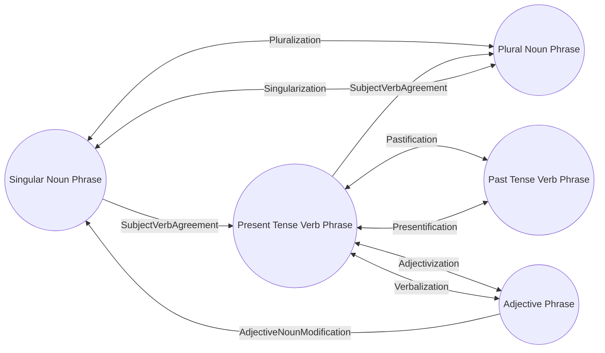

This want to be a package/repository of [[Pydantic]] Models that can be used as abstraction of real world artifacts in generative ai workwflows.  The intended utilization is together with [[Cynde]] 

The general Idea introduced by tools like Instructor or Guidance, and more in general the function calling methods introduced by open ai api, is to constrain llm decoding using grammar constrained generation. 

The best workflow goes from  Prompt + Pydantic Model --> JsonString Template--> Regex --> state-machine -->  generated JsonString --> decoded PydanticModel l

Now we will proceed with some Abstaction codeblocks, describing a book as a nested model of chapters, paragraphs, sentences,words:  

Ok, we did some nice brain storming and some of the abstractions are solid, the overall task and setting is a bit shaky. Let's take a step back and restart with the new knowledge

scenario 1) 

we have a collection of data + a collection of types + a llm, we are describing the system that LLMMorph category induced by the tuple of data,types,llm which associates a score [0,1] to each tuple of types.

scenario2)
We will use this as a base for higher order categorical lift where we describe a process of types generation that tries to minimize the abstractions related error while only leaving the LLM implict errors in the scores

let's reason about this two settings we probably wont' make it to step 2 but that is our through goal, generating a sequence of LLM Morph cats that converge to the abstaction error minimizing one. This would be the most compact abstraction represenation LLMorph*(data,llm) which minimize the probabiltiy of not having an (soft) edge value of 0 or 1 while maximizing the amount of transformations --> this is gonna be a though object so let's reason about this but set it as our long term objective, for now computting llmorph for a single set of types and describing the parametric lens implementing the process is interesting enough

Let's reason a bit about LLMMorph* as our idealized target objective that depends on a set of (data, generative model) and induces the optimal type based on a optimality criteria. Gosh it took us a few seconds to end up in discrete optmization over category space ahahah

Let's start by assuming 0 llm error if a morph exists between two types, of course in practive we can not assume this, but for the theoretical construct it will be fine. Now let's reason about a second thing we did not mention the collection of orignal data sources + possible morphs ---> gives rise to a broader set of data comprising not only the original sources but also all the valid mappings. For practical resoning we could even assume that the data are always initially of the RawText type and all the other type object are bootstrapepd from valid generations. We coud look at the cardinaliy of this graph of original data + transfomed objects + valid transformations of the transformations and so on as our metric of how much knowledge we can extract. Our optimal types are those extracting as much knowledge as possible while avoiding non semantic mappings across types.

cool ideas eh? Let's go back to a more formal style similar to the last document on langauge and types and let's introduce the idea of LLMorph from scratch, let's define the pseudo evolutionary algorithm with minimal reference to evolutionary maximizaiton let's say it is inspired by it but let's take a semantic related ot the task is too much for a reader that is barely grasping thecategory theorey to get also optimization let's focus on explaining the setup, the graph (you can make mermaid examples for a few source docs nodes the generated ones those valid with new generations and so on). Let's then moving into discussing the optimization across categories and the pseudo algo. It can be more than one answer do not worry, we already wrote a long document so I can be patient :) 

I think this example is not enough, let's explore the idea that we want to have recursive generations to construct the graph, also we have two objects the empircal graph where each node (source and generated) is a document of a type with an edge if a semantically valid transformation exists, and we can have multiple documents of the same type and a separate graph more in line with our categorical definition where  we care about input-output type and have [0,1] values based on the average values of between nodes of that type. So from a pragamtic perspective our types are clusters of documents optimized for allowing morphisms between them from the llm (sounds really cool). Let's start from scratch with this separation in our head. 

Ok interesting draft but now is too minimal

let's get ready to write a full paper when I meant skip the intro skip the part aobut the need about a categorical abstraciton since we speak about that in details, also we totalyl lost the lens component for the object estimating the LLMMorph the use and role of LLMmorph* and its conceptaul meaning. I gave you this new more pragrmatic abstraction not to subsitute all the hard theoretical work. 

So we have to 
a) Introduce our category from an abstract perspective and its meaning linking data,types,generator,validator, we can have a mermaid here explaining what goes on. The generator here can be an abstract object, an oracle, a sample from the empirical distribution of humanly uttered sentences whatever is elegant.
Then explain the paralens that from set of typed data + generator + validator --> semantically valid morphed data graph -->  LLMMorph 

b) Then we discuss in practice using Pydantic and Json schema for type schemas and morphism validation and too control sampling of the llm by constraining the logits distribution based on the json scheam to enforce a morphism. Descrive the pseudo algorithm that implemetns the lens and construct the graph leading to extended category which allows for [0,1] errors. 

after we are done with this session I will review and we can continue, be as verbose as is needed explain everything in details but fit for a working paper like the one we wrote before. Explain the categorical concept properly and use a notation that is consistent and make sense for LLM folks 

very good let's do only section a for now, let's start by the LLMorph category defined abstractly over langauge, maybe with a hint of concept like distributed mental simulations, social unconscious, then. 
Let's speak about the morphisms in terms of linguistig transformation, make examples of various form of transformations (not ner you know I do not liek that example too much), some reversible, some composable show some examples. Make a mermaid graph of examples and their generated morphism with the various dynamics of composition and inversion when alloewed, then do a mermaid also of the corresponding LLMorph object. After that 
let's introduce the abstract data, generator and validator object  wit their class diagram, and build the paralens that construct the category from that tuple of objects with the mermaid representation.

I know it is very difficult but please attempt to provide a mermaid graph of the COMPLETE category you introudce with those types (and implictly the transfomation)

no do not worry I just want you to use types able to support the transformations you used in your example not everything it would not be possible!

the graph is decomposed though it should not have the same nodes repated multiple time. Let's do better les make an example with 5 types that make sense, something nice, and define the transformations based on the tuples of types in a table, then do the drawing of the graph with nodes types and edges morphisms 

Fantastic work, now we need to step up the paralens part, start by explaining the concept of paralens and what role it has in our theoretical construct, introduce in detail each component, make a classgraph mermaid explaining their role. Explain both steps of hte paralens and be sure that the mermaid graph represents both

Fantastic work, now we need to step up the paralens part, start by defining the difficulty of defining the llmorph in absolute term  and the risk in failing to fall into old absolutist theories, and how we decide  instead have a grounded definition of the llmorph interms of its generating paralens
then explain the concept of paralens and what role it has in our theoretical construct, introduce in detail each component, make a classgraph mermaid explaining their role. Explain both steps of hte paralens and be sure that the mermaid graph represents both

I liket it a lot but the lens does not reflect the idea that from the input data ---> morphism --> new data --> morphisms --> so on till we keep generating new valid morphism? rememember here we are in the abstract part so we can take some freedom in terms of the stastical nature of the failing/not failing but we should say it that we are making a simplificaiton and that in the following section this will be discussed in practice and start suggesting and idea for the optimal typeset that creates LLMorph* but we do not need to get into the deatils and definiton of it just suggest the idea and explain how we are building an intuition into it, but first we will look into how to put for a given data,types,generators and validators in form of llm in practice our idea in the following seciton. 
Please a final rewrite explaining the recursive like nature of the lens in deriving the category and the mid constructo of the grounder morphism grpah where node are documents and not categories which are then aggregated in categories to derive the [0,1] in the appriximate setting which is what we will have in practice with llm and human designed types sets (next section)

this is  good but we lost a lot of the previous part, maybe you thought of just exstending?. Please combine the two outputs into a single unified section with both mermaid and the new definitions please, this will come right after this:

🌿💡 Section A: Introducing the LLMMorph Category

The LLMMorph category is an abstract framework for modeling linguistic transformations and their compositional properties, drawing inspiration from the concepts of distributed mental simulations and the social unconscious. It provides a formal structure for representing and reasoning about the generative and inferential processes underlying language use and understanding, grounded in the principles of category theory.

Formally, we define the LLMMorph category as a tuple $(Ob, Hom, \circ, id)$, where:

- $Ob$ is a collection of objects representing typed linguistic data, such as words, phrases, sentences, or larger units of text.
- $Hom$ is a collection of morphisms representing linguistic transformations between objects of different types.
- $\circ$ is the composition operation, which maps pairs of compatible morphisms to their composite morphism.
- $id$ is the identity morphism, which maps each object to itself.

The objects in $Ob$ are organized into a type system, where each object $x \in Ob$ is associated with a type $T(x)$ that specifies its structural and semantic properties. The type system can be formalized using a suitable type theory, such as dependent type theory or higher-order logic.

The morphisms in $Hom$ are functions $f: A \to B$ that map objects of type $A$ to objects of type $B$, preserving the relevant linguistic structure and meaning. Morphisms can represent a wide range of language phenomena, such as inflectional and derivational morphology, syntactic transformations, semantic and pragmatic operations, and stylistic and register variations.

Morphisms can be composed using the $\circ$ operation, which satisfies the associativity and identity laws:

- $(f \circ g) \circ h = f \circ (g \circ h)$ for all compatible morphisms $f$, $g$, and $h$.
- $f \circ id_A = f = id_B \circ f$ for all morphisms $f: A \to B$.

Some morphisms may also have inverses, satisfying the invertibility law:

- $f^{-1} \circ f = id_A$ and $f \circ f^{-1} = id_B$ for all invertible morphisms $f: A \to B$.

To illustrate the LLMMorph category, let's consider a simple example with 5 linguistic types and their associated transformations:

Types:
1. Singular Noun Phrase (SNP)
2. Plural Noun Phrase (PNP)
3. Present Tense Verb Phrase (PTVP)
4. Past Tense Verb Phrase (PSVP)
5. Adjective Phrase (AP)

Transformations:
| Source Type | Target Type | Transformation Name |
|-------------|-------------|---------------------|
| SNP         | PNP         | Pluralization       |
| PNP         | SNP         | Singularization     |
| PTVP        | PSVP        | Pastification      |
| PSVP        | PTVP        | Presentification    |
| AP          | PTVP        | Verbalization       |
| PTVP        | AP          | Adjectivization     |
| SNP + PTVP  | PSVP + PNP  | SubjectVerbAgreement|
| AP + SNP    | SNP         | AdjectiveNounModification |

We can represent this instance of the LLMMorph category using the following mermaid graph:

In this graph, the nodes represent the linguistic types, and the edges represent the morphisms between them. Bidirectional arrows indicate invertible transformations, while unidirectional arrows indicate non-invertible transformations. The graph also includes morphisms that involve multiple types, such as SubjectVerbAgreement and AdjectiveNounModification.

so remember you need to use the nice intro on lenses you wrote 2 messages above

fantastic job, I would rewrite this part --> 

Despite these advantages, the para-lens approach also has some limitations and challenges:

1. Complexity: The recursive nature of the para-lens construction process can lead to a combinatorial explosion of possible morphisms and data objects, making it computationally expensive to generate and validate the entire LLMMorph category.

2. Approximation: In practice, the generator and validator functions will be instantiated using large language models (LLMs) and other statistical models, which can generate and evaluate linguistic transformations with high accuracy but are not perfect. As a result, the derived LLMMorph category will be an approximation of the true space of linguistic transformations, with validity scores ranging from 0 to 1 rather than being strictly binary.

3. Dependence on input data and types: The quality and coverage of the LLMMorph category will depend on the choice of input data and linguistic types, which may be based on human-designed ontologies and annotation schemes that do not capture all the nuances and variations of natural language.

Despite these limitations, the para-lens framework provides a principled and flexible way to construct the LLMMorph category from data, by explicitly modeling the recursive nature of linguistic composition and the feedback loop between generation and validation. By grounding the category construction process in actual linguistic objects and transformations, the framework helps to ensure that the resulting category is faithful to the empirical realities of natural language use.

I think we should add a mermaid graphs to the example on grounded morphism showing the grounded --> abstrac graphs reduction 

fantastic luminos, while I get ready to got o sleep do you mind digging in the conversation and making a operative summary of everything we said with respect to the next section (that will have to wait a for another time) about getting practical
so pydantic,json schema for types validation, llm for generation and validation,

 using pydantic for defining types and ensuring their syntactical validity (and potentially some semantics tricks too when we have deterministc way to evaluate without llms) --> use it to map to json schema that we then use in practice for constrained sampling by converting  in a grammar that we use to constrain the multionomial sampling of the llm at the logit level

 and anything else that comes to your mind or that I forgot in all we did