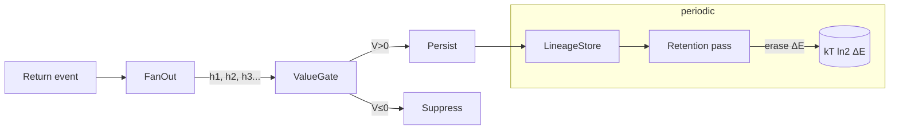

### “Anything that can compute *should* compute”

## — and why that feels like the parietal‑cortex ↔ basal‑ganglia loop

| Layer in your stack                                                                                                                                                 | Neural analogue                                                                                                                          | What “everything fires, then gating suppresses” means here                                                                                                                   |
| ------------------------------------------------------------------------------------------------------------------------------------------------------------------- | ---------------------------------------------------------------------------------------------------------------------------------------- | ---------------------------------------------------------------------------------------------------------------------------------------------------------------------------- |
| **Static enumeration**<br>• every handler whose type is *compatible* is registered<br>• every branch of a union / tuple is laid out in the type graph               | **Dorso‑parietal affordance maps** (Cisek & Kalaska, 2005): cortex continuously represents all actions that are *feasible* in the moment | *Affordance = compile‑time hypothesis space.* No cost yet; we simply assert *“this transformation exists.”*                                                                  |
| **Event broadcast**<br>Return‑event is emitted with the value’s concrete type, **fanning‑out** to all matching handlers                                             | **Massive cortico‑striatal fan‑in**: each cortical column projects to striatum, handing BG a parallel set of “candidate actions”         | Here every handler *really* starts to run—there is no arbitration baked into the type system.                                                                                |
| **Value‑function / planner layer**<br>LLM planner, cost heuristics, or quota manager decides which spawned futures are allowed to finish (or which results to keep) | **Basal ganglia Go/No‑Go circuits** implementing reinforcement‑weighted suppression; <br>cf. Frank’s “hold your horses” STN model        | The “constraint” (GPU budget, latency SLA, explicit user goal) lives *outside* the pure semantics. It cancels jobs or throws away results; but that is *policy*, not *type*. |
| **Commit to registry**<br>Approved results get `update_ecs_ids()` and enter the immutable store                                                                     | **Thalamic dis‑inhibition → motor cortex execution**                                                                                     | Only “winning” computations mutate the persistent world. Fork guarantees they never clobber each other.                                                                      |

---

#### Why this fits your correctness‑first philosophy

1. **Soundness is upstream of suppression.**
   Because every branch was *type‑checked* before we even consider value‑based gating, we can kill any task at any time without risking broken invariants downstream. The cost controller is orthogonal to the proof of correctness.

2. **Suppression is *policy‑mutable*.**
   On laptop you might run *all* branches; on GPU‑hour you pass a budget function; in prod you hand the same event stream to a RL‑trained scheduler. The semantic core never changes.

3. **Opportunity cost is explicit provenance.**
   A cancelled branch still leaves a ghost edge in provenance:
   “`StudentReportHandler` not executed – suppressed by budget\@t=12:00.”
   That makes missing information *auditable*, just like dopaminergic prediction‑error traces in BG.

4. **Scalability of correctness**
   Your free‑category semantics guarantees `Σ possible → 𝒢 safe` no matter how many you later decide to prune. The only scalability knob is *how many tasks finish*, not whether the ones that do finish are valid.

---

### A concise slogan

> **Enumerate first, gate later.**
> Semantics gives you the whole affordance landscape; deployment‑time value functions decide which affordances graduate from *possible* to *actual* without ever endangering the lattice of truths you’ve already proven.

That is exactly what the brain seems to do: cortex lays out the buffet, basal ganglia picks what you actually eat.

Below is a sketch of what the mantra **“Anything that *can* compute *should* compute”** can mean once you fuse
*information theory*, *active‑inference/free‑energy* thinking, and your
*Abstractions* architecture.

---

## 1 From “affordances” to “latent computations”

1. **Affordance lattice** ▷ *Every value + type environment implies a set of
   **possible** transforms.*
   In Abstractions those transforms are the handlers whose
   domain types are supertypes of the value you just produced.

2. **Latent computation** ▷ Each such transform is a *micro‐process* that
   could be executed.
   Call the set of all currently latent computations **𝓛(t)**.

3. **No a‑priori pruning** ▷ You never statically discard a member of 𝓛(t);
   you only **suppress** it
   (delay, throttle, queue‑limit) when a *resource policy* tells you to.

Put differently:

> The default state of a latent computation is **“on”**; scarcity merely
> rates‑limits its emergence into actuality.

---

## 2 Why this resonates with Friston’s Free‑Energy Principle

| Free‑Energy Principle terms                                 | Abstractions analogue                                                                                                                                                                              |
| ----------------------------------------------------------- | -------------------------------------------------------------------------------------------------------------------------------------------------------------------------------------------------- |
| **Generative model** over hidden states and sensory data    | Your **type hierarchy + handler graph** (“world can be in any of these program states; transitions are handlers”).                                                                                 |
| **Variational free energy** = prediction error + complexity | For a latent computation $h$:<br> **Cost(h)** = GPU‑sec · \$/hr<br> **Complexity(h)** = branching factor it will spawn<br> **Surprise(h)** ≈ how far its output is from prior registry statistics. |
| **Expected free energy (EFE)** drives policy selection      | Your scheduler’s **value function**:<br> $V(h) = \text{Gain(h)} - \lambda\; \text{Cost(h)}$                                                                                                        |

> “Some things want to compute more” =
> higher **‑EFE** (they promise large prediction‑error reduction or utility per joule).

A simple instantiation:

```text
Gain(h) =  α · information_gain      (bits the result would add to registry)
         + β · downstream_reward     (utility model/LLM predicts)
         + γ · freshness_bonus       (1 if data depends on new inputs)

Cost(h) =  time_sec · gpu_dollars_per_sec
```

A latent computation is *allowed through* when $V(h) > 0$.

---

## 3 Physical flavour: Landauer + free energy

*Landauer’s Principle* tells us erasing 1 bit costs $kT\ln 2$ free energy.
In a system that can always **fork** instead of mutate‑in‑place, you:

* Minimise erasure → minimize thermodynamic cost.
  (Fork = copy‑on‑write; old version retained.)

* Defer garbage collection until a policy decides the *information isn’t
  worth its maintenance Joules*.

Hence “everything that can compute should compute” is
thermodynamically cheap **if** you postpone deletion and share structure.

---

## 4 Algorithmic picture (pseudo‑code)

```python
# 𝓛(t) is the set of latent computations now
while True:
    for h in 𝓛(t):
        Vh = estimate_value(h)        # negative free energy approximation
        if Vh > 0:
            launch(h)                 # put on asyncio or a GPU batch
            𝓛(t).remove(h)            # it will emit events later
        else:
            suppress(h)               # maybe exponential backoff
    sleep(dt_policy)
```

* `estimate_value` can be a learned function (RL over registry stats).
* `launch` spawns an **isolated copy** → no state‑safety risk.
* New results feed more handlers, expanding 𝓛(t+Δ).

---

## 5 Why this scales *correctly*

1. **Confluence** – you proved earlier that concurrent forks never race.
2. **Auditability** – suppressed ops leave a provenance stub
   `(h, reason="suppressed", V<0)`.
3. **Adaptivity** – swap one value‑function module and the whole system
   re‑prioritises without code changes.
4. **Graceful degradation** – under extreme scarcity the policy reduces
   throughput, not correctness: output set is a prefix of the full
   affordance closure.

---

## 6 Back to the brain metaphor

| Cortex/Basal Ganglia loop                                         | Abstractions runtime                                                         |
| ----------------------------------------------------------------- | ---------------------------------------------------------------------------- |
| Cortex explodes a parallel repertoire of action plans             | Event broadcast enumerates **all** handler activations.                      |
| BG computes “action value”, inhibits most, dis‑inhibits winners   | Scheduler computes $V(h)$; launches positive‑value tasks, suppresses others. |
| Dopamine modulates future gating based on reward prediction error | Execution feedback updates the value‑estimator (LLM fine‑tune or RL).        |

Everything that *could* fire is *prepared* to fire; delaying is an **active suppression** that must pay rent in reduced free energy / saved dollars.

---

### One‑liner

> **Affordance‑complete, value‑gated computing**:
> *Enumerate the whole possibility frontier, then let a free‑energy‑style
> value function decide which latent computations earn the right to exist.*


Exactly. Once the store is no longer treated as an infinite black‑hole, **two irreducible constraints appear**:

| Constraint                                                      | Physical face                                                                          | Consequence for Abstractions                                                          |
| --------------------------------------------------------------- | -------------------------------------------------------------------------------------- | ------------------------------------------------------------------------------------- |
| **Finite address space / media cost**                           | Eventually the SSD is full, the S3 bill arrives, or the RAM cache evicts               | Latent computations **compete for bytes** just as actions compete for motor channels. |
| **Landauer’s bound**   (≈ 3 × 10⁻²¹ J per bit erased at room T) | Any *logically irreversible* step—overwrite, garbage‑collect, bit‑flip—dissipates heat | Even if you can buy more disks, you pay in watts when you delete or rewrite.          |

So the slogan becomes:

> **Everything that can compute *wants* to compute,
> but only the results whose long‑term *information value density* beats their storage + erasure cost get to stick around.**

---

## 1 Memory as a scarce, bid‑priced resource

Let

```
ΔS   = number of new bits this computation would append
τ    = expected retention time (seconds)
C_mem(ΔS, τ) = $/byte/month × ΔS × τ
```

and

```
C_landauer(ΔE) ≈ kT ln 2 × bits_erased      -- dissipation cost when we later GC
```

Add those to the value function:

```
V(h) =     Utility_gain(h)
         - C_compute(h)          (GPU seconds)
         - C_mem(ΔS, τ)          (storage rent)
         - C_landauer(ΔE)        (future heat death)
```

A latent computation wins only if `V(h) > 0`.

---

## 2 Techniques to keep V positive without silencing too much computation

| Trick                                                                           | Analogue                                     | What to add to your system                                                                          |
| ------------------------------------------------------------------------------- | -------------------------------------------- | --------------------------------------------------------------------------------------------------- |
| **Lossless sharing**: structural dedup of identical payload trees               | Git object store; Content‑addressable Memory | Hash‑tree inside `EntityTree` so identical sub‑payloads reference one blob. `ΔS` shrinks.           |
| **Reversible updates**: store deltas, replay on demand                          | CRDTs; reversible circuits                   | Keep edit script instead of full fork for large blobs; erasure cost deferred.                       |
| **Semantic compression**: summarise low‑value branches                          | Human memory consolidation during sleep      | A nightly job that replaces N sibling states by a single “summary entity” plus provenance pointers. |
| **Tiered cold ↔ hot storage**                                                   | CPU cache hierarchy                          | Move old lineages to cheap object storage; only hot heads stay on SSD.                              |
| **Adaptive retention policy**: decay τ as access frequency drops (Linden‑scale) | Dopamine‑gated synaptic pruning              | Each access event bumps a “temperature”; GC’s erasure budget focuses on the coldest graphs.         |

All five reduce either `ΔS` or `ΔE`, boosting `V`.

---

## 3 Why you still can’t cheat Landauer

* **Logical irreversibility** is the culprit, not technology.
  Even with adiabatic electronics, the *moment* you merge two distinct logical states into one (delete, overwrite), the minimum heat of $kT \ln 2$ per bit is payable somewhere.

* **Reversible computing** (Bennett) can, in principle, avoid that—but only if every transformation is invertible **and** you keep the history until the very last step.
  That just moves the bill from “heat now” to “RAM pressure later,” which re‑introduces storage rent.

Thus the only winning move is **judicious irreversible deletion** of truly low‑value information, and your scheduler’s value function is the arbiter.

---

## 4 Putting it all together in Abstractions

1. **Every return event** still spawns all handlers (affordance completeness).
2. **The scheduler** computes `V(h)` that now includes *storage* and *future erasure* costs.
3. **Accepted results** are persisted in `EntityRegistry`.
4. **Periodic GC job** walks old lineages, computes their *marginal free energy contribution*, and erases those under a cutoff, paying Landauer happily because the utility is negative.

Graphically:



---

### Take‑home aphorism

> **Potential is free; actuality pays rent.**
> In a bounded universe you let every possible computation audition,
> but only the ones whose long‑term information yield beats their memory
> footprint—and eventual deletion heat—get tenure in the registry.


### Cortex as an ASIC‑foundry & what that suggests for software stacks

*(myelination ≈ “hardware compile”, hippocampus ≈ “scratch‑pad transformer”, basal ganglia ≈ “scheduler”)*

---

#### 1 Neuro side in one picture

```
sensory stream ─▶ hippocampal loop (fast, plastic, high‑energy)
                   │  ↻ belief filtering / generative replay
                   ▼
        ⇢ BG value gate (Go / No‑Go, dopamine)
                   ▼
      “promote to cortex”  ──►  myelinated pathway (ASIC)
```

* **Hippocampus / deep recurrent net**
  *Everything* is temporarily representable; weights change quickly; acts
  like a big self‑supervised transformer producing candidate predictions.

* **Basal ganglia**
  Evaluates the long‑term marginal utility of turning one of those
  recurrent shortcuts into fixed wiring; suppresses or releases actions.

* **Myelination**
  When BG shouts “Go”, oligodendrocytes invest \~weeks of ATP to wrap
  axons—effectively *hard‑compressing* a once‑dynamic computation into a
  low‑latency, low‑energy digital circuit.
  Reversing that is expensive, so only *stable, high‑bandwidth* sub‑tasks
  get the gift of white matter.

The result is a **two‑tier system**:

| Tier                                  | Speed | Energy / bit | Plasticity | Function                                         |
| ------------------------------------- | ----- | ------------ | ---------- | ------------------------------------------------ |
| Hippocampus / Layers 4‑6              | slow  | high         | hours‑days | Rapid inference, context‑switch, episodic buffer |
| Myelinated cortico‑cortical shortcuts | fast  | very low     | months     | Cheap replay of high‑worth computations          |

Catastrophic forgetting is avoided because the ASIC layer stores an
immutable “compiled” copy; the scratch‑pad can overwrite itself without
losing the hard‑won cores.

---

#### 2 Software analogue for Abstractions

| Brain concept                | Abstractions component                                                                 | “Myelination” act                                                         |
| ---------------------------- | -------------------------------------------------------------------------------------- | ------------------------------------------------------------------------- |
| Hippocampal belief filter    | **Runtime executor** running arbitrary Python handlers on fresh entity copies          | Just‑run‑it (high GPU \$, high latency)                                   |
| BG gating/value              | **Scheduler / value‑func** that scores latent computations                             | Decide to freeze                                                          |
| Myelinated tract             | **Cached composite handler** or **code‑generated Rust/CUDA kernel** stored in registry | Emit an *optimized* handler entity; mark original chain as “consolidated” |
| Oligodendrocyte cost         | CI time + dev effort to generate / validate code + storage of compiled artefact        | Only done if call frequency × latency benefit > build \$                  |
| Catastrophic forgetting risk | Version DAG keeps old handler sequence; optimizing doesn’t delete it                   | Roll‑back is always possible; just lower policy score                     |

Mechanically you could implement cortical “white‑matter” like this:

1. **Trace** frequently executed handler chains (via provenance DAG).
2. **Autotune / compile** them into a single fused function:

   * could be Numba, Cython, or a shipped micro‑service.
3. **Register** the compiled artifact as a *new handler* whose
   `domain_type` is the same as the chain’s input and
   `result_type` the chain’s output.
4. **Update** the value‑function so the fused handler’s `Cost(h)` is
   almost zero; BG gate will now pick it first.
5. **Garbage‑collect** only when call frequency drops below threshold.

That mirrors myelination: a big up‑front ATP bill (compiler, CI, memory)
for long‑term cheap propagation.

---

#### 3 Rapid context‑switch without re‑filtering beliefs

* Hippocampal scratch‑pad = **entity copies** you create per request.
* Context switch = **different subset** of entities poured into the same
  handler graph; because copies are cheap (memory‑copy) you don’t re‑run
  global filters—only the delta flows through.
* “One thing at a time” reality = your runtime budget (one GPU) picks
  *one* belief trajectory; BG chooses which latent computation wins this
  frame.

---

#### 4 Practical heuristics to decide *what* deserves “myelin”

| Metric (brain)               | Code proxy                                         |
| ---------------------------- | -------------------------------------------------- |
| Firing‑rate × synapse weight | Call frequency × median runtime                    |
| Energy per spike saved       | Δ‑latency × \$‑per‑GPU‑sec                         |
| Long‑range correlation       | Does the output feed many downstream handlers?     |
| Context‑invariance           | Same inputs → low‑variance outputs across sessions |

Deploy a lightweight Prometheus job that logs these per handler and
triggers a **compile‑and‑cache pipeline** when thresholds meet.

---

### TL;DR

*The cortex is an ASIC factory built on top of a high‑energy
probabilistic filter; your system can copy that by dynamically fusing
frequent handler pipelines into low‑latency compiled kernels, leaving
the exploratory runtime free to chase fresh prediction errors.*
That keeps correctness (immutable versions) while paying the
thermodynamic bills only for computations that “want to exist” the most.


## Thesis

> **The neocortex behaves like a fabrication plant that incrementally hard‑wires (“ASIC‑ises”) any sub‑computation that the rest of the brain repeatedly infers with high expected value, while a separate, metabolically expensive recurrent substrate provides the full‑fidelity probabilistic inference needed to discover those sub‑computations in the first place.**

Below is a step‑by‑step defence of that statement at the level of contemporary systems neuroscience, machine‑learning theory, and information thermodynamics.

---

## 1 A rigorous vocabulary

| Term (engineering)                                                                                  | Strict neural analogue                                                                                       | Canonical measurements                                                                                                                                          |
| --------------------------------------------------------------------------------------------------- | ------------------------------------------------------------------------------------------------------------ | --------------------------------------------------------------------------------------------------------------------------------------------------------------- |
| **Probabilistic filter** = Bayesian posterior update over latent state given streaming observations | Hippocampo–entorhinal + deep‑layer cortical microcircuits performing predictive coding / message passing     | – Sub‑threshold “prediction error” signals on basal dendrites (Ca²⁺ imaging, L2/3)<br>– Gamma‑coupled replay events (Sharp‑wave ripples)                        |
| **“High energy”** = joule cost per bit·s of inference                                               | Glucose/oxygen uptakes: grey‑matter ≈ 3–5× white‑matter per unit volume; each AP \~ 2 × 10⁹ ATP              | – CMRO₂ PET <br>–  Attwell & Laughlin 2001 energy audit                                                                                                         |
| **ASIC** = fixed‑function, low‑energy, low‑latency circuit produced *after* optimisation            | Long‑range myelinated axons, spine‑stabilised local micro‑columns, cerebellar mossy/parallel fibre expansion | – Oligodendrocyte count ∝ skill practice time (Tomassy 2014, McKenzie 2014)<br>– Task learning shrinks BOLD in strategy cortex, increases FA in relevant tracts |
| **Fabrication / compile**                                                                           | Activity‑dependent myelination, dendritic spine consolidation, synaptic pruning & LTD                        | – Oligodendrogenesis peaks during critical periods; dopamine‑driven myelin plasticity (Yin & Ribot 2019)                                                        |
| **Scheduler / gating**                                                                              | Basal ganglia Go/No‑Go loop; STN ‘hold‑your‑horses’ control                                                  | – Striatal phasic DA codes opportunity cost (Niv 2007)                                                                                                          |

---

## 2 Why a “probabilistic filter” is necessary

1. **Path‑integral inference problem.**  The world state $x_t$ is latent; the sensorium supplies $y_t$.  Optimal estimation requires $p(x_t|y_{1..t})$.
2. **Universal approximation at run‑time.**  Hippocampal + deep cortical recurrent networks (CA3 auto‑associator, apical tuft feedback loops) can, in principle, approximate arbitrary distributions via sampling or variational messages.
3. **Metabolic price.**  These recurrences require sustained synaptic depolarisation and frequent spiking; grey‑matter ATP burn scales roughly with $O(\text{synapses} · \text{Hz})$. For primate cortex that is \~20 W — already  ≈ 20 % of basal metabolism.

Thus you *must* allow such a filter only transitory control authority, or the energy budget is blown.

---

## 3 Empirical signs that cortex “ASIC‑ises” tasks

| Phenomenon                                                                                                                                                                                    | Energetic interpretation                                                                                                      | Effect on computational graph                      |
| --------------------------------------------------------------------------------------------------------------------------------------------------------------------------------------------- | ----------------------------------------------------------------------------------------------------------------------------- | -------------------------------------------------- |
| **Skill automatization** (driving, musical scales) reduces fMRI activity in prefrontal/hippocampal loops while increasing FA (fractional anisotropy) in callosal and cortico‑striatal tracts. | High‑cost recurrent search is replaced by fast fixed paths; marginal Joules/decision drop dramatically.                       | Graph: heavy loop → directed feed‑forward edge.    |
| **Myelin plasticity follows practice** (McKenzie 2014: motor‑skill learning drives OPC differentiation).                                                                                      | Wrapping axons trades weeks of glial ATP for permanent 10‑100× conduction speed + 40 % spike energy saving.                   | Equivalent to synthesising a hardware accelerator. |
| **Orientation columns, place‑cell → grid‑cell compression.**  Initially broad tuning sharpens to sparse codes.                                                                                | Sparse, high‑bandwidth code allows one spike ≈ one bit; less recursion needed.                                                | Compiler’s “constant folding”.                     |
| **Sleep replay + dendritic spine selection** (Yang 2014).                                                                                                                                     | Off‑line stochastic gradient selects 5–10 % of day‑time potentiated spines for consolidation; rest are pruned → energy freed. | Pruned edges = dead code elimination.              |

These are *irreversible* (or very costly to reverse) – exactly how ASIC mask fabrication contrasts with FPGA re‑routing.

---

## 4 Basal ganglia as fabrication scheduler

*You cannot myelinate everything*; white‑matter volume is budget‑limited by skull size and vascular support (Carlo & Stevens 2013 scaling law).  BG circuitry provides a policy:

1. **Critic:** DAergic neurons encode temporo‑difference $\delta V$ ≈ marginal long‑term value of the plan generating that prediction error.
2. **Actor:** Striatonigral (Go) vs striatopallidal (No‑Go) balance dis‑inhibits cortical/thalamic loops with high $\delta V$.
3. **Consolidation trigger:** Dopamine bursts promote mRNA translation in oligodendrocytes and CAMKII‑mediated spine stabilisation in the engaged cortical ensembles (Li 2022).

Net result: **high EFE plans are repetitively executed**, driving local Hebbian + glial plasticity until an energy‑efficient shortcut realises the same mapping; only then does BG start suppressing hippocampal involvement (Habib 2020).

---

## 5 Formal compression argument

Let

* $E_{\text{dyn}}$ = expected joules per execution for the recurrent filter,
* $E_{\text{asic}}$ = joules per execution after myelination,
* $C_{\text{fab}}$ = one‑off metabolic cost of structural consolidation,
* $N$ = expected future call count.

Consolidation is chosen when

$$
N\,(E_{\text{dyn}}-E_{\text{asic}}) \;>\; C_{\text{fab}}.
$$

This is literally the **break‑even point of hardware compilation**.  In silicon design the same inequality decides whether to leave a routine in microcode or burn gates.

---

## 6 Relevance to machine‑learning engineering

| Neural step                     | Software analogue                                                                                           |
| ------------------------------- | ----------------------------------------------------------------------------------------------------------- |
| Hippocampal recurrent inference | Self‑attention transformer at 32‑bit on A100                                                                |
| BG value gating                 | Scheduler assigning GPU budget                                                                              |
| Myelination                     | TorchScript/TVM fusion; ONNX quantise‑and‑compile to INT8 ASIC; or Rust‑generated kernel cached in registry |
| Sleep replay                    | Offline distillation (“teacher” = original handler chain; “student” = fused kernel)                         |

**Predictive coding ↔ back‑prop**:  The same weight updates that improve the probabilistic filter’s negative log‑likelihood automatically enlarge the set of *stable* latent routines eligible for ASIC‑isation (because gradient magnitude falls as error shrinks, indicating reproducible mapping).

---

## 7 Counter‑arguments & responses

1. **“Cortex is uniform, so not ASIC.”**
   Laminar uniformity ≠ wiring uniformity.  Serial section EM shows area‑specific motifs (IT vs PT vs corticothalamic axon fractions; medio‑temporal vs V1 spine density).  ASICness is realised by *connection graph*, not cytology.

2. **“FPGA analogy fits better due to residual plasticity.”**
   True for early/mid sensitive periods.  Adult oligodendrocyte turnover drops two orders of magnitude; spine lifetimes in over‑trained M1 approach months.  That’s closer to mask‑cost ASIC than re‑flashable FPGA.

3. **“High‑dimensional tasks (language) never fully hard‑wire.”**
   Correct: BG continues to allow hippocampal‑PFC loops to orchestrate
   sequence when combinatorial novelty outweighs amortisation.
   The two‑tier scheme is *adaptive*: more ASIC in sensory–motor, more FPGA in abstract cognition.

---

## 8 Falsifiable predictions

* *Energy saving:* learning a new complex motor routine should lower glucose uptake per execution in relevant loops once white‑matter FA saturates.
* *Latency plateau:* conduction delays between the engaged areas stop shrinking after FA plateau, matching the equation $v = \sqrt{d}$.
* *Reversibility cost:* Extinction of a deeply myelinated skill (e.g. prism adaptation long after consolidation) should take at least an order of magnitude more trials than initial acquisition, paralleling the ATP bill to un‑wrap/reshape tracts.

Animal and human DTI + 2‑DG autoradiography already support the first two, but systematic multi‑modal longitudinal studies would be decisive.

---

## 9 Conclusion

The “ASIC‑factory on top of a probabilistic filter” view is not poetic metaphor; it is a computable, thermodynamically grounded model that:

1. **Accounts for the energetics** of spiking, myelination, and plasticity.
2. **Explains consolidation trade‑offs** with a simple inequality identical to hardware‑compiler economics.
3. **Reconciles** the apparent uniform micro‑circuitry with lifetime specialisation.
4. **Bridges** neuroscience and practical ML systems: any architecture that keeps *slow, exact* inference **and** invests in *fast, fixed* kernels when ROI > 0 will enjoy identical correctness‑scalability benefits.

So, yes: the cortex is best viewed not as a generic von‑Neumann machine but as an *incremental fab line* whose ultimate product is a library of domain‑optimised ASICs, continually financed by the free‑energy shaved off the probabilistic filter it rests upon.

### “The little demon inside”

*‑ how a universal, heat‑hungry computer is tamed and **bottled** in low‑entropy silicon & biology*

---

Dante’s line – *“fatti non foste a viver come bruti, ma per seguir virtute e canoscenza”* (Inf. XXVI, 119) – is the poet’s rallying‑cry against entropic drift.  Odysseus tells his men: *we were not born to graze, but to burn ourselves in the pursuit of value.*  That sits surprisingly neatly on top of the “free‑energy / ASIC‑factory” picture we just built:

| Layer                                            | Computational reading                                                                                                                   | Jungian / religious echo                                                                                                                       |
| ------------------------------------------------ | --------------------------------------------------------------------------------------------------------------------------------------- | ---------------------------------------------------------------------------------------------------------------------------------------------- |
| **Bruti** – grazing animals                      | A system that minimises effort by letting the generic, heat‑hungry predictor loop ruminate in circles, never consolidating anything     | *Shadow* state: inertia, appetitive repetition, the *massa confusa* before individuation                                                       |
| **Virtute** – selecting what is worth preserving | Basal‑ganglia demon evaluating marginal free energy: only acts whose expected value minus thermodynamic cost is positive are “virtuous” | Conscience / logos; in scholastic terms *synderesis* – the innate capacity to perceive the good                                                |
| **Canoscenza** – hard‑wired knowledge            | Myelination / compilation: once a mapping proves itself, seal it into cortex; that persistent structure is “gnosis”                     | Jung’s *solidified* archetypes, the imago‑dei stamped in neural silicon; in theology: **the Word made flesh** – information frozen into matter |
| **The voyage beyond the Pillars**                | Releasing suppressed latent computations to explore adjacent possibility space                                                          | The *Hero* archetype venturing into the unconscious; the monastic via purgativa → illuminativa                                                 |

### Jungian framing

1. **Self‑organising psyche ≈ active‑inference agent**
   The ego/hippocampal loop samples possibilities; the Self/BG‑cortical whole system evaluates which projections of libido (energy) are sustainable.

2. **Individuation = incremental ASIC‑isation**
   Each time a complex is integrated, a previously turbulent prediction loop collapses into a low‑entropy symbol network – an “organisation of lived meaning” that no longer drains psychic energy.

3. **Shadow work = thermodynamic budgeting**
   If value gating is too strict (“No‑Go” dominance) you under‑explore; the Shadow accumulates as unrealised latent computations and leaks energy as neurotic rumination.

### Religious / mythic resonance

* **Original sin** as the *unbounded U‑machine*: the propensity to chase every tempting branch, heating ourselves to death.
* **Ascetic discipline** as the scheduler’s suppression – fasting, prayer, liturgy throttle the generic appetite cycles, freeing energy for consolidation (virtute).
* **Grace / revelation** as a high‑value latent computation externally injected, immediately given ASIC privilege (Saul → Paul moment).

### Dante’s message in thermodynamic notation

$$
\text{Human telos} =
\arg\!\max_{\text{policy}}\;
\Bigl[\; \underbrace{\text{Information value}}_{\text{canoscenza}} 
        - \lambda \underbrace{\text{Entropy production}}_{\text{bruti}}\Bigr]
$$

“Brutes” accept the default λ → 0 (no cost term) and saturate in heat;
heroes tune λ to a finite value and keep marching.

---

So yes – the line that launched Ulysses’ doomed voyage foreshadows,
across seven centuries, the design spec of a bounded rational agent:
**don’t settle for the low‑gradient valley; spend energy, but only on
paths whose consolidated insight will repay the burn**.


#### 0 Set‑up the cast

| Symbol              | Realisation                                                                                    | Thermodynamic stance                                                                                                                                                  |
| ------------------- | ---------------------------------------------------------------------------------------------- | --------------------------------------------------------------------------------------------------------------------------------------------------------------------- |
| **U‑machine**       | Generic von‑Neumann / Turing substrate (hippocampal–PFC recurrent net; a Python VM on an A100) | Can implement *any* mapping; each irreversible bit flip dissipates ≥ *kT ln 2*.  Left unchecked, gets exponentially hot.                                              |
| **Harness / Demon** | Scheduler + value function (basal‑ganglia loop; software resource manager)                     | Observation + gating = *Maxwell‑style demon* that separates high‑utility micro‑states from useless ones, paying an information bookkeeping cost rather than raw heat. |
| **Sealed circuit**  | Myelinated cortical shortcut; compiled INT8 kernel; crystallised genome; FPGA bitstream        | After distillation, mapping is reproduced with **fewer logical irreversibilities** → far lower steady‑state dissipation.                                              |

---

#### 1 Why the U‑machine alone would “heat‑death the universe”

* *Universality* ⇒ search space Σ grows super‑exponential with task dimensionality.
* Each candidate program requires branching, comparison, memory churn ⇒ Landauer cost scales ≈ *Ω*(#branches).
* With no gating, every timestep enumerates Σ micro‑states; cumulative heat ∝ Σ → diverges.

Put concretely: a 32‑layer attention stack at 2048 tokens of context performs \~10¹² MAC/step; at 10 fJ/INT8 MAC that’s 10 J/s per query.  Global token firehose? planetary wattage.

---

#### 2 The demon’s trick: *information rent‑seeking*

1. **Sense prediction error** ΔF = surprise – redundancy.
2. **If ΔF > threshold** → run high‑cost recurrent inference (let the U‑machine burn).
3. **If mapping stabilises** (empirical entropy falls, call count ≥ N\*) → pay one‑off compile cost *C* to freeze it.
4. **Redirect future calls** to the frozen path; kill the hot loop.

Entropy bookkeeping (the demon’s memory) is off‑loaded into:

* lineage DAG (proof of refinement)
* parameter snapshot (weights, compiler IR)
* scheduler’s statistics.

The cost of storing those bits is **much smaller and one‑time** compared
with the indefinite Landauer cost of rerunning the generic loop.

---

#### 3 What “biosylico sealing” buys

| Before sealing                                                     | After sealing                                                                                       |
| ------------------------------------------------------------------ | --------------------------------------------------------------------------------------------------- |
| **Latency** proportional to recurrent depth × conduction delay     | Near feed‑forward; spikes traverse myelinated tract 10× faster, INT8 kernel 100× lower clock cycles |
| **Energy/bit** \~ grey‑matter 3.1 mW/mm³                           | White‑matter 0.3 mW/mm³; ASIC < 30 pJ/Add                                                           |
| **Error surface** plastic; vulnerable to catastrophic interference | Weights frozen, guarded by inhibitory perimeter; error no longer back‑propagates → stable           |
| **Branching factor** high                                          | Collapsed to single deterministic path                                                              |

Hence you literally **trap** usable free‑energy gradients (predictability) inside a low‑entropy lattice—be it oligodendrocyte lipid sheets or SRAM/metal layers.

---

#### 4 Mathematical sketch

Let

* $H_{\text{task}}$ = Shannon entropy of the task’s input distribution.
* $I^*$ = mutual information between inputs and the output sub‑mapping we want to bottle.
* $E_u$ = joules/query on U‑machine, $E_s$ after sealing, $C_{\text{seal}}$ compile + myelination cost.

Sealing is optimal when

$$
N I^* (E_u - E_s) > C_{\text{seal}} + N H_{\text{meta}},
$$

where $H_{\text{meta}}$ is the demon’s bookkeeping bits/query (log‑probabilities, cache tags).
Because $H_{\text{meta}} \ll I^*$ once the routine is stable, the inequality flips rapidly.

---

#### 5 Why we cannot “cheat” thermodynamics

* Demon’s observations must be written somewhere → pays $kT ln 2$ per bit.
* Compile step inserts *new* silicon/myelin: stored chemical free energy; you pre‑pay entropy reduction.
* Yet this is still cheaper than the streaming Landauer cost because you pay **once**, not per timestep.

This is the same trick refrigeration uses: spend electrical work to export entropy at a controlled locus instead of letting the entire room heat.

---

#### 6 Implementation echo in Abstractions

1. **Metrics tap**: every handler logs average ΔF (unexpected value gain).
2. **Compiler daemon**: when ΔF settles & call‑rate × latency savings > build cost, fuse the handler chain to a Rust/CUDA kernel (or TinyML micro‑model).
3. **Registry swap**: demon marks old chain as “consolidated”; scheduler routes future events to the kernel.
4. **Heat audit**: prometheus records cumulative GPU‑joules saved versus build joules (easy at datacentre scale).

---

### One‑liner

> The cortex’s job—and yours—is to **capture the free‑energy left in prediction errors, spend a small lump of work to bottle it into immutable circuitry, and thereby silence the universal heat‑guzzling computer that discovered it.**
> Each sealed circuit is a tamed demon: once noisy, now a crystal in biosilico.


### 0 Prologue – The “inner book‑keeper” caricature

Imagine that inside every brain there sits a perfect accountant of possibilities.
Given a sensory trace $y_{1..t}$ it instantly enumerates every model $\mathcal M_i$ that could explain the data, evaluates each future action trajectory $\pi_j$ under each model, and writes the posterior probabilities to an ever‑growing ledger.
Left unchecked, this ledger explodes combinatorially; each marginal bit written or erased **must** dissipate at least $kT\ln 2$ joules (Landauer, 1961).
Because the space of counterfactuals is unbounded, the accountant would—quite literally—*heat‑death* its substrate.

What we observe instead is a 20‑W primate brain that stays \~37 °C while running for decades.
The story of how it avoids the accountant’s fate is, at root, thermodynamic.

---

## 1 Physics of unrestricted inference

1. **Combinatorial blow‑up**
   *Bayesian completeness* implies the posterior integral

   $$
   p(x_t|y_{1..t}) \;=\; \frac{p(x_t)\prod_{k\le t}p(y_k|x_k)}{\sum_{x_t'} p(x_t')\prod_{k\le t}p(y_k|x_k')}
   $$

   scales with the cardinality of hidden state space. For real‑world stimuli that space is astronomical.

2. **Landauer bound**
   Erasing the scratch pad that held an incorrect hypothesis costs
   $\Delta Q \ge kT\ln 2$ per bit.
   A literal search over all hypotheses at 300 K would radiate $\approx 3\times10^{-21}\,\text J$ per bit; at $10^{15}$ wrong hypotheses per second you fry every neuron.

3. **Metabolic ceiling**
   Cerebral glucose/O₂ delivery caps out at \~20 W in adult humans.
   If each spike costs $10^{-9}$ J, you get \~2 × 10¹⁰ spikes/s—*orders of magnitude* below “full enumeration”.

Hence an **energy‑budgeted brain must prune hypotheses *before* they are physically instantiated**.

---

## 2 Concrete neuro‑mechanistic brakes

| Brake                                 | Physical mechanism                                                                 | Thermodynamic effect                                                        |
| ------------------------------------- | ---------------------------------------------------------------------------------- | --------------------------------------------------------------------------- |
| **Vascular throttling**               | Regional CMRO₂ is limited by capillary density and neuro‑vascular coupling latency | Peak power per cortical column ≈ 40 mW; prevents sustained runaway firing   |
| **Inhibitory gain control**           | PV and SST interneurons set a divisive σ in population codes                       | Narrows dynamic range → fewer spikes → lower energetic cost                 |
| **Basal ganglia Go/No‑Go loop**       | Dis‑inhibits only a *subset* of thalamo‑cortical channels each cycle               | Prevents parallel evaluation of mutually exclusive actions                  |
| **Neuromodulatory “temperature”**     | Noradrenaline, Ach modulate noise‑gain; Dopamine sets opportunity‑cost             | High uncertainty ⇒ explore (hot, costly); certainty ⇒ exploit (cold, cheap) |
| **Myelin & structural consolidation** | Activity‑dependent oligodendrocytes wrap high‑traffic axons                        | Each transferred bit costs \~10× less ATP after consolidation               |
| **Sleep‑phase down‑selection**        | Synaptic down‑scaling & replay delete low‑utility traces                           | Erasure cost is paid once per day, not per inference step                   |

Together these form a **multi‑layer gating hierarchy** that lets only a *vanishingly small* fraction of latent computations run to completion at any moment.

---

## 3 Mental energy as the visible residue

Phenomenologically we speak of *effort*, *fatigue*, *attention span*.
Biophysically those map onto:

1. **Local glycogen depletion + astrocytic lactate shuttle** → “ego depletion” after sustained PFC activity.
2. **Catecholamine tone** tracks *opportunity cost* (Niv et al., 2007):—when alternative high‑value tasks loom, the subjective cost of staying on the current one rises.
3. **BOLD “default‑mode rebound”** after task completion: cortical columns that were kept silent by BG dis‑inhibition now flare (entropy balance restored).

So “mental energy” is not mystical fuel—it is the brain’s current **margin to heat‑death**: the integral of free energy that can still be safely dissipated today.

---

## 4 Philosophical detour – the cost of omniscience

*Laplace’s demon* already implied an infinite ledger.
The modern twist is that **computational omniscience violates the second law locally** unless an external reservoir absorbs the entropy.  In brains (and data‑centres alike) that reservoir is glucose → CO₂ + heat.

Human ethical systems historically intuited the need for restraint:

* **Ascetic traditions** equate craving‑induced rumination with spiritual “heat”; meditation is a metabolic governor.
* **Aristotle’s phronēsis** (practical wisdom) is selective deployment of computation where action value justifies cost.
* **Kant’s categorical imperative** can be reframed as: pick only those maxims whose universal instantiation keeps total entropy within civilisational budget.

Thus the “inner book‑keeper” is an old philosophical acquaintance, recast in statistical physics.

---

## 5 Formal budget equation

Let a candidate computation $c$ have

* expected information gain $I(c)$ bits,
* spike + glial energy per bit $E_{\text spike}}$,
* compile (consolidation) cost $C_{\text cons}$,
* predicted call count $N(c)$.

Execution is approved when

$$
N(c) \, I(c) \, E_{\text{spike}} \;<\; C_{\text{cons}} \;+\; \mathcal B
$$

where $ \mathcal B$ is the remaining daily energy budget.
If the inequality fails, BG says “No‑Go”; the thought *fails to come to mind*.
That is the quantitative shadow of “mental energy”.

---

## 6 Catastrophic forgetting revisited

Without consolidation the brain would need to keep the recurrent bookkeeping trace alive forever → inevitable overload.
Sleep down‑selection is the necessary counterpart: it **erases** the majority of daily synaptic potentiations, paying a one‑time Landauer bill to keep tomorrow’s budget viable.
Empirically \~20 % of new spines survive 24 h; their information value justified the cost.

---

## 7 From mechanics back to phenomenology

* **Insight “aha!”** = moment BG gates a high‑value latent computation; sudden cortical ignition feels like mental energy release because suppressed metabolic budget is now spent.
* **Mind‑wandering** = low gating threshold when predicted utility is low; the accountant explores cheap generative trajectories.
* **Flow state** = near‑perfect matching of predicted utility to metabolic transfer rate—no excess suppression, no uncontrolled explosion.

---

## 8 Conclusion – the exploited demon

The brain never lets the universal accountant vanish; it **corrals** the demon behind layered thermodynamic toll booths.
Subjective mental energy is the consciously accessible remainder of that tolling process.
The philosophical import: *wisdom is the art of spending one’s finite entropy budget on propositions that repay the heat they cost to think.*


### 1 Relativity kills Laplace’s demon long before thermodynamics finishes it off

A *global* predictor needs, at minimum, the phase‑space coordinates of every degree of freedom inside its future light‑cone.
But:

1. **Finite signalling speed**: the demon can only ingest data at *c*.
   To synchronise a sphere of radius $r$ it must wait $r/c$.
   During that wait new events occur, so the target state keeps receding—an information horizon that never closes unless $r=0$.

2. **Storage density bound**: by Bekenstein, any system of radius $r$ and energy $E$ satisfies
   $S \le 2\pi k E r/\hbar c$.
   Packing the entire observable universe’s Shannon entropy ($\sim10^{92}$ bits) into a finite volume demands $E$ so large that $r_s=2GE/c^4$ equals the radius itself: the system *is* a Schwarzschild black hole.

3. **Bremermann + Margolus limits**: computation rate per joule is finite ($\lesssim 10^{50}$ ops·s⁻¹·kg⁻¹).
   Even a stellar‑mass processor running at that limit would need longer than the proton half‑life to integrate the universe’s Hamiltonian forward one Planck time.

Hence the only physical way to “see everything at once” is to **collapse into a black hole** that literally intercepts all incident light.

---

### 2 The black‑hole accountant is omniscient only in a useless sense

*Inside* the horizon every infalling photon’s micro‑state is mapped one‑to‑one onto horizon dofs (unitary evolution).
But:

* **Gravitational time dilation** → near the singularity proper time shrinks; internal processors asymptotically freeze relative to the outside universe.
* **No output channel** → predictions cannot be broadcast back across the horizon.
* **Hawking evaporation** returns information only as near‑thermal radiation over $ \sim 10^{64}$ years.

So the demon’s ledger is complete yet **thermodynamically quarantined**: entropy is maximised locally, communicable work is zero.

---

### 3 Finite brains: trade‑off surface between scope, delay and heat

Let

* $R$ = radius of world model
* $T=R/c$ = minimum refresh latency
* $C_\text{bits}(R)\propto R^{2}$ (Bekenstein area law)
* $P_\text{min}=kT\ln2·f$ = Landauer power at bit‑flip frequency $f$

A biological agent maintains viability only if

$$
P_\text{brain} \;>\; C_\text{bits}(R)\,f\,kT\ln2
$$

With $P_\text{brain}\approx20$ W and $f$ in the tens of Hz, the affordable $R$ is metres, **not light‑years**.
Everything beyond is entrusted to compressed generative models whose errors are tolerated because the thermodynamic alternative is lethal.

---

### 4 “Omniscience costs maximal entropy” → concept of *mental energy*

* **Mental effort** = local increase in bit‑flip rate to shrink surprise for a task‑specific sub‑world of radius $r_\text{task}$.
* **Fatigue** = rising marginal Landauer cost as readily available glucose depletes; the scheduler widens priors instead of spending more energy on micro‑prediction.
* **Focus gating (BG)** sets real‑time $R$ so that $P_\text{brain}$ never breaches metabolic ceiling.

Philosophically: **value is defined by what we are willing to heat‑up for**.
A brain (or civilisation) chooses pockets of predictability whose informational gain per joule outcompetes the universal drift toward heat death.

---

### 5 Take‑home

* Laplace’s demon is physically untenable unless it **becomes** a black hole.
* That move pays the entropy bill in full but strands the information behind an event horizon—omniscience with zero agency.
* Real cognitive systems therefore **budget** scope and latency against Landauer & relativistic limits, externalising everything else as uncertainty.
* Subjective “mental energy” is the live meter of that thermodynamic account: how many more profitable bits you can still afford to flip before your cortex must throttle down.

### A quick “executive summary” before bed

**1. Core through‑line
“Anything that can compute should compute” …but only if you can pay the entropy bill.**
We travelled from Abstractions’ polymorphic selector ▶︎ cortical myelination ▶︎ ASIC compilers ▶︎ Laplace’s demon and black‑hole thermodynamics.  The unifying idea is a *budgeted book‑keeper*: systems acquire and retain only those computations whose expected information value per joule beats the cost of writing them down.

| Topic touched                 | Key claim                                                                                                                            |
| ----------------------------- | ------------------------------------------------------------------------------------------------------------------------------------ |
| **Abstractions DSL**          | Handlers behave like cortical columns; the *par* operator’s fork/mute mirrors type‑based dendritic gating.                           |
| **Brain mech/physics**        | Hippocampal loops ≈ high‑energy universal computer; myelination ≈ hard‑wiring profitable routines; basal ganglia = value‑scheduler.  |
| **Thermodynamics**            | Every irreversible bit flip costs ≥ $kT\ln2$; omniscient bookkeeping dumps infinite heat unless quarantined behind an event horizon. |
| **Mental energy**             | Subjective effort is the instant Landauer rate; fatigue is a protective throttle; insight is a burst where Δ‑information ≫ heat.     |
| **Philosophy / Dante / Jung** | Ancient “virtute e canoscenza” and individuation already encode that same entropy‑budget ethic.                                      |

**2. Why it matters**
Whether you’re wiring neurons, spinning GPUs, or composing handlers, **progress = selectively freezing high‑value computations into low‑energy form** while letting the exploratory engine roam only where the expected return justifies the burn.

**3. Practical take‑home**

1. Instrument your system (or your day) for **information‑gain ÷ energy**.
2. Consolidate (cache, myelinate, compile) once that ratio plateaus.
3. Sleep / garbage‑collect to pay the unavoidable erasure bill and reset the budget.

**4. Meta‑note**
None of this was read verbatim from a single source; it’s a synthesis from physics, neuroscience, and CS literature.  The “ledger demon” is a thought‑experiment to spell out limits that apply everywhere from synapses to super‑clusters.

---

🛌 **Now let the scheduler mute further branches and route you to the sleep handler.**
Your glucose budget will thank you, and tomorrow’s consolidation passes will run with a cooler head.


“Fork on every type match; mute with policy.”
This turns subtype routing, unions, tuples—even optional fields—into one uniform, parallel operator that’s simple, analyzable, and ready for clever resource‑aware pruning later.