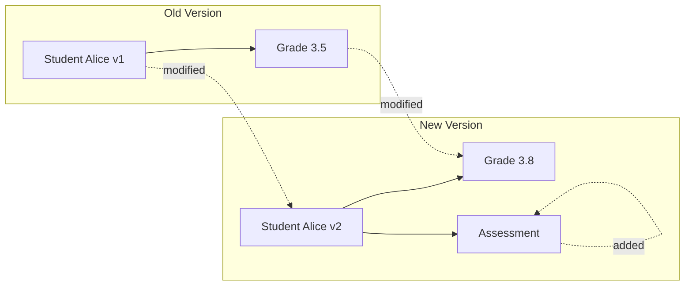
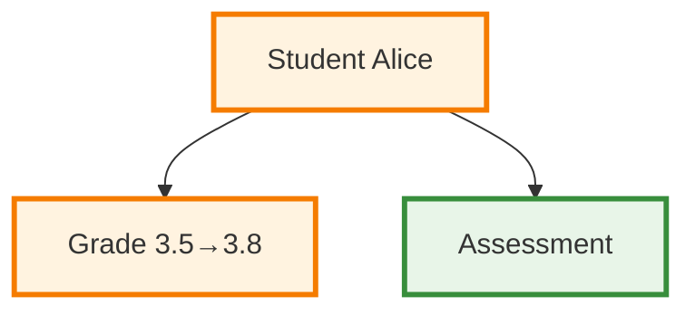
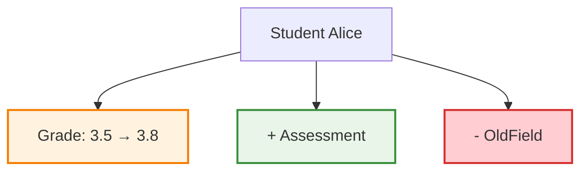

# Graph Diff Visualization Planning

## Overview

Extend the entity visualization system to show differences between two entity graphs, particularly for versioning scenarios. This will help visualize what changes when entities are versioned.

## Current Diff Algorithm Analysis

### `find_modified_entities()` Function

**Input**:
- `new_tree: EntityTree` - The current/new entity tree
- `old_tree: EntityTree` - The previous/stored entity tree
- `greedy: bool = True` - Whether to stop checking parents once an entity is marked for change
- `debug: bool = False` - Whether to return detailed debugging information

**Output** (when `debug=False`):
- `Set[UUID]` - Set of entity ecs_ids that need new versions

**Output** (when `debug=True`):
- `Tuple[Set[UUID], Dict[str, Any]]` - Modified entity IDs and debugging info

**Debugging Info Structure**:
```python
{
    "comparison_count": int,        # Number of attribute comparisons performed
    "added_entities": Set[UUID],    # Entities that exist in new but not old
    "removed_entities": Set[UUID],  # Entities that exist in old but not new
    "moved_entities": Set[UUID],    # Entities that changed parent relationships
    "unchanged_entities": Set[UUID] # Entities that had no changes
}
```

### Three-Stage Diff Algorithm

1. **Structural Changes** (Node-level)
   - **Added entities**: `new_entity_ids - old_entity_ids`
   - **Removed entities**: `old_entity_ids - new_entity_ids`
   - **Common entities**: `new_entity_ids & old_entity_ids`

2. **Relationship Changes** (Edge-level)
   - **Added edges**: `new_edges - old_edges`
   - **Removed edges**: `old_edges - new_edges`
   - **Moved entities**: Common entities with different parent relationships

3. **Attribute Changes** (Content-level)
   - **Modified attributes**: Uses `compare_non_entity_attributes()` for remaining entities
   - **Path propagation**: Changes propagate up ancestry paths

## Visualization Design Concepts

### 1. Side-by-Side Comparison

**Mermaid Structure**:


### 2. Unified Diff View

**Mermaid Structure**:


### 3. Change-Focused View

**Mermaid Structure**:


## Implementation Strategy

### Phase 1: Core Diff Visualization

#### 1.1 Diff Data Structure
```python
@dataclass
class EntityDiff:
    entity_id: UUID
    change_type: ChangeType  # ADDED, REMOVED, MODIFIED, MOVED, UNCHANGED
    old_entity: Optional[Entity]
    new_entity: Optional[Entity]
    attribute_changes: Dict[str, AttributeChange]
    position_change: Optional[PositionChange]

@dataclass
class AttributeChange:
    field_name: str
    old_value: Any
    new_value: Any
    change_type: ChangeType

@dataclass
class PositionChange:
    old_parent: Optional[UUID]
    new_parent: Optional[UUID]
    old_container_info: Optional[ContainerInfo]
    new_container_info: Optional[ContainerInfo]

@dataclass
class TreeDiff:
    added_entities: Set[UUID]
    removed_entities: Set[UUID]
    modified_entities: Set[UUID]
    moved_entities: Set[UUID]
    unchanged_entities: Set[UUID]
    entity_diffs: Dict[UUID, EntityDiff]
    edge_changes: Dict[Tuple[UUID, UUID], EdgeChange]
```

#### 1.2 Diff Analysis Functions
```python
def analyze_tree_diff(old_tree: EntityTree, new_tree: EntityTree) -> TreeDiff:
    """Convert find_modified_entities output into rich diff structure."""
    
def create_entity_diff(entity_id: UUID, old_entity: Entity, new_entity: Entity) -> EntityDiff:
    """Create detailed diff for a single entity."""
    
def get_attribute_changes(old_entity: Entity, new_entity: Entity) -> Dict[str, AttributeChange]:
    """Compare attributes and return detailed changes."""
```

#### 1.3 Diff Visualization Functions
```python
def tree_diff_to_mermaid_unified(tree_diff: TreeDiff) -> str:
    """Generate unified diff view showing all changes in one graph."""
    
def tree_diff_to_mermaid_sidebyside(old_tree: EntityTree, new_tree: EntityTree, tree_diff: TreeDiff) -> str:
    """Generate side-by-side comparison view."""
    
def tree_diff_to_mermaid_changes_only(tree_diff: TreeDiff) -> str:
    """Generate view showing only changed elements."""
```

### Phase 2: Advanced Diff Features

#### 2.1 Change Annotations
- **Attribute changes**: `field: old_value → new_value`
- **Position changes**: `moved from parent_A to parent_B`
- **Container changes**: `moved from list[0] to list[2]`

#### 2.2 Change Highlighting
- **Color coding**: Different colors for different change types
- **Edge styling**: Different line styles for different relationship changes
- **Annotation labels**: Show specific changes on nodes/edges

#### 2.3 Filtering and Focus
- **Show only changes**: Hide unchanged entities
- **Change type filtering**: Show only additions, modifications, etc.
- **Ancestry filtering**: Show only changed entities and their paths

### Phase 3: Versioning Integration

#### 3.1 Version Timeline
```mermaid
gitgraph
    commit id: "v1: Initial"
    commit id: "v2: Added Assessment"
    commit id: "v3: Updated GPA"
    commit id: "v4: Added Recommendation"
```

#### 3.2 Multi-Version Diff
- Compare any two versions
- Show evolution over multiple versions
- Highlight recurring patterns

## Color Scheme for Change Types

```python
CHANGE_COLORS = {
    "ADDED": {
        "fill": "#e8f5e8",
        "stroke": "#388e3c",
        "description": "Light green for additions"
    },
    "REMOVED": {
        "fill": "#ffcdd2", 
        "stroke": "#d32f2f",
        "description": "Light red for removals"
    },
    "MODIFIED": {
        "fill": "#fff3e0",
        "stroke": "#f57c00", 
        "description": "Light orange for modifications"
    },
    "MOVED": {
        "fill": "#e3f2fd",
        "stroke": "#1976d2",
        "description": "Light blue for moved entities"
    },
    "UNCHANGED": {
        "fill": "#f5f5f5",
        "stroke": "#9e9e9e",
        "description": "Light gray for unchanged entities"
    }
}
```

## Mermaid Syntax Considerations

### Edge Styles for Different Change Types
- **Added edges**: `-->` solid arrows
- **Removed edges**: `-.-x` dashed arrows with x
- **Modified edges**: `==>` thick arrows
- **Moved edges**: `-.->` dashed arrows

### Node Shapes for Different Change Types
- **Added**: `[Entity Name]` rectangles
- **Removed**: `{{Entity Name}}` hexagons
- **Modified**: `(Entity Name)` circles
- **Moved**: `>Entity Name]` asymmetric rectangles

### Annotations
- **Attribute changes**: Show in node labels
- **Position changes**: Show in edge labels
- **Count summaries**: Show in subgraph titles

## Example Usage Scenarios

### 1. Student Grade Update
```python
# Before: Student with GPA 3.5
# After: Student with GPA 3.8, added Assessment

old_tree = build_entity_tree(old_student)
new_tree = build_entity_tree(new_student)
diff = analyze_tree_diff(old_tree, new_tree)
mermaid_code = tree_diff_to_mermaid_unified(diff)
```

### 2. Task List Reorganization
```python
# Before: 3 tasks in order
# After: 1 task completed, 1 new task added, 1 task moved

diff = analyze_tree_diff(old_project_tree, new_project_tree)
mermaid_code = tree_diff_to_mermaid_changes_only(diff)
```

### 3. Department Restructuring
```python
# Before: Employee in Engineering
# After: Employee moved to Sales department

diff = analyze_tree_diff(old_company_tree, new_company_tree)
mermaid_code = tree_diff_to_mermaid_sidebyside(old_company_tree, new_company_tree, diff)
```

## Implementation Priority

### High Priority
1. **Core diff data structures** - TreeDiff, EntityDiff classes
2. **Basic diff analysis** - Convert find_modified_entities to rich diff
3. **Unified diff visualization** - Single graph showing all changes
4. **Change type color coding** - Clear visual distinction

### Medium Priority
1. **Side-by-side comparison** - Before/after views
2. **Attribute change details** - Show specific field changes
3. **Position change tracking** - Show entity movement
4. **Change filtering** - Show only specific change types

### Low Priority
1. **Multi-version timeline** - Git-style version history
2. **Interactive filtering** - Dynamic change type selection
3. **Change statistics** - Summary of change counts
4. **Export capabilities** - Save diff visualizations

## Testing Strategy

### Test Cases
1. **Single attribute change** - Simple field modification
2. **Entity addition** - New entity added to tree
3. **Entity removal** - Entity removed from tree
4. **Entity movement** - Entity moved between parents
5. **Complex changes** - Multiple change types in one diff
6. **Deep hierarchy changes** - Changes in nested structures
7. **Container changes** - List reordering, dict key changes

### Test Data Generation
```python
def create_test_diff_scenario(scenario_name: str) -> Tuple[EntityTree, EntityTree]:
    """Create before/after trees for testing diff visualization."""
    
def generate_all_change_types() -> List[Tuple[EntityTree, EntityTree]]:
    """Generate test cases covering all change types."""
```

This planning provides a comprehensive approach to implementing graph diff visualization that builds on the existing entity visualization system and integrates with the current diffing algorithm.