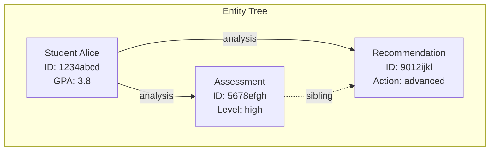
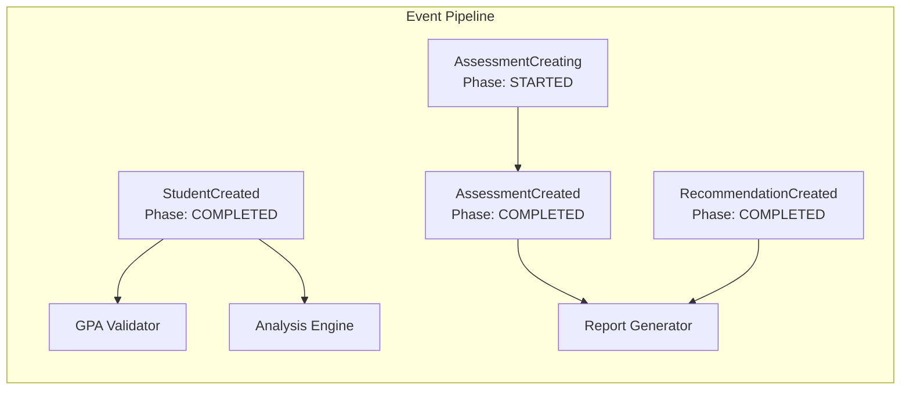

# Abstractions Visualization Layer Planning

## Overview
Create a comprehensive visualization layer for the Abstractions framework with Mermaid diagrams to represent:
1. Entity graphs (hierarchical trees)
2. Entity lineages (version evolution)
3. Event bus flow (event processing)

## Design Principles

### 1. Functional Architecture
- Pure functions: `entity -> mermaid_string`
- No side effects, easy to test
- Composable visualization components
- Clear separation of concerns

### 2. Hierarchical Tree Focus
- **No loops**: Entity graphs are strict trees (DAGs)
- **Parent-child relationships**: Clear ownership hierarchy
- **Container relationships**: Lists, dicts, tuples with proper indexing
- **Sibling relationships**: Entities from same function execution

### 3. Iterative Development
- **Quick rendering**: Built-in mermaid rendering for fast iteration
- **Test-driven**: Each visualization function thoroughly tested
- **Incremental**: Start with basic, add complexity gradually

## Updated Understanding from entity.py Analysis

### Core Entity Architecture
Based on comprehensive analysis of `/abstractions/ecs/entity.py`, the entity system has these key components:

#### Entity Class Structure
- **Identity Fields**: `ecs_id`, `live_id`, `lineage_id`, `root_ecs_id`, `root_live_id`
- **Versioning Fields**: `created_at`, `forked_at`, `previous_ecs_id`, `old_ids`, `old_ecs_id`
- **Provenance Fields**: `attribute_source`, `derived_from_function`, `derived_from_execution_id`, `sibling_output_entities`
- **Relationship Fields**: `output_index` (for tuple outputs)

#### EntityTree Structure
- **Nodes**: `Dict[UUID, Entity]` - Maps ecs_id to entity objects
- **Edges**: `Dict[Tuple[UUID, UUID], EntityEdge]` - Relationship metadata
- **Ancestry Paths**: `Dict[UUID, List[UUID]]` - Paths from entities to root
- **Live ID Mapping**: `Dict[UUID, UUID]` - Maps live_id to ecs_id

#### EntityEdge Types
- **EdgeType Enum**: `DIRECT`, `LIST`, `DICT`, `SET`, `TUPLE`, `HIERARCHICAL`
- **Container Metadata**: `container_index`, `container_key` for lists/dicts
- **Ownership Tracking**: `ownership` and `is_hierarchical` flags

#### EntityRegistry System
- **Five-dimensional storage**: tree_registry, lineage_registry, live_id_registry, ecs_id_to_root_id, type_registry
- **Immutability**: Deep copy with new live_ids on retrieval
- **Versioning**: Change detection with `find_modified_entities()`

### Existing Visualization
There's already a `generate_mermaid_diagram(tree: EntityTree)` function that creates basic tree diagrams. We need to:
1. **Enhance it** with better styling and container information
2. **Make it functional** - pure functions that take entities/trees as input
3. **Add rendering** capability for quick iteration
4. **Extend coverage** to lineage and events

## 1. Entity Graph Visualization

### Requirements
- **Input**: Entity (root) or EntityTree
- **Output**: Mermaid graph string
- **Structure**: Hierarchical tree diagram
- **Features**: 
  - Node styling by entity type
  - Edge labels for field names and container indices
  - Root node highlighting
  - Attribute display (optional)

### Mermaid Structure


### API Design
```python
def entity_to_mermaid_graph(entity: Entity, 
                          include_attributes: bool = True,
                          show_siblings: bool = True,
                          max_depth: int = 10) -> str:
    """Convert entity to hierarchical mermaid graph."""
    
def entity_tree_to_mermaid_graph(tree: EntityTree,
                                include_attributes: bool = True,
                                show_siblings: bool = True) -> str:
    """Convert EntityTree to hierarchical mermaid graph."""
```

### Node Representation
- **Short ID**: Last 8 characters of UUID
- **Type**: Entity class name
- **Key attributes**: Name, status, value fields
- **Styling**: Color coded by entity type

### Edge Representation
- **Hierarchical**: Solid arrows `-->`
- **Sibling**: Dashed arrows `-.->`
- **Container**: Labeled with index/key `[0]`, `[key]`
- **Field names**: Edge labels

## 2. Entity Lineage Visualization

### Requirements
- **Input**: Entity lineage_id or list of entity versions
- **Output**: Mermaid timeline/gitgraph
- **Structure**: Chronological progression of versions
- **Features**:
  - Version progression timeline
  - Branch points for different modification paths
  - Attribute change annotations

### Mermaid Structure
```mermaid
%%{init: {'theme':'base', 'themeVariables': { 'primaryColor': '#ffffff'}}}%%
gitgraph
    commit id: "Student v1 (created)"
    commit id: "Student v2 (GPA: 3.5→3.8)"
    branch assessment_creation
    commit id: "Assessment created"
    commit id: "Assessment v2 (updated)"
    checkout main
    commit id: "Student v3 (name updated)"
    merge assessment_creation
    commit id: "Student v4 (merged)"
```

### API Design
```python
def entity_lineage_to_mermaid_timeline(lineage_id: UUID,
                                     include_branches: bool = True,
                                     show_changes: bool = True) -> str:
    """Convert entity lineage to timeline diagram."""

def entity_versions_to_mermaid_timeline(versions: List[Entity],
                                      show_changes: bool = True) -> str:
    """Convert version list to timeline diagram."""
```

## 3. Event Bus Visualization

### Requirements
- **Input**: Event history or event types
- **Output**: Mermaid flowchart
- **Structure**: Event flow and handler relationships
- **Features**:
  - Event progression (Creating→Created→Processing→Completed)
  - Handler relationships
  - Event hierarchy (parent-child)
  - Processing pipelines

### Mermaid Structure


### API Design
```python
def events_to_mermaid_flow(events: List[Event],
                          show_handlers: bool = True,
                          show_phases: bool = True) -> str:
    """Convert event list to flow diagram."""

def event_hierarchy_to_mermaid_tree(root_event: Event,
                                   max_depth: int = 5) -> str:
    """Convert event hierarchy to tree diagram."""
```

## Implementation Strategy

### Phase 1: Foundation (Current)
1. **Planning document** (this file)
2. **Examples/mermaid/ directory** with test scripts
3. **Basic entity graph** visualization (remake from scratch)
4. **Rendering infrastructure** for quick iteration

### Phase 2: Core Features
1. **Enhanced entity graph** with all edge types
2. **Entity lineage** visualization
3. **Basic event flow** visualization
4. **Comprehensive testing**

### Phase 3: Advanced Features
1. **Interactive elements** (clickable nodes)
2. **Filtering and grouping** options
3. **Performance optimization** for large graphs
4. **Export capabilities** (SVG, PNG)

## Testing Strategy

### Unit Tests
- Each visualization function tested in isolation
- Edge cases (empty trees, single nodes, deep hierarchies)
- Mermaid syntax validation
- Performance benchmarks

### Integration Tests
- End-to-end entity creation → visualization
- Real-world entity hierarchies
- Event processing pipelines
- Visual regression testing

### Visual Testing
- **examples/mermaid/test_visualizations.py** - Test runner
- **examples/mermaid/render_examples.py** - Visual verification
- **examples/mermaid/benchmark_performance.py** - Performance testing

## File Structure
```
examples/
├── mermaid/
│   ├── visualization_planning.md         # This file
│   ├── test_visualizations.py           # Test runner
│   ├── render_examples.py               # Visual verification
│   ├── entity_graph_examples.py         # Entity graph tests
│   ├── lineage_examples.py              # Lineage visualization tests
│   ├── event_flow_examples.py           # Event flow tests
│   └── utils/
│       ├── mermaid_renderer.py          # Rendering utilities
│       └── test_data_generators.py      # Test data creation
│
abstractions/
├── visualization/
│   ├── __init__.py
│   ├── entity_graphs.py                 # Entity graph visualization
│   ├── entity_lineages.py               # Entity lineage visualization
│   ├── event_flows.py                   # Event flow visualization
│   └── mermaid_utils.py                 # Shared utilities
```

## Success Criteria

### Entity Graph Visualization
- ✅ Clean hierarchical tree structure
- ✅ Proper parent-child relationships
- ✅ Container indexing (lists, dicts)
- ✅ Sibling relationship indicators
- ✅ Attribute display options
- ✅ Type-based styling

### Entity Lineage Visualization
- ✅ Chronological version progression
- ✅ Branch visualization for different paths
- ✅ Change annotations
- ✅ Merge point identification

### Event Bus Visualization
- ✅ Event flow representation
- ✅ Handler relationship mapping
- ✅ Phase progression display
- ✅ Hierarchy visualization

### Technical Requirements
- ✅ Pure functional design
- ✅ No loops in entity graphs
- ✅ Fast rendering for iteration
- ✅ Comprehensive test coverage
- ✅ Easy to extend and maintain

## Next Steps

1. **Create examples/mermaid/ directory structure**
2. **Implement basic mermaid rendering utility**
3. **Build entity graph visualization from scratch**
4. **Test with real entity hierarchies**
5. **Iterate based on visual feedback**

This planning document will guide the implementation of a robust, functional visualization layer that enhances the Abstractions framework's observability and debugging capabilities.