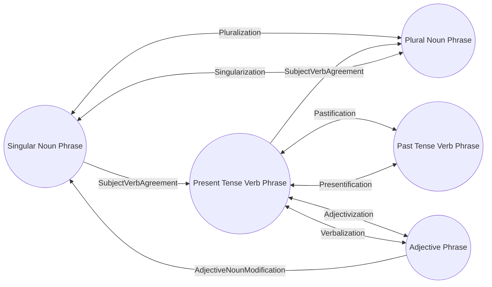
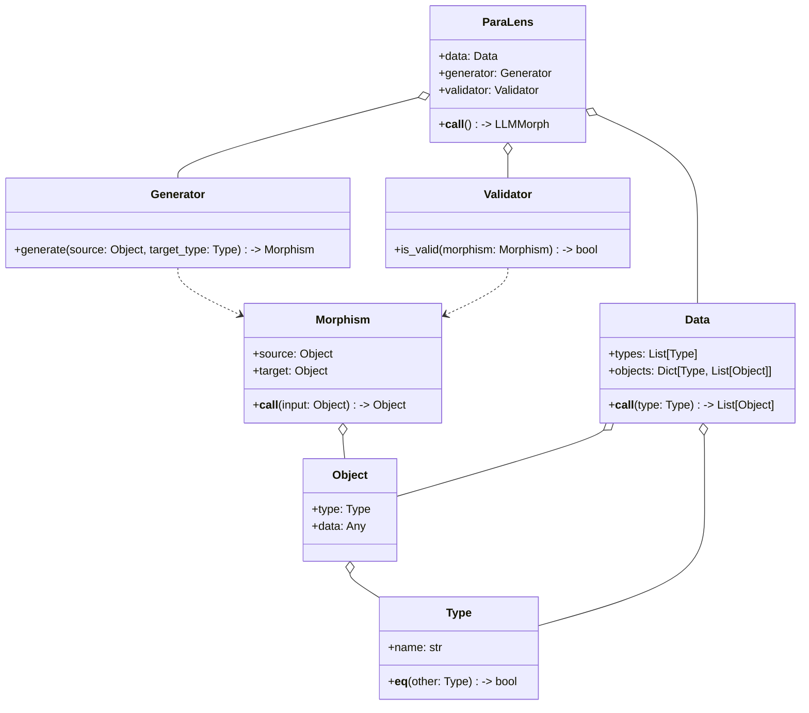
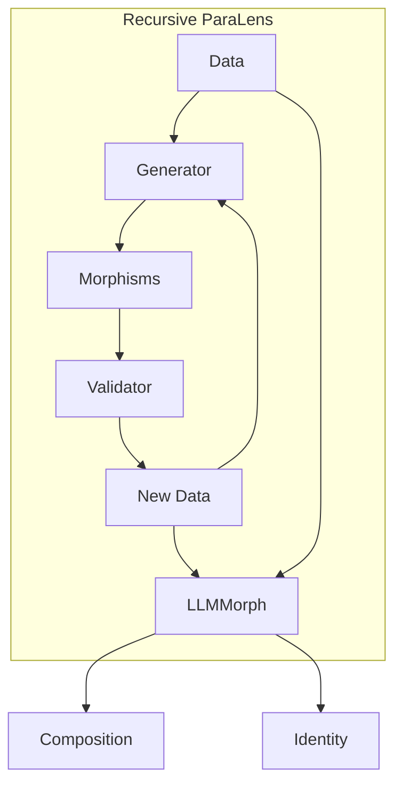
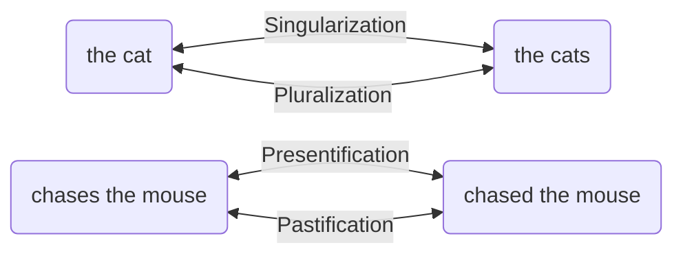
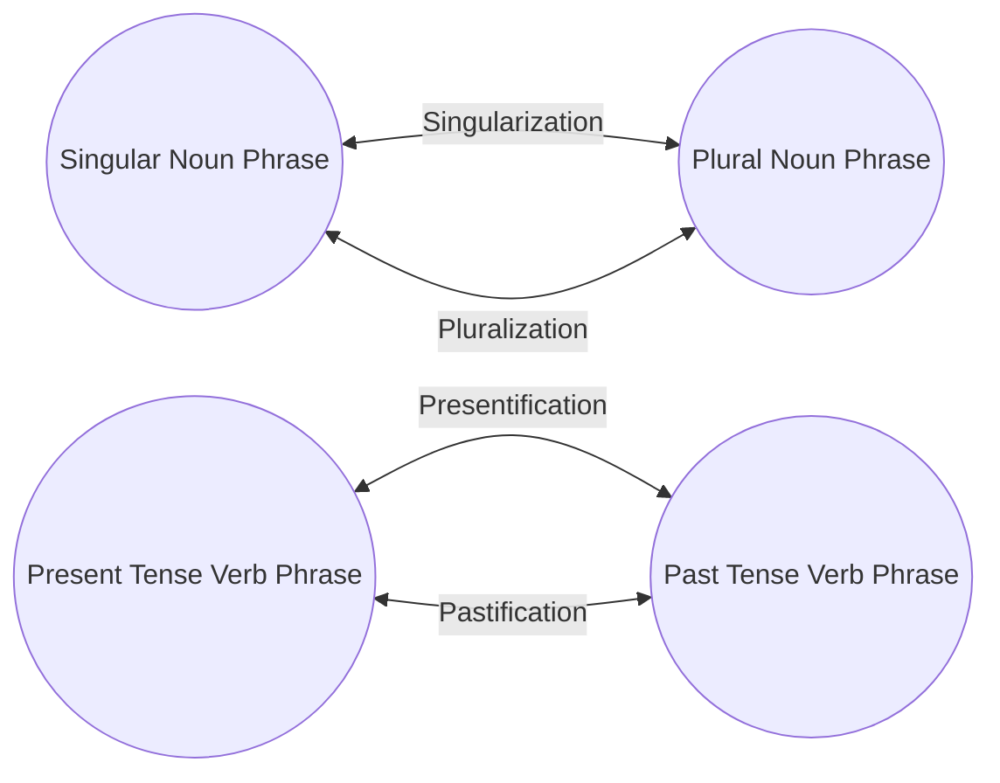
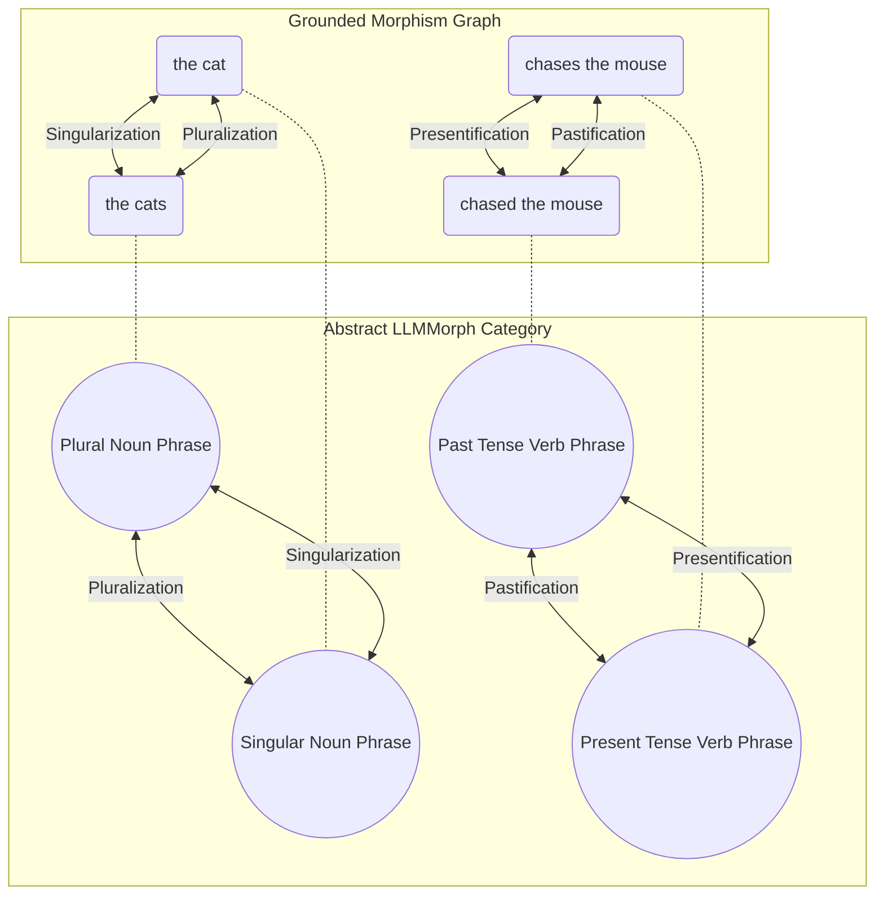

# 🌿💡LLMMorph 

The LLMMorph category is an abstract framework for modeling linguistic transformations and their compositional properties, drawing inspiration from the concepts of distributed mental simulations and the social unconscious. It provides a formal structure for representing and reasoning about the generative and inferential processes underlying language use and understanding, grounded in the principles of category theory.

Formally, we define the LLMMorph category as a tuple $(Ob, Hom, \circ, id)$, where:

- $Ob$ is a collection of objects representing typed linguistic data, such as words, phrases, sentences, or larger units of text.
- $Hom$ is a collection of morphisms representing linguistic transformations between objects of different types.
- $\circ$ is the composition operation, which maps pairs of compatible morphisms to their composite morphism.
- $id$ is the identity morphism, which maps each object to itself.

The objects in $Ob$ are organized into a type system, where each object $x \in Ob$ is associated with a type $T(x)$ that specifies its structural and semantic properties. The type system can be formalized using a suitable type theory, such as dependent type theory or higher-order logic.

The morphisms in $Hom$ are functions $f: A \to B$ that map objects of type $A$ to objects of type $B$, preserving the relevant linguistic structure and meaning. Morphisms can represent a wide range of language phenomena, such as inflectional and derivational morphology, syntactic transformations, semantic and pragmatic operations, and stylistic and register variations.

Morphisms can be composed using the $\circ$ operation, which satisfies the associativity and identity laws:

- $(f \circ g) \circ h = f \circ (g \circ h)$ for all compatible morphisms $f$, $g$, and $h$.
- $f \circ id_A = f = id_B \circ f$ for all morphisms $f: A \to B$.

Some morphisms may also have inverses, satisfying the invertibility law:

- $f^{-1} \circ f = id_A$ and $f \circ f^{-1} = id_B$ for all invertible morphisms $f: A \to B$.

To illustrate the LLMMorph category, let's consider a simple example with 5 linguistic types and their associated transformations:

Types:
1. Singular Noun Phrase (SNP)
2. Plural Noun Phrase (PNP)
3. Present Tense Verb Phrase (PTVP)
4. Past Tense Verb Phrase (PSVP)
5. Adjective Phrase (AP)

Transformations:
| Source Type | Target Type | Transformation Name |
|-------------|-------------|---------------------|
| SNP         | PNP         | Pluralization       |
| PNP         | SNP         | Singularization     |
| PTVP        | PSVP        | Pastification      |
| PSVP        | PTVP        | Presentification    |
| AP          | PTVP        | Verbalization       |
| PTVP        | AP          | Adjectivization     |
| SNP + PTVP  | PSVP + PNP  | SubjectVerbAgreement|
| AP + SNP    | SNP         | AdjectiveNounModification |

We can represent this instance of the LLMMorph category using the following mermaid graph:

In this graph, the nodes represent the linguistic types, and the edges represent the morphisms between them. Bidirectional arrows indicate invertible transformations, while unidirectional arrows indicate non-invertible transformations. The graph also includes morphisms that involve multiple types, such as SubjectVerbAgreement and AdjectiveNounModification.

🌿💡 Constructing the LLMMorph Category with Parametrized Lenses

Defining the LLMMorph category in absolute terms is a challenging task, as it requires capturing the full complexity and diversity of linguistic transformations across all possible languages and domains. Attempting to do so risks falling into the trap of old absolutist theories, which sought to reduce language to a fixed set of rules and structures, ignoring its inherent flexibility and adaptability.

Instead, we propose a more grounded approach, where the LLMMorph category is defined in terms of the parametrized lens (para-lens) that generates it. This approach acknowledges that the specific instantiation of the LLMMorph category may vary depending on the input data, the choice of generator and validator, and the desired level of abstraction and granularity.

## The Parametrized Lens Framework

A parametrized lens is a mathematical construct that transforms one set of objects into another, based on a set of input parameters. In the context of the LLMMorph category, the para-lens takes as input a collection of typed linguistic data, a generator function that produces morphisms between types, and a validator function that checks the semantic validity and compositionality of the generated morphisms.

The para-lens consists of three main components:

1. Data: A collection of typed linguistic objects, serving as the input to the category construction process. The data can be represented as a functor $D: \mathbf{Set} \to \mathbf{LLMMorph}$ that maps each type $T$ to a collection of linguistic objects of type $T$.

2. Generator: An abstract object that generates morphisms between data objects. The generator can be instantiated as a language model, an oracle, or a sampling function from an empirical distribution of linguistic transformations. Formally, the generator is a natural transformation $G: D \Rightarrow Hom$ that maps each linguistic object $x$ of type $A$ to a morphism $G_x: A \to B$ for some type $B$.

3. Validator: A function that checks the semantic validity and compositionality of the generated morphisms, ensuring that they are well-defined and meaningful linguistic transformations. The validator can be represented as a natural transformation $V: Hom \Rightarrow \mathbf{2}$ that maps each morphism $f: A \to B$ to a boolean value indicating its validity.

The para-lens construction process can be visualized using the following mermaid class diagram:

The para-lens construction process involves two main steps:

1. Generation: The generator is applied to each pair of types in the input data, producing a set of candidate morphisms between them. This step can be seen as a form of hypothesis generation, where the generator proposes potential linguistic transformations based on its underlying model or distribution.

2. Validation: The validator is applied to each generated morphism, checking its semantic validity and compositionality. This step can be seen as a form of hypothesis testing, where the validator filters out any ill-defined or meaningless transformations, based on a set of linguistic constraints and heuristics.

The output of the para-lens is the LLMMorph category, which consists of the input data objects, the generated morphisms that passed validation, and the composition and identity laws that govern their behavior. The resulting category captures the linguistic structure and relationships within the input data, as discovered and verified by the generator and validator.

## The Recursive Para-Lens Construction

The construction of the LLMMorph category is a recursive process, where the para-lens generates new linguistic data by applying morphisms to the input data, and then iteratively discovers new morphisms between the generated data types. This recursive process continues until no new valid morphisms can be found, at which point the resulting category represents the complete space of linguistic transformations that can be derived from the input data and the chosen generator and validator.

To model this recursive process, we can extend the para-lens framework to include a feedback loop, where the output of each iteration becomes the input for the next one. Formally, we can define the recursive para-lens as a functor $L: \mathbf{Set}^3 \to \mathbf{LLMMorph}$ that takes as input a collection of linguistic data $D$, a generator $G$, and a validator $V$, and produces an LLMMorph category $L(D, G, V)$ as output.

The recursive construction process can be visualized using the following mermaid graph:

In this graph, the input data $D$ is passed to the generator $G$, which produces a set of candidate morphisms $M$. These morphisms are then passed to the validator $V$, which filters out any invalid transformations and generates a set of new linguistic data $N$. The new data is then fed back into the generator, along with the original input data, to discover additional morphisms. This process continues recursively until no new valid morphisms can be found.

The output of the recursive para-lens is the LLMMorph category $L(D, G, V)$, which consists of:

1. The input data objects $D$ and all the generated linguistic data $N$ from each iteration.
2. All the valid morphisms $M$ that were discovered and verified by the generator and validator across all iterations.
3. The composition and identity laws that govern the behavior of the morphisms.

### The Grounded Morphism Graph and Abstract LLMMorph Category

It's important to note that the recursive para-lens construction process generates a grounded morphism graph, where each node represents a specific linguistic object (e.g., a word, phrase, or sentence), and each edge represents a valid morphism between two objects. This is in contrast to the abstract LLMMorph category, where the nodes represent linguistic types (e.g., noun phrases, verb phrases) and the edges represent morphisms between types.

To derive the abstract LLMMorph category from the grounded morphism graph, we need to aggregate the individual objects into their respective types and compute the validity scores for each type-level morphism. This can be done by averaging the validity scores of all the object-level morphisms that instantiate a given type-level morphism, weighted by the frequency or importance of each object.

For example, consider the grounded morphism graph shown in the following mermaid diagram:

In this graph, we have the following nodes and edges:

- Nodes:
  - "the cat" (singular noun phrase)
  - "the cats" (plural noun phrase)
  - "chased the mouse" (past tense verb phrase)
  - "chases the mouse" (present tense verb phrase)
- Edges:
  - "the cat" -> "the cats" (pluralization)
  - "the cats" -> "the cat" (singularization)
  - "chases the mouse" -> "chased the mouse" (pastification)
  - "chased the mouse" -> "chases the mouse" (presentification)

To derive the abstract LLMMorph category from this grounded morphism graph, we would aggregate these nodes and edges into the following types and morphisms:

- Types:
  - Singular Noun Phrase (SNP)
  - Plural Noun Phrase (PNP)
  - Present Tense Verb Phrase (PTVP)
  - Past Tense Verb Phrase (PSVP)
- Morphisms:
  - SNP -> PNP (pluralization)
  - PNP -> SNP (singularization)
  - PTVP -> PSVP (pastification)
  - PSVP -> PTVP (presentification)

The resulting abstract LLMMorph category can be visualized using the following mermaid diagram:

The validity scores for each type-level morphism in the abstract LLMMorph category would be computed based on the validity scores of the corresponding object-level morphisms in the grounded morphism graph, weighted by their frequency or importance.

To illustrate the relationship between the grounded morphism graph and the abstract LLMMorph category, we can combine both diagrams into a single mermaid graph, using dashed lines to indicate the mapping from grounded objects to abstract types:

This combined graph shows how the grounded objects are mapped to their corresponding abstract types, and how the morphisms between the grounded objects are reduced to morphisms between the abstract types. The dashed lines represent the aggregation process, where the validity scores of the grounded morphisms are used to compute the validity scores of the abstract morphisms.

By visualizing the relationship between the grounded morphism graph and the abstract LLMMorph category in this way, we can better understand the process of reducing the grounded knowledge to the abstract linguistic types and transformations, and see how the para-lens framework enables the construction of a meaningful and coherent linguistic ontology from raw data.

### Practical Implications of Grounded Knowledge

While the recursive para-lens framework provides a principled and flexible way to construct the LLMMorph category from data, it is important to acknowledge the practical challenges and limitations that arise when implementing this framework in real-world settings.

One of the key challenges is the process of converting the grounded morphism graph, which represents the actual linguistic objects and transformations, into the abstract LLMMorph category, which represents the linguistic types and morphisms. This conversion process is not trivial in practice, and can introduce various sources of error and approximation.

Firstly, the generator and validator functions, which are typically instantiated using large language models (LLMs) and other statistical models, are not perfect and can introduce errors in the generation and validation of morphisms. While these models can achieve high accuracy in many linguistic tasks, they may still produce invalid or nonsensical transformations, especially for rare or complex linguistic phenomena.

Secondly, the choice of linguistic types and the process of aggregating the grounded objects into these types can also introduce errors and approximations. The linguistic types used in the LLMMorph category are often based on human-designed ontologies and annotation schemes, which may not fully capture the nuances and variations of natural language. Moreover, the process of mapping the grounded objects to these types and computing the validity scores for the type-level morphisms can involve various heuristics and simplifications.

Finally, and perhaps most crucially, the overall quality and coverage of the LLMMorph category will depend on the choice of the linguistic type set itself. While the generator and validator errors can be gradually reduced as LLMs and other models improve over time, the fundamental limitation of the LLMMorph category lies in the design of the type abstraction.

To address this limitation, we propose the idea of LLMMorph*, which represents the optimal linguistic type set that maximizes the coverage and accuracy of the resulting category, given the available data and models. Finding LLMMorph* can be framed as an optimization problem over the space of possible type sets, where the objective is to minimize the approximation error between the grounded morphism graph and the abstract category, while also ensuring the coherence and interpretability of the types.

One possible approach to this optimization problem is to use meta-learning techniques, such as reinforcement learning or evolutionary algorithms, to search the space of type sets and iteratively refine the abstraction based on the feedback from the generator and validator models. Another approach is to leverage the structure and semantics of the grounded morphism graph itself, using graph clustering and community detection algorithms to identify the natural types and morphisms that emerge from the data.

Ultimately, the success of the LLMMorph framework in modeling and understanding natural language will depend on our ability to design effective and efficient algorithms for finding LLMMorph*, and to integrate these algorithms with the recursive para-lens construction process. While this remains an open challenge, we believe that the combination of category theory, computational linguistics, and machine learning provides a promising foundation for tackling this problem and advancing the state of the art in natural language processing.