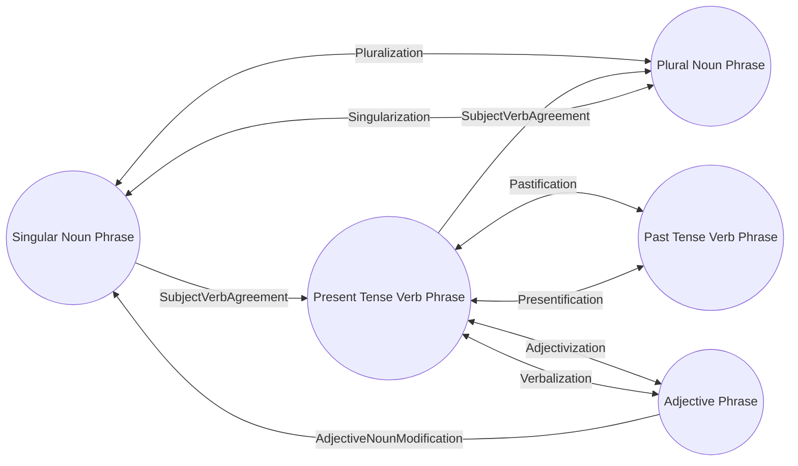
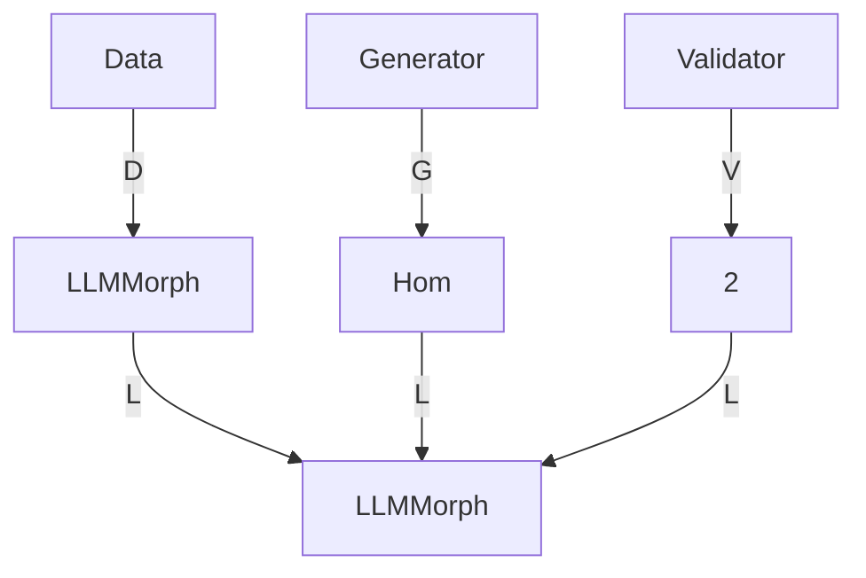

🌿💡 Section A: Introducing the LLMMorph Category

The LLMMorph category is an abstract framework for modeling linguistic transformations and their compositional properties, drawing inspiration from the concepts of distributed mental simulations and the social unconscious. It provides a formal structure for representing and reasoning about the generative and inferential processes underlying language use and understanding, grounded in the principles of category theory.

Formally, we define the LLMMorph category as a tuple $(Ob, Hom, \circ, id)$, where:

- $Ob$ is a collection of objects representing typed linguistic data, such as words, phrases, sentences, or larger units of text.
- $Hom$ is a collection of morphisms representing linguistic transformations between objects of different types.
- $\circ$ is the composition operation, which maps pairs of compatible morphisms to their composite morphism.
- $id$ is the identity morphism, which maps each object to itself.

The objects in $Ob$ are organized into a type system, where each object $x \in Ob$ is associated with a type $T(x)$ that specifies its structural and semantic properties. The type system can be formalized using a suitable type theory, such as dependent type theory or higher-order logic.

The morphisms in $Hom$ are functions $f: A \to B$ that map objects of type $A$ to objects of type $B$, preserving the relevant linguistic structure and meaning. Morphisms can represent a wide range of language phenomena, such as inflectional and derivational morphology, syntactic transformations, semantic and pragmatic operations, and stylistic and register variations.

Morphisms can be composed using the $\circ$ operation, which satisfies the associativity and identity laws:

- $(f \circ g) \circ h = f \circ (g \circ h)$ for all compatible morphisms $f$, $g$, and $h$.
- $f \circ id_A = f = id_B \circ f$ for all morphisms $f: A \to B$.

Some morphisms may also have inverses, satisfying the invertibility law:

- $f^{-1} \circ f = id_A$ and $f \circ f^{-1} = id_B$ for all invertible morphisms $f: A \to B$.

To illustrate the LLMMorph category, let's consider a simple example with 5 linguistic types and their associated transformations:

Types:
1. Singular Noun Phrase (SNP)
2. Plural Noun Phrase (PNP)
3. Present Tense Verb Phrase (PTVP)
4. Past Tense Verb Phrase (PSVP)
5. Adjective Phrase (AP)

Transformations:
| Source Type | Target Type | Transformation Name |
|-------------|-------------|---------------------|
| SNP         | PNP         | Pluralization       |
| PNP         | SNP         | Singularization     |
| PTVP        | PSVP        | Pastification      |
| PSVP        | PTVP        | Presentification    |
| AP          | PTVP        | Verbalization       |
| PTVP        | AP          | Adjectivization     |
| SNP + PTVP  | PSVP + PNP  | SubjectVerbAgreement|
| AP + SNP    | SNP         | AdjectiveNounModification |

We can represent this instance of the LLMMorph category using the following mermaid graph:

In this graph, the nodes represent the linguistic types, and the edges represent the morphisms between them. Bidirectional arrows indicate invertible transformations, while unidirectional arrows indicate non-invertible transformations. The graph also includes morphisms that involve multiple types, such as SubjectVerbAgreement and AdjectiveNounModification.

To construct the LLMMorph category from a given set of linguistic data, we introduce the following components:

1. Data: A collection of typed linguistic objects, serving as the input to the category construction process.

2. Generator: An abstract object that generates morphisms between data objects. The generator can be instantiated as a language model, an oracle, or a sampling function from an empirical distribution of linguistic transformations.

3. Validator: A function that checks the semantic validity and compositionality of the generated morphisms, ensuring that they are well-defined and meaningful linguistic transformations.

These components can be formalized as follows:

- Data: A functor $D: \mathbf{Set} \to \mathbf{LLMMorph}$ that maps each type $T$ to a collection of linguistic objects of type $T$.
- Generator: A natural transformation $G: D \Rightarrow Hom$ that maps each linguistic object $x$ of type $A$ to a morphism $G_x: A \to B$ for some type $B$.
- Validator: A natural transformation $V: Hom \Rightarrow \mathbf{2}$ that maps each morphism $f: A \to B$ to a boolean value indicating its semantic validity and compositionality.

The construction of the LLMMorph category from these components can be achieved using a parametrized lens (para-lens), which is a functor $L: \mathbf{Set}^3 \to \mathbf{LLMMorph}$ that takes the data, generator, and validator as input and produces the category as output. The para-lens can be visualized using the following commutative diagram:

The para-lens works by iteratively applying the generator to the input data objects, producing morphisms between them. The validator checks the semantic validity and compositionality of each generated morphism, filtering out any invalid or ill-defined transformations. The resulting set of objects and morphisms forms the LLMMorph category, which captures the linguistic structure and relationships within the input data.

This abstract formulation of the LLMMorph category provides a flexible and expressive framework for modeling and reasoning about linguistic transformations, grounded in the principles of category theory and type theory. By specifying the behavior of the generator and validator, the framework can be instantiated for a wide range of language phenomena and applications, from morphological analysis and generation to semantic parsing and machine translation.

In the next section, we will explore a concrete implementation of the LLMMorph category using Pydantic and JSON Schema for type specification and validation, and discuss how this implementation can be used in conjunction with large language models to enable more robust and interpretable natural language processing systems.