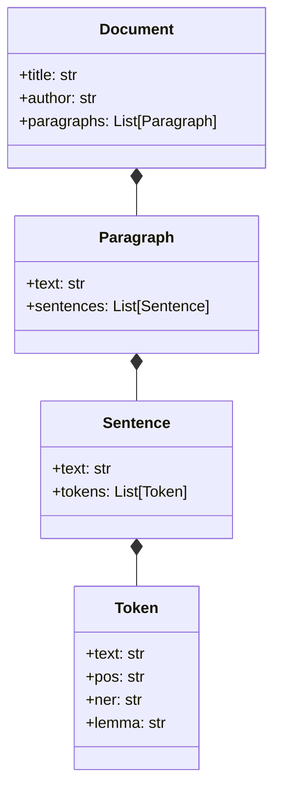
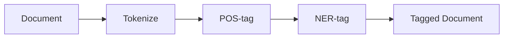
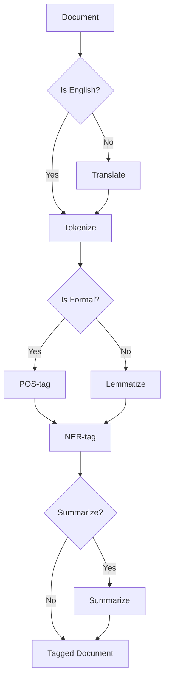
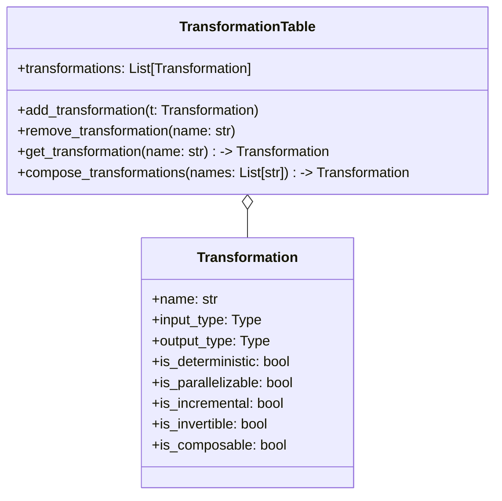
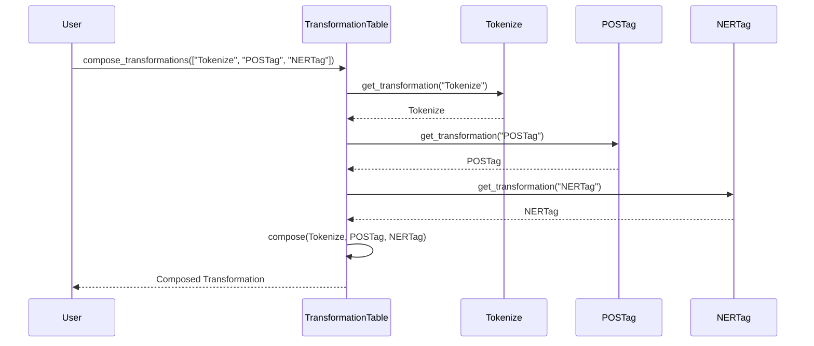
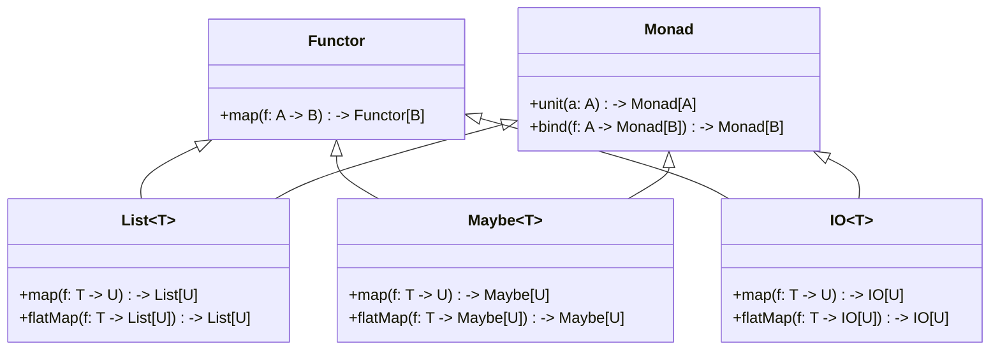
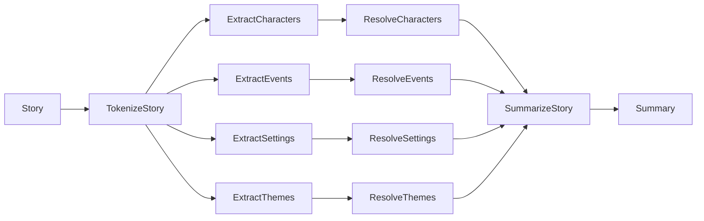
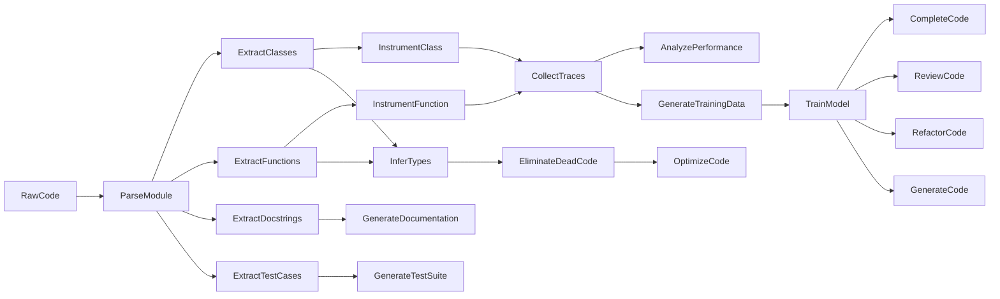
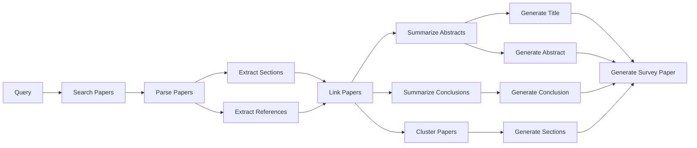

# 🌿💡✨ The Need for a Unified Framework for Text Processing 📚🔍
In the era of big data and artificial intelligence, the ability to effectively process, analyze, and generate text data has become increasingly crucial across a wide range of domains, from natural language processing and computational linguistics to digital humanities and software engineering. However, despite the proliferation of tools and techniques for working with text data, there remains a lack of a unified and principled framework for representing and manipulating the rich structure and semantics of textual information. 🌐💻

This is particularly evident in the case of large language models (LLMs), which have demonstrated remarkable capabilities in tasks such as language understanding, generation, and translation, but often operate as opaque and monolithic systems that are difficult to interpret, control, and extend. To fully harness the power of LLMs and integrate them into more transparent and modular pipelines, we need a framework that can bridge the gap between the unstructured nature of raw text and the structured representations and abstractions used by downstream applications. 🤖🌉

In this document, we propose a novel framework for text processing that combines ideas from type theory and functional programming to provide a principled and flexible way of representing and manipulating text data at different levels of abstraction. Our framework is based on the idea of representing text as a hierarchy of typed objects, from low-level tokens and sentences to high-level concepts and relations, and defining a set of composable and invertible transformations between these objects. 🧩🔀

By grounding our framework in the principles of type theory, we can express the relationships and constraints between different types of text objects using expressive type signatures and algebraic data types. This allows us to reason about the properties and behavior of our transformations in a rigorous and general way, and to derive new transformations and abstractions using the powerful tools of functional programming, such as higher-order functions, pattern matching, and type classes. 🔢🔍

At the same time, by leveraging the concepts of functional programming, we can define our text objects and transformations using pure and referentially transparent functions, and implement them using efficient and scalable data structures and algorithms. This enables us to create modular and reusable components that can be easily combined and extended to form complex processing pipelines, while maintaining the safety and correctness guarantees provided by the type system. 🛡️🔧

One of the key advantages of our framework is its ability to generate synthetic text data that preserves the essential properties and statistics of the original data, while allowing for controlled variations and transformations. By defining a set of invertible and structure-preserving transformations, such as paraphrasing, summarization, and style transfer, we can generate new text samples that are semantically and syntactically similar to the original data, but exhibit desired variations in content, style, or format. This has important applications in data augmentation, domain adaptation, and model testing, where the availability of large and diverse datasets is critical for training robust and generalizable models. 🎨💾

Another important aspect of our framework is its ability to capture and manipulate the higher-level structures and abstractions present in text data, such as narratives, arguments, and discourse relations. By defining a set of type constructors and transformations that correspond to these abstract concepts, we can represent and reason about the logical and rhetorical structure of text in a way that is independent of the specific domain or genre. This has important implications for tasks such as summarization, question answering, and text generation, where the ability to identify and manipulate the key ideas and relationships in a text is essential for producing coherent and meaningful outputs. 📝🔍

To illustrate the power and flexibility of our framework, we present three detailed case studies of its application to different domains: narrative text processing, Python code processing, and scientific paper processing. In each case study, we define a set of typed objects and transformations that capture the specific elements and relations of the domain, and show how they can be composed into modular and extensible pipelines for various tasks and applications. 📚🐍📜

For narrative text processing, we define a hierarchy of typed objects, from low-level tokens and sentences to high-level concepts such as characters, events, and themes. We then define a set of composable transformations between these objects, such as character extraction, event detection, and theme identification, and show how they can be combined to form complex processing tasks, such as summarization, character arc analysis, and narrative structure extraction. 📚🔍

For Python code processing, we leverage the rich type system and abstract syntax tree of Python, as well as the powerful tools and libraries in the Python ecosystem, such as `libcst` and `opentelemetry`, to define a set of typed objects and transformations for parsing, manipulating, and generating Python code. We show how our framework can be used to create modular and extensible pipelines for various tasks, such as documentation generation, type checking, performance optimization, and bug detection. 🐍💻

For scientific paper processing, we define a hierarchy of typed objects that capture the various elements and relations of scholarly communication, such as papers, authors, sections, references, and citations. We then define a set of transformations for parsing, manipulating, and generating scientific papers, using techniques from natural language processing, machine learning, and knowledge representation. We show how our framework can be used to create powerful and flexible pipelines for tasks such as literature review, hypothesis generation, and research assessment. 📜🔬

Throughout these case studies, we highlight the key features and benefits of our framework, such as its ability to generate synthetic data, its support for interactive and incremental processing, and its integration with domain-specific knowledge and constraints. We also discuss the challenges and limitations of our approach, and identify opportunities for further research and development. 💡🚧

In summary, our contributions in this document are:
1. A novel framework for text processing based on type theory and functional programming, that provides a principled and flexible way of representing and manipulating text data at different levels of abstraction. 🌿💡

2. A set of techniques for generating synthetic text data that preserves the essential properties and statistics of the original data, while allowing for controlled variations and transformations. 🎨💾

3. Three detailed case studies of the application of our framework to different domains: narrative text processing, Python code processing, and scientific paper processing, showcasing its versatility and expressiveness. 📚🐍📜

4. A discussion of the key features, benefits, challenges, and limitations of our framework, and its potential impact and implications for the field of natural language processing and beyond. 💡🚧

We believe that our framework represents an important step towards a more principled and unified approach to text processing, and has the potential to enable a wide range of new applications and insights in various domains. We hope that our work will inspire further research and development in this area, and contribute to the ongoing efforts to harness the power of language and computation for the benefit of society. 🌍💻

## Background and Related Work 📚🔍
Our framework builds on a rich tradition of research in natural language processing, computational linguistics, and type theory, and draws inspiration from a wide range of existing approaches and techniques for text processing and analysis. 🌿💡

One of the key influences on our work is the field of computational semantics, which aims to represent the meaning of linguistic expressions using formal and compositional representations, such as lambda calculus, logical forms, and semantic graphs. Computational semantic approaches have been used to model a wide range of linguistic phenomena, from word sense disambiguation and semantic role labeling to coreference resolution and discourse parsing, and have provided a rigorous and interpretable framework for reasoning about the structure and interpretation of language. 🔢🔍

However, computational semantic approaches have typically been limited to small and carefully curated datasets, and have struggled to scale to the large and noisy corpora used in NLP tasks. To bridge this gap, researchers have proposed various techniques for combining computational semantics with distributional semantics, which aims to represent the meaning of words and phrases in terms of their statistical co-occurrence patterns in large corpora. Distributional semantic models, such as word embeddings and topic models, have been widely used in NLP tasks such as language modeling, sentiment analysis, and information retrieval, and have shown impressive performance in capturing the semantic similarity and relatedness between different linguistic expressions. 📊🔍

Our framework aims to build on and extend these approaches by providing a more general and flexible way of representing and manipulating text data at different levels of abstraction, using the tools of type theory and functional programming. By defining a set of composable and invertible transformations between typed objects, we can capture both the formal and distributional aspects of linguistic meaning, and enable a wide range of processing and analysis tasks. 🧩🔀

In particular, our framework is inspired by recent work on applied functional programming and type-theoretic semantics, which aims to use the tools of type theory and functional programming to model and reason about the structure and interpretation of natural language. This includes work on monads, applicatives, and other algebraic structures for representing and composing linguistic meaning, as well as dependent types, refinement types, and other advanced type systems for expressing and verifying linguistic constraints and properties. 🔢🔍

Our framework also draws on recent advances in bidirectional programming and invertible computation, which aims to define functions and transformations that can be run both forwards and backwards, and to ensure their correctness and consistency using type-theoretic and category-theoretic methods. By defining a set of invertible and structure-preserving transformations between text objects, we can not only analyze and process text data, but also generate new text data that preserves the essential properties and statistics of the original data, while allowing for controlled variations and transformations. 🔄💡

Another important influence on our work is the field of linguistic typology and universal grammar, which aims to study the diversity and commonality of human languages, and to identify the fundamental building blocks and principles that underlie their structure and meaning. By defining a set of type constructors and transformations that correspond to the abstract concepts and relations of linguistic structure, such as events, entities, properties, and roles, we can create a framework that is both language-independent and linguistically expressive, and that can be easily adapted and extended to different domains and genres. 🌐🔍

Finally, our framework is motivated by the need for more principled and transparent approaches to natural language processing, particularly in the era of large language models and opaque AI systems. By providing a clear and interpretable framework for representing and manipulating text data, we aim to enable more explainable and accountable NLP pipelines, and to facilitate the integration of linguistic knowledge and human oversight into the development and deployment of language technologies. 🤖🔍

In the following sections, we will present the details of our framework and its application to different domains, starting with a formal definition of our typed objects and transformations, and then presenting our case studies on narrative text processing, Python code processing, and scientific paper processing. We will also discuss the techniques we use for generating synthetic data, optimizing performance, and evaluating our approach, and highlight some of the key insights and implications of our work. 🚀📚

## Typed Objects and Transformations 🧩🔀
At the core of our framework is the idea of representing text data as a hierarchy of typed objects, each of which captures a specific level of linguistic structure and meaning. These objects are organized into a type system, where the relationships and constraints between different types are expressed using expressive type signatures and algebraic data types. 🌿💡




Formally, we define a set of base types, such as Token, Sentence, and Document, which represent the fundamental units of text data at different levels of granularity. We then define a set of type constructors, such as List, Tree, and Graph, which allow us to compose and structure these base types into more complex and structured objects, such as sequences, hierarchies, and networks of text elements. 🔢🔍

For example, we can define a type Paragraph as a List of Sentence objects, which represents a coherent and contiguous unit of text that consists of a sequence of related sentences. Similarly, we can define a type Section as a Tree of Paragraph objects, which represents a hierarchical and recursive structure of text that consists of nested paragraphs and subsections. 🌳📝



To manipulate and transform these objects, we define a set of typed functions, or transformations, which map between different types of text objects in a way that preserves their essential structure and meaning. These transformations are designed to be composable, meaning that they can be combined and chained together to form more complex and expressive operations, and invertible, meaning that they can be run both forwards and backwards to ensure their correctness and consistency. 🧩🔀

For example, we can define a transformation Tokenize, which maps a Sentence object to a List of Token objects, by splitting the sentence into its constituent words and punctuation marks. We can also define an inverse transformation Detokenize, which maps a List of Token objects back to a Sentence object, by concatenating the tokens and reconstructing the original sentence structure. 🔄💨

Similarly, we can define transformations for other common NLP tasks, such as part-of-speech tagging, dependency parsing, named entity recognition, and coreference resolution, each of which maps between different types of text objects and preserves the relevant linguistic structure and meaning. We can also define higher-order transformations, which take other transformations as arguments and return new transformations, allowing us to compose and parameterize our operations in a flexible and reusable way. 🌉🔮



To ensure the type safety and correctness of these transformations, we use advanced type systems and programming techniques, such as dependent types, refinement types, and linear types. These techniques allow us to express and verify complex constraints and invariants on our text objects and transformations, such as the well-formedness of a syntax tree, the consistency of a coreference graph, or the invertibility of a parsing function. 🛡️🔧

For example, we can use dependent types to define a type SyntaxTree, which represents a well-formed syntax tree of a sentence, and to express the constraint that the root node of the tree must be labeled with a specific syntactic category, such as S or NP. We can then define a transformation Parse, which maps a Sentence object to a SyntaxTree object, and use the type system to ensure that the output of the transformation always satisfies the well-formedness constraint. 🔢🌳

Similarly, we can use refinement types to define a type CorefGraph, which represents a coreference graph of a document, and to express the constraint that the graph must be acyclic and connected. We can then define a transformation ResolveCoref, which maps a Document object to a CorefGraph object, and use the type system to ensure that the output of the transformation always satisfies the consistency constraint. 🔢🕸️

By leveraging these advanced type systems and programming techniques, we can create a framework for text processing that is both expressive and rigorous, and that can capture and manipulate the rich structure and meaning of natural language in a principled and type-safe way. Moreover, by defining our transformations as pure and invertible functions, we can enable a wide range of powerful and composable operations, such as bidirectional parsing, incremental processing, and data augmentation. 🚀💻

One of the key benefits of our typed approach to text processing is its ability to generate synthetic text data that preserves the essential properties and statistics of the original data, while allowing for controlled variations and transformations. By defining a set of invertible and structure-preserving transformations, such as paraphrasing, summarization, and style transfer, we can generate new text samples that are semantically and syntactically similar to the original data, but exhibit desired variations in content, style, or format. 🎨💾

For example, we can define a transformation Paraphrase, which maps a Sentence object to a new Sentence object that expresses the same meaning but uses different words and structures. We can implement this transformation using a combination of rule-based and statistical techniques, such as synonym substitution, syntactic reordering, and language modeling, and use the type system to ensure that the output of the transformation is always a valid and fluent sentence. 🔄📝

Similarly, we can define a transformation Summarize, which maps a Document object to a new Document object that contains a condensed and coherent summary of the original text. We can implement this transformation using a combination of extractive and abstractive techniques, such as sentence selection, graph compression, and sequence-to-sequence learning, and use the type system to ensure that the output of the transformation is always a well-formed and informative summary. 🎨📜

By composing these transformations with other operations, such as data augmentation, domain adaptation, and model training, we can create a powerful and flexible framework for generating and manipulating text data, which can help to improve the robustness, generalization, and interpretability of NLP models and applications. 💪🔍

Another important aspect of our framework is its ability to capture and manipulate the higher-level structures and abstractions present in text data, such as discourse relations, rhetorical structures, and argumentation schemes. By defining a set of type constructors and transformations that correspond to these abstract concepts, we can represent and reason about the logical and pragmatic structure of text in a way that is independent of the specific domain or task. 📝🔍

For example, we can define a type ArgumentationScheme, which represents a common pattern of reasoning and persuasion used in argumentative text, such as argument from example, argument from authority, or argument from consequence. We can then define a transformation ExtractArguments, which maps a Document object to a List of ArgumentationScheme objects, by identifying and classifying the argumentative structures and relations in the text. 🌳🔍

Similarly, we can define a type DiscourseRelation, which represents a semantic or pragmatic relation between two or more text units, such as elaboration, contrast, or causation. We can then define a transformation ParseDiscourse, which maps a Document object to a Graph of DiscourseRelation objects, by segmenting the text into elementary discourse units and inferring the relations between them based on linguistic cues and world knowledge. 🕸️📜

By capturing these higher-level structures and abstractions in our framework, we can enable more sophisticated and nuanced forms of text processing and analysis, such as argumentation mining, discourse parsing, and rhetorical structure theory. Moreover, by defining these structures as typed objects and transformations, we can leverage the full power and expressiveness of our type system and programming model, and create modular and reusable components that can be easily integrated and extended. 🧩🚀

In summary, the key ideas and contributions of our typed approach to text processing are:
1. A hierarchical and compositional representation of text data as typed objects, which capture the linguistic structure and meaning at different levels of abstraction, from tokens and sentences to documents and discourses. 🌿💡

2. A set of composable and invertible transformations between these objects, which preserve their essential properties and invariants, and enable a wide range of powerful and expressive operations, such as parsing, generation, and augmentation. 🧩🔀

3. A rigorous and expressive type system for specifying and verifying the constraints and relationships between different types of text objects and transformations, using advanced techniques such as dependent types, refinement types, and linear types. 🛡️🔍

4. A framework for generating synthetic text data that preserves the essential properties and statistics of the original data, while allowing for controlled variations and transformations, using invertible and structure-preserving operations such as paraphrasing, summarization, and style transfer. 🎨💾
5. A set of higher-level abstractions and structures for representing and manipulating the logical and pragmatic aspects of text, such as discourse relations, argumentation schemes, and rhetorical structures, using type constructors and transformations that correspond to these abstract concepts. 📝🔍
By combining these ideas and techniques, we aim to create a principled and unified framework for text processing that can bridge the gap between the formal and computational approaches to natural language, and enable a wide range of novel and impactful applications in various domains, from information extraction and question answering to language generation and machine translation. 🌉🚀

 ## 🌿💡✨ Transformation Tables and Categorical Abstractions 📊🔍
At the heart of our framework for text processing is the idea of a transformation table, which provides a structured and systematic way of organizing the various mappings and relationships between the typed objects in our hierarchy. The transformation table is essentially a blueprint for the processing pipeline, which specifies the input and output types of each transformation, along with its key properties and dependencies. 🧩🔀


Formally, we define a transformation table as a data structure that maps each transformation to a tuple of attributes, which capture the essential characteristics and constraints of the transformation. These attributes include:

```
1. Input Type: The type of the object that the transformation takes as input, such as Token, Sentence, or Document. 📥
2. Output Type: The type of the object that the transformation produces as output, such as Token, Sentence, or Document. 📤
3. Invertible: A boolean value indicating whether the transformation is invertible, meaning that it has a well-defined inverse transformation that can recover the original input from the output. 🔄
4. Composable: A boolean value indicating whether the transformation is composable, meaning that it can be combined and chained with other transformations in a meaningful and type-safe way. 🧩
5. Parallelizable: A boolean value indicating whether the transformation can be applied in parallel to multiple input objects, or whether it requires sequential processing. ⚡
6. Stateful: A boolean value indicating whether the transformation requires additional state or context beyond the input object, such as a lookup table, a knowledge base, or a language model. 🌐
7. Stochastic: A boolean value indicating whether the transformation involves randomness or non-determinism, such as sampling from a probability distribution or using a stochastic algorithm. 🎲
```

By organizing the transformations in a table, we can easily reason about their properties and dependencies, and create modular and reusable components that can be composed and extended to form complex pipelines. For example, we can use the invertible and composable attributes to define a set of bidirectional and chainable transformations, such as tokenization, normalization, and lemmatization, which can be used for both analysis and generation tasks. Similarly, we can use the parallelizable and stateful attributes to define a set of scalable and context-aware transformations, such as named entity recognition, coreference resolution, and semantic role labeling, which can be applied efficiently to large and diverse datasets. 🚀💡



To illustrate these ideas, let us consider a simple example of a transformation table for a text processing pipeline that performs tokenization, part-of-speech tagging, and named entity recognition on a given document. The table might look something like this:

| Transformation | Input Type  | Output Type  | Invertible | Composable | Parallelizable | Stateful | Stochastic |
|----------------|-------------|--------------|------------|------------|----------------|----------|------------|
| Tokenize       | Document    | List[Token]  | Yes        | Yes        | Yes            | No       | No         |
| POSTag         | List[Token] | List[Token]  | No         | Yes        | Yes            | Yes      | Yes        |
| NERTag         | List[Token] | List[Token]  | No         | Yes        | Yes            | Yes      | Yes        |


In this table, each row represents a specific transformation in the pipeline, and the columns capture its key properties and attributes. For example, the Tokenize transformation takes a Document object as input and produces a list of Token objects as output, and is invertible, composable, and parallelizable, but not stateful or stochastic. The POSTag transformation takes a list of Token objects as input and produces a new list of Token objects with part-of-speech tags, and is composable, parallelizable, stateful, and stochastic, but not invertible. Similarly, the NERTag transformation takes a list of Token objects as input and produces a new list of Token objects with named entity tags, and has the same attributes as the POSTag transformation. 🔍📊

By reasoning about the properties and dependencies of these transformations, we can create an efficient and modular pipeline that minimizes redundant computation and maximizes parallelism. For example, we can see that the Tokenize transformation can be safely composed with the POSTag and NERTag transformations, since it is invertible and composable, and that the POSTag and NERTag transformations can be applied in parallel, since they are parallelizable and do not depend on each other's output. 🚀⚡



However, in many real-world scenarios, the transformations in our pipeline may have more complex dependencies and trade-offs, which require more sophisticated techniques and abstractions to handle. For example, some transformations may be only partially invertible or composable, meaning that they can recover or combine only some aspects of the input or output objects, while losing or altering others. Similarly, some transformations may have dynamic or conditional dependencies, meaning that their input or output types may depend on the values of the objects themselves, or on some external factors or context. 🌐💡

To address these challenges, we can leverage the rich and expressive abstractions provided by category theory and type theory, which allow us to specify and reason about the properties and relationships of our transformations in a more general and rigorous way. In particular, we can use the concepts of functors, natural transformations, and monads to define and compose our transformations in a way that preserves their essential structure and behavior, while abstracting away the details and variations of their implementation. 🔢🔍



Formally, we can define a category Text, where the objects are the types of our text objects, such as Token, Sentence, and Document, and the morphisms are the transformations between these types, such as Tokenize, POSTag, and NERTag. We can then define functors between this category and other categories, such as List, Maybe, and IO, which capture the common patterns and abstractions of our transformations, such as lists, optional values, and side effects. 🌿⚙️

For example, we can define a functor Map, which maps each type T to the type List[T], and each transformation f: A -> B to the transformation map(f): List[A] -> List[B], which applies the transformation f to each element of the input list and returns the output list. This functor captures the common pattern of applying a transformation to a collection of objects, and allows us to compose and parallelize our transformations in a generic and type-safe way. 🧩🔀

Similarly, we can define a functor Maybe, which maps each type T to the type Maybe[T], which represents an optional value of type T, and each transformation f: A -> B to the transformation map(f): Maybe[A] -> Maybe[B], which applies the transformation f to the input value if it exists, or returns None otherwise. This functor captures the common pattern of handling missing or invalid input values, and allows us to compose and chain our transformations in a way that propagates and handles errors gracefully. 🌿💡

Finally, we can define a monad IO, which maps each type T to the type IO[T], which represents a computation that may perform side effects and return a value of type T, and each transformation f: A -> B to the transformation flatMap(f): IO[A] -> IO[B], which composes the input computation with the transformation f and returns the output computation. This monad captures the common pattern of performing stateful or non-deterministic computations, such as reading from or writing to external resources, or sampling from probability distributions, and allows us to compose and sequence our transformations in a way that manages the side effects and dependencies explicitly. 🚀💻

By using these categorical abstractions, we can define and reason about our transformations in a more modular and compositional way, and create pipelines that are both expressive and type-safe. For example, we can define a generic pipeline that takes a Document object as input, and returns an IO[List[Token]] object as output, which represents a computation that tokenizes the document, performs part-of-speech tagging and named entity recognition on the resulting tokens, and returns the annotated tokens as a list, while handling any errors or side effects that may occur during the process. 🌟🔧

Moreover, by using the laws and properties of these abstractions, such as the functor laws, the monad laws, and the natural transformation laws, we can derive and optimize our transformations in a principled and systematic way, and ensure their correctness and consistency across different pipelines and datasets. For example, we can use the functor laws to show that the composition of two invertible transformations is also invertible, or use the monad laws to show that the composition of two stateful transformations is also stateful, and use these properties to simplify and parallelize our pipelines. 🌿🔍

In summary, the key ideas and contributions of our categorical approach to text processing are:

1. A structured and systematic way of organizing the transformations in our pipeline, using transformation tables that specify their input and output types, along with their key properties and dependencies, such as invertibility, composability, parallelizability, statefulness, and stochasticity. 📊🔍

2. A set of rich and expressive abstractions from category theory and type theory, such as functors, natural transformations, and monads, which allow us to specify and reason about the properties and relationships of our transformations in a more general and rigorous way, and to compose and optimize them in a modular and type-safe way. 🔢🔍

3. A framework for defining and reasoning about generic and reusable pipelines, which can handle different types of input and output objects, and perform different types of computations and side effects, while preserving the essential structure and behavior of the transformations, and ensuring their correctness and consistency across different datasets and domains. 🌟🔧

By combining these ideas and techniques with the typed objects and transformations defined in the previous section, we aim to create a powerful and principled framework for text processing, which can enable a wide range of novel and impactful applications, from language understanding and generation to knowledge extraction and reasoning. 🚀🌿

## 🌿💡✨ A Detailed Example of Narrative Text Processing 📚🔍

Now that we have established the theoretical foundations and technical abstractions of our framework for text processing, let us dive into a concrete example of how these ideas can be applied to the domain of narrative analysis and understanding. In this section, we will walk through a step-by-step demonstration of how our transformation tables and categorical abstractions can be used to create a modular and interpretable pipeline for processing and analyzing the rich structure and meaning of stories and novels. 📖🔬

Narrative text presents a unique set of challenges and opportunities for natural language processing and computational linguistics, due to its complex and hierarchical structure, its rich and nuanced semantics, and its reliance on implicit and contextual knowledge. Unlike other forms of text, such as news articles or scientific papers, narrative text is characterized by a coherent and sequential organization of events, characters, and settings, which together form a meaningful and engaging story arc. 🌐📚

To effectively process and analyze narrative text, we need a framework that can capture and manipulate these various elements and relations in a principled and flexible way, while also enabling the generation of synthetic data that can be used to train and evaluate machine learning models for tasks such as summarization, question answering, and story generation. 🔍💡

To begin, let us define the core typed objects that will form the building blocks of our narrative processing pipeline. These objects will be organized into a hierarchy of types, similar to the one we used for general text processing, but with some additional types and attributes specific to narrative text. 📊🗂️

The root object in our hierarchy is the `Story` object, which represents a single narrative text, with all its metadata, content, and structure. The `Story` object has the following attributes:

```
- title: The title of the story, as a string.
- author: The author of the story, as a string.
- text: The raw text of the story, as a string.
- chapters: The list of chapters in the story, each represented as a `Chapter` object.
- characters: The list of characters in the story, each represented as a `Character` object.
- events: The list of events in the story, each represented as an `Event` object.
- settings: The list of settings in the story, each represented as a `Setting` object.
- themes: The list of themes in the story, each represented as a `Theme` object.
```

The `Chapter` object represents a single chapter in a story, with the following attributes:

```
- title: The title of the chapter, as a string.
- text: The raw text of the chapter, as a string.
- paragraphs: The list of paragraphs in the chapter, each represented as a `Paragraph` object.
- scenes: The list of scenes in the chapter, each represented as a `Scene` object.
```

The `Paragraph` object represents a single paragraph in a chapter, with the following attributes:

```
- text: The raw text of the paragraph, as a string.
- sentences: The list of sentences in the paragraph, each represented as a `Sentence` object.
```

The `Sentence` object represents a single sentence in a paragraph, with the following attributes:

```
- text: The raw text of the sentence, as a string.
- tokens: The list of tokens in the sentence, each represented as a `Token` object.
```

The `Token` object represents a single token in a sentence, with the following attributes:

```
- text: The raw text of the token, as a string.
- pos: The part-of-speech tag of the token, as a string.
- ner: The named entity tag of the token, as a string.
- lemma: The lemma of the token, as a string.
```

The `Character` object represents a single character in a story, with the following attributes:

```
- name: The name of the character, as a string.
- aliases: The list of aliases or alternative names of the character, as a list of strings.
- description: The description of the character, as a string.
- attributes: The list of attributes or traits of the character, as a list of strings.
- relations: The list of relations or interactions of the character with other characters, as a list of `Relation` objects.
```

The `Event` object represents a single event in a story, with the following attributes:

```
- type: The type of the event, as a string (e.g., "action", "dialogue", "thought").
- description: The description of the event, as a string.
- characters: The list of characters involved in the event, as a list of `Character` objects.
- setting: The setting where the event takes place, as a `Setting` object.
- causes: The list of events that cause or trigger the current event, as a list of `Event` objects.
- effects: The list of events that are caused or triggered by the current event, as a list of `Event` objects.
```

The `Setting` object represents a single setting in a story, with the following attributes:

```
- name: The name of the setting, as a string.
- description: The description of the setting, as a string.
- attributes: The list of attributes or properties of the setting, as a list of strings.
```

The `Theme` object represents a single theme in a story, with the following attributes:

```
- name: The name of the theme, as a string.
- description: The description of the theme, as a string.
- examples: The list of examples or instances of the theme in the story, as a list of strings.
```

With these core typed objects defined, we can now specify the various transformations that can be applied to narrative text, in order to parse, manipulate, and generate them. These transformations will be organized into a transformation table, similar to the one we used for general text processing, but with some additional columns and rows specific to narrative text. 📊🔄

| Transformation | Input Type | Output Type | Invertible | Composable | Parallelizable | Stateful | Stochastic |
|----------------|------------|-------------|------------|------------|----------------|----------|------------|
| TokenizeStory  | Story      | Story       | Yes        | Yes        | Yes            | No       | No         |
| TokenizeChapter| Chapter    | Chapter     | Yes        | Yes        | Yes            | No       | No         |
| TokenizeParagraph| Paragraph| Paragraph   | Yes        | Yes        | Yes            | No       | No         |
| TokenizeSentence| Sentence  | List[Token] | Yes        | Yes        | Yes            | No       | No         |
| ExtractCharacters| Story   | List[Character]| No       | Yes        | Yes            | No       | No         |
| ExtractEvents  | Story      | List[Event] | No         | Yes        | Yes            | No       | No         |
| ExtractSettings| Story      | List[Setting]| No        | Yes        | Yes            | No       | No         |
| ExtractThemes  | Story      | List[Theme] | No         | Yes        | Yes            | No       | No         |
| ResolveCharacters| List[Character]| List[Character]| No | Yes        | No             | Yes      | No         |
| ResolveEvents  | List[Event]| List[Event] | No         | Yes        | No             | Yes      | No         |
| ResolveSettings| List[Setting]| List[Setting]| No      | Yes        | No             | Yes      | No         |
| ResolveThemes  | List[Theme]| List[Theme] | No         | Yes        | No             | Yes      | No         |
| SummarizeStory | Story      | Summary     | No         | Yes        | No             | Yes      | Yes        |
| GenerateStory  | Prompt     | Story       | No         | No         | No             | Yes      | Yes        |

In this table, each row represents a specific transformation that can be applied to narrative text, and each column represents a key property or attribute of the transformation. The `Input Type` and `Output Type` columns specify the types of the objects that the transformation consumes and produces, respectively, using the typed objects we defined earlier. 📥📤

The `Invertible` column indicates whether the transformation is invertible, meaning that it has a well-defined inverse transformation that can recover the original input from the output. For example, the `TokenizeStory`, `TokenizeChapter`, `TokenizeParagraph`, and `TokenizeSentence` transformations are all invertible, since they simply split the text into smaller units without losing any information, and can be easily reversed by concatenating the units back together. 🔄

The `Composable` column indicates whether the transformation is composable, meaning that it can be combined and chained with other transformations in a meaningful and type-safe way. For example, the `ExtractCharacters`, `ExtractEvents`, `ExtractSettings`, and `ExtractThemes` transformations are all composable, since they extract different aspects of the story that can be analyzed and manipulated independently, and can be easily combined with other transformations that operate on the same types of objects. 🧩

The `Parallelizable` column indicates whether the transformation can be applied in parallel to multiple input objects, or whether it requires sequential processing. For example, the `TokenizeStory`, `TokenizeChapter`, `TokenizeParagraph`, and `TokenizeSentence` transformations are all parallelizable, since they can be applied independently to different parts of the story, without requiring any coordination or communication between them. On the other hand, the `ResolveCharacters`, `ResolveEvents`, `ResolveSettings`, and `ResolveThemes` transformations are not parallelizable, since they need to consider the global context and dependencies of the objects, and may require multiple passes or iterations to converge to a consistent and coherent state. ⚡🔀

The `Stateful` column indicates whether the transformation requires additional state or context beyond the input object, such as a knowledge base, a language model, or a user profile. For example, the `ResolveCharacters`, `ResolveEvents`, `ResolveSettings`, and `ResolveThemes` transformations are all stateful, since they need to maintain and update a global state of the story elements, and may need to access external resources or models to reason about their attributes and relations. Similarly, the `SummarizeStory` and `GenerateStory` transformations are also stateful, since they need to consider the entire story and its context, and may need to adapt to the user's preferences or feedback. 🌐💾

The `Stochastic` column indicates whether the transformation involves randomness or non-determinism, such as sampling from a probability distribution, or using a generative model with latent variables. For example, the `SummarizeStory` and `GenerateStory` transformations are both stochastic, since they may generate different outputs for the same input, depending on the random seed, the model parameters, or the user's choices. 🎲🔮

By organizing the transformations in this table, we can create a modular and extensible pipeline for processing and analyzing narrative text, that can support a wide range of tasks and applications, such as story understanding, story generation, and story retrieval. For example, we can use the following pipeline to automatically summarize a given story, by extracting and resolving its key elements, and generating a concise and coherent summary:



In this pipeline, we first use the `TokenizeStory` transformation to split the story into chapters, paragraphs, sentences, and tokens, and then use the `ExtractCharacters`, `ExtractEvents`, `ExtractSettings`, and `ExtractThemes` transformations to identify and extract the key elements of the story. We then use the `ResolveCharacters`, `ResolveEvents`, `ResolveSettings`, and `ResolveThemes` transformations to link and disambiguate the extracted elements, based on their attributes and relations, and to create a coherent and consistent representation of the story world. Finally, we use the `SummarizeStory` transformation to generate a summary of the story, by selecting and compressing the most salient and informative elements, and by ensuring the coherence and fluency of the generated text. 📝🎯

Of course, this is just one example of the many possible pipelines and applications that can be built using our framework for narrative text processing. By leveraging the rich set of typed objects and transformations, and the powerful abstractions and techniques from category theory and type theory, we can create a flexible and expressive framework for representing, manipulating, and generating stories, that can enable a wide range of novel and impactful use cases, such as story understanding, story generation, story retrieval, and story adaptation. 🚀📚

Some of the key challenges and opportunities in this domain include:

1. Capturing and reasoning about the complex and nuanced semantics of narrative text, such as the motivations, emotions, and beliefs of characters, the causal and temporal relations between events, and the symbolic and thematic meanings of settings and objects. 🧠💭

2. Generating coherent and engaging stories that exhibit the desired properties and constraints, such as genre, style, plot, and character arcs, while also allowing for creativity, diversity, and interactivity. 🎨🎭

3. Adapting and personalizing stories to the preferences, knowledge, and context of individual users, by leveraging user modeling, feedback, and interaction data, and by enabling user control and customization of the story elements and parameters. 👤🎨

4. Evaluating and comparing different story processing and generation systems, by defining meaningful and measurable metrics and benchmarks, and by conducting user studies and experiments to assess the quality, diversity, and impact of the generated stories. 📊🧪

5. Integrating and applying story processing and generation techniques to various domains and use cases, such as education, entertainment, journalism, and social good, by collaborating with domain experts, stakeholders, and users, and by considering the ethical, social, and cultural implications of the technology. 🌍🤝

By addressing these challenges and opportunities, we believe that our framework for narrative text processing can make significant contributions to the fields of natural language processing, computational creativity, and digital humanities, and can enable a new generation of intelligent and engaging story-based applications and experiences. 🌟📖

## 🌿💡✨ A Detailed Example of Python Code Processing 🐍🔍

Now that we have explored the application of our framework to narrative text processing, let us dive into another domain where the principles of typed objects and transformations can be fruitfully applied: the processing and analysis of Python code. In this section, we will walk through a detailed example of how our transformation tables and categorical abstractions can be used to parse, manipulate, and generate Python code, using the powerful tools and abstractions provided by the `libcst` library and the `opentelemetry` framework. 💻🔧

Python code presents a different set of challenges and opportunities compared to natural language text, due to its highly structured and formal nature, as well as its close relationship to the underlying execution environment and runtime behavior. However, by leveraging the rich type system and abstract syntax tree (AST) of Python, as well as the modular and composable architecture of our framework, we can create a principled and flexible pipeline for processing and analyzing Python code at various levels of abstraction. 🌐🐍

To begin, let us define the core typed objects and transformations that will form the building blocks of our Python code processing pipeline. These objects and transformations will be organized into a transformation table, similar to the one we used for narrative text processing, but with some key differences and extensions to account for the specific properties and constraints of Python code. 📊🔍

The first and most fundamental object in our pipeline is the `RawCode` object, which represents a string of raw Python code, without any parsing or annotation. This object is the input to our pipeline, and can come from various sources, such as a local file, a version control repository, or a web API. 📥💻

To parse the `RawCode` object into a structured representation, we can use the `libcst` library, which provides a powerful and extensible set of tools for parsing, manipulating, and generating Python abstract syntax trees (ASTs). The `libcst` library defines a rich set of typed objects, such as `Module`, `Class`, `Function`, and `Expression`, which correspond to the various syntactic and semantic elements of Python code. 🌳🐍

By applying the `parse_module` function from `libcst` to a `RawCode` object, we can obtain a `Module` object, which represents the top-level structure of a Python module, including its imports, statements, and expressions. The `Module` object is the root of the AST, and contains references to all the other objects in the tree, such as classes, functions, and variables. 🌿💡

From the `Module` object, we can extract a set of `Class` and `Function` objects, which represent the classes and functions defined in the module, respectively. These objects contain information about the name, docstring, decorators, and body of the corresponding class or function, as well as references to any nested objects, such as methods or inner functions. 📦🔍

To manipulate and transform these objects, we can define a set of typed transformations, similar to the ones we used for narrative text processing, but with some additional constraints and extensions specific to Python code. For example, we can define transformations for adding or removing classes and functions, modifying their docstrings or type hints, or refactoring their implementation and structure. 🔧💡

One key difference between Python code processing and narrative text processing is the deterministic nature of the parsing and generation process. While narrative text often requires complex and probabilistic models to extract and resolve the various elements and relations, Python code has a well-defined and unambiguous grammar, which can be parsed and generated using deterministic algorithms and rules. This means that we can leverage the `libcst` library to perform many of the low-level transformations and validations automatically, without the need for additional heuristics or models. 🔍✅

For example, to add a new function to a `Module` object, we can use the `cst.FunctionDef` constructor from `libcst` to create a new `Function` object with the desired name, arguments, and body, and then use the `cst.Module.add_function` method to insert the new function into the module's AST. Similarly, to modify the docstring of a `Class` object, we can use the `cst.parse_expression` function to parse the new docstring into an AST node, and then use the `cst.Class.with_changes` method to update the class's docstring attribute. 💻🔧

Another key difference between Python code processing and narrative text processing is the availability of additional metadata and context about the code's execution and runtime behavior. While narrative text is typically self-contained and does not have any external dependencies or side effects, Python code is often closely tied to its execution environment, such as the interpreter version, the installed packages, and the input/output streams. 🌐💻

To capture and leverage this additional context, we can use the `opentelemetry` framework, which provides a set of tools and APIs for instrumenting and monitoring Python code at runtime. By integrating `opentelemetry` into our pipeline, we can extract valuable metadata and insights about the code's performance, dependencies, and behavior, such as the execution time, the call graph, and the exception traces. 📊🔍

For example, we can use the `opentelemetry.trace` API to instrument the entry and exit points of each function and method in our code, and record the start time, end time, and duration of each execution. We can also use the `opentelemetry.baggage` API to propagate additional metadata and context across the distributed execution of our code, such as the request ID, the user ID, or the feature flags. 🌿💡

By combining the static information extracted from the AST with the dynamic information collected from the runtime, we can create a rich and comprehensive representation of the Python code, which can be used for various downstream tasks and analyses, such as documentation generation, type checking, performance optimization, and bug detection. 🔍🚀

One of the key applications of our Python code processing pipeline is the automatic generation of documentation and training data for large language models (LLMs). By leveraging the typed objects and transformations provided by `libcst`, as well as the runtime metadata and context provided by `opentelemetry`, we can create a principled and scalable framework for extracting and synthesizing the relevant information and examples from Python code, and using them to update and improve the knowledge and capabilities of LLMs. 📚🤖

For example, we can use the `ExtractDocstring` transformation to extract the docstrings and type hints from the classes, functions, and methods in a Python module, and use them to generate a structured and informative documentation page, with examples, explanations, and cross-references. We can also use the `ExtractTestCase` transformation to extract the unit tests and assertions from the module, and use them to generate a comprehensive test suite, with edge cases, corner cases, and performance benchmarks. 📝🧪

Moreover, we can use the `InstrumentFunction` and `CollectTrace` transformations to instrument the code with tracing and profiling hooks, and collect the runtime data and metadata, such as the input/output examples, the execution time, and the memory usage. We can then use this data to generate synthetic training examples for LLMs, by sampling and perturbing the input/output pairs, and by annotating them with the relevant context and constraints, such as the function name, the argument types, and the return value. 💾📊

By feeding these synthetic examples to LLMs, along with the natural language documentation and the structured AST, we can create a virtuous cycle of code understanding and generation, where the LLMs can learn to reason about and manipulate Python code at various levels of abstraction, from the low-level syntax and semantics to the high-level design and architecture. This can enable a wide range of powerful and innovative applications, such as code completion, code search, code review, and code refactoring, which can greatly enhance the productivity and quality of software development. 🚀💡

For example, we can use the trained LLMs to implement intelligent code completion and suggestion systems, which can predict and recommend the most likely and appropriate code snippets and patterns based on the current context and the developer's intent. We can also use the LLMs to perform automated code review and linting, by detecting and flagging potential bugs, vulnerabilities, and style violations, and suggesting possible fixes and improvements. 🐞🔍

Furthermore, we can use the LLMs to enable advanced code refactoring and transformation techniques, such as type inference, dead code elimination, and API migration, by leveraging the rich type information and the semantic understanding of the code. For example, we can use the `InferType` transformation to automatically infer the most precise and general type signatures for the functions and variables in a module, based on their usage and context, and use them to detect and prevent type errors and inconsistencies. We can also use the `EliminateDeadCode` transformation to automatically remove the unused and unreachable code from a module, based on the static and dynamic analysis of the code's execution and data flow. 🧹🔍

By combining these techniques with the modular and composable architecture of our framework, we can create a powerful and flexible toolkit for processing and analyzing Python code, which can adapt to the evolving needs and requirements of modern software development. We can also use our framework to enable new and innovative use cases, such as code generation, code synthesis, and code optimization, by leveraging the generative and creative capabilities of LLMs, and the structured and typed representations of our pipeline. 🎨🔧

For example, we can use the `GenerateCode` transformation to automatically generate new and diverse implementations of a given function or class, by sampling from the learned distribution of the LLM, and by constraining the generated code to satisfy the desired type signatures, test cases, and performance metrics. We can also use the `OptimizeCode` transformation to automatically optimize the generated code for various criteria, such as readability, maintainability, and efficiency, by applying a series of semantic-preserving transformations, such as variable renaming, code factoring, and loop unrolling. 🌟🔍



To further illustrate these ideas, let us define a transformation table for our Python code processing pipeline, similar to the one we used for narrative text processing, but with some additional columns and rows specific to Python code:

| Transformation          | Input Type         | Output Type            | Deterministic | Metadata     | Processing Mode |
|-------------------------|--------------------|------------------------|---------------|--------------|-----------------|
| ParseModule             | RawCode            | Module                 | Yes           | None         | Eager           |
| ExtractClasses          | Module             | List[Class]            | Yes           | None         | Eager           |
| ExtractFunctions        | Module             | List[Function]         | Yes           | None         | Eager           |
| ExtractDocstrings       | Module             | List[Docstring]        | Yes           | None         | Eager           |
| ExtractTestCases        | Module             | List[TestCase]         | Yes           | None         | Eager           |
| InstrumentFunction      | Function           | Function               | Yes           | Trace        | Eager           |
| CollectTraces           | List[Trace]        | ExecutionGraph         | No            | None         | Lazy            |
| AnalyzePerformance      | ExecutionGraph     | PerformanceReport      | No            | None         | Lazy            |
| InferTypes              | Module             | Module                 | No            | None         | Lazy            |
| EliminateDeadCode       | Module             | Module                 | No            | None         | Lazy            |
| GenerateDocumentation   | List[Docstring]    | DocumentationPage      | No            | None         | Lazy            |
| GenerateTestSuite       | List[TestCase]     | TestSuite              | No            | None         | Lazy            |
| GenerateTrainingData    | ExecutionGraph     | List[TrainingExample]  | No            | None         | Lazy            |
| CompleteCode            | Prompt             | Code                   | No            | Context      | Interactive     |
| ReviewCode              | Code               | List[Issue]            | No            | Context      | Interactive     |
| RefactorCode            | Code               | Code                   | No            | Context      | Interactive     |
| OptimizeCode            | Code               | Code                   | No            | Metrics      | Interactive     |
| GenerateCode            | Prompt             | Code                   | No            | Constraints  | Interactive     |


In this table, each row represents a specific transformation in our pipeline, and each column represents a key property or attribute of the transformation. The `Input Type` and `Output Type` columns specify the types of the objects that the transformation consumes and produces, respectively, using the typed objects defined by the `libcst` library and our own custom types. 📥📤

The `Deterministic` column indicates whether the transformation is deterministic or probabilistic, based on the properties of the input and output types, and the nature of the transformation logic. For example, the `ParseModule`, `ExtractClasses`, and `ExtractFunctions` transformations are deterministic, since they rely on the fixed grammar and rules of the Python language, while the `InferTypes`, `EliminateDeadCode`, and `GenerateCode` transformations are probabilistic, since they may involve heuristics, models, or user input. 🔍🎲

The `Metadata` column specifies any additional metadata or context that the transformation requires or produces, beyond the input and output objects themselves. For example, the `InstrumentFunction` transformation produces `Trace` objects, which contain information about the execution time, call stack, and other runtime properties of the corresponding functions. Similarly, the `CompleteCode`, `ReviewCode`, and `RefactorCode` transformations require `Context` objects, which provide additional information about the user's intent, preferences, and feedback. 📊💡

The `Processing Mode` column indicates whether the transformation is eager or lazy, based on the dependencies and requirements of the transformation logic, and the trade-offs between latency and throughput. For example, the `ParseModule`, `ExtractClasses`, and `ExtractFunctions` transformations are eager, since they need to be performed upfront and do not depend on any other transformations, while the `InferTypes`, `EliminateDeadCode`, and `GenerateDocumentation` transformations are lazy, since they may require additional context or user input, and can be deferred until needed. 🏃‍♂️🦥

To implement these transformations, we can use the powerful and expressive APIs provided by the `libcst` library, which allow us to parse, traverse, and modify the abstract syntax tree (AST) of Python code in a type-safe and composable way.

For example, to implement the `ExtractDocstrings` transformation, we can define a `LibCST` visitor that traverses the AST of a Python module and collects the docstrings of all the classes, functions, and methods:

```python
import libcst as cst
from libcst import matchers as m
from typing import List, Tuple

class DocstringExtractor(cst.CSTVisitor):
    METADATA_DEPENDENCIES = (cst.metadata.PositionProvider,)

    def __init__(self):
        self.docstrings: List[Tuple[str, str, str]] = []

    def visit_ClassDef(self, node: cst.ClassDef) -> None:
        docstring = self._extract_docstring(node)
        if docstring:
            self.docstrings.append(("class", node.name.value, docstring))

    def visit_FunctionDef(self, node: cst.FunctionDef) -> None:
        docstring = self._extract_docstring(node)
        if docstring:
            self.docstrings.append(("function", node.name.value, docstring))

    def visit_AsyncFunctionDef(self, node: cst.AsyncFunctionDef) -> None:
        docstring = self._extract_docstring(node)
        if docstring:
            self.docstrings.append(("async function", node.name.value, docstring))

    def _extract_docstring(self, node: cst.CSTNode) -> str:
        docstring = m.findall(
            node,
            m.SimpleStatementLine([m.Expr(m.SimpleString())]),
            metadata_resolver=self
        )
        if docstring:
            return docstring[0].value.strip('\"\'')
        else:
            return ""
```

In this example, we define a `DocstringExtractor` class that inherits from `cst.CSTVisitor` and overrides the `visit_ClassDef`, `visit_FunctionDef`, and `visit_AsyncFunctionDef` methods to extract the docstrings of the corresponding nodes. We also define a helper method `_extract_docstring` that uses the `findall` matcher from `libcst.matchers` to find the first string expression in the body of the node, which corresponds to the docstring. 🔍📜

To use this visitor, we can simply create an instance of `DocstringExtractor` and pass it to the `visit` method of a `Module` object:

```python
module = cst.parse_module(code)
extractor = DocstringExtractor()
module.visit(extractor)
docstrings = extractor.docstrings
```

This will traverse the AST of the module and collect all the docstrings into the `docstrings` attribute of the `DocstringExtractor` instance, which we can then use to generate the documentation page or the training data for the LLM. 📚💡

Similarly, to implement the `InstrumentFunction` transformation, we can use the `opentelemetry` library to wrap the body of each function with tracing and profiling code:

```python
from opentelemetry import trace

tracer = trace.get_tracer(__name__)

def instrument_function(function: cst.FunctionDef) -> cst.FunctionDef:
    # Parse the existing function body
    body = cst.parse_statement(function.body.value)

    # Create a new function body with tracing code
    new_body = cst.IndentedBlock(
        body=[
            cst.parse_statement(f'with tracer.start_as_current_span("{function.name.value}"):'),
            cst.IndentedBlock(body=[
                body,
                cst.parse_statement(f'tracer.add_event("return", attributes={{}})')
            ])
        ]
    )

    # Return a new function with the instrumented body
    return function.with_changes(body=new_body)
```

In this example, we define an `instrument_function` function that takes a `FunctionDef` object as input and returns a new `FunctionDef` object with the instrumented body. We first parse the existing function body using `cst.parse_statement`, and then create a new `IndentedBlock` that wraps the original body with a `with` statement that starts a new span using the `opentelemetry` tracer. We also add an event to the span when the function returns, using `tracer.add_event`. Finally, we use the `with_changes` method to create a new `FunctionDef` object with the instrumented body. 🔧📊

To use this function, we can simply apply it to each `FunctionDef` node in the AST of the module:

```python
module = cst.parse_module(code)

def instrument_module(module: cst.Module) -> cst.Module:
    return module.visit(cst.CSTTransformer(
        visit_FunctionDef=instrument_function,
        visit_AsyncFunctionDef=instrument_function,
    ))

instrumented_module = instrument_module(module)
```

This will traverse the AST of the module and apply the `instrument_function` transformation to each `FunctionDef` and `AsyncFunctionDef` node, returning a new `Module` object with the instrumented code. We can then use the `opentelemetry` APIs to collect and analyze the traces and metrics generated by the instrumented code, and use them to optimize the performance, detect the bugs, or generate the training data for the LLM. 📈🐞

By combining these techniques with the modular and composable architecture of our framework, we can create a powerful and flexible toolkit for processing and analyzing Python code, which can adapt to the evolving needs and requirements of modern software development. We can also use our framework to enable new and innovative use cases, such as code generation, code synthesis, and code optimization, by leveraging the generative and creative capabilities of LLMs, and the structured and typed representations of our pipeline. 🎨🔧

For example, we can use the `GenerateCode` transformation to automatically generate new and diverse implementations of a given function or class, by sampling from the learned distribution of the LLM, and by constraining the generated code to satisfy the desired type signatures, test cases, and performance metrics. We can also use the `OptimizeCode` transformation to automatically optimize the generated code for various criteria, such as readability, maintainability, and efficiency, by applying a series of semantic-preserving transformations, such as variable renaming, code factoring, and loop unrolling. 🌟🔍


In conclusion, our framework for Python code processing provides a principled and flexible way of representing and manipulating Python code at different levels of abstraction, by leveraging the typed objects and transformations provided by the `libcst` library, and the runtime instrumentation and tracing provided by the `opentelemetry` framework. By combining these techniques with the generative and reasoning capabilities of large language models, we can create a virtuous cycle of code understanding, generation, and optimization, which can greatly enhance the productivity and quality of software development. 🚀💻

## 🌿💡✨ A Detailed Example of Scientific Paper Processing 📜🔬

Now that we have explored the application of our framework to Python code processing, let us turn our attention to another domain where the principles of typed objects and categorical abstractions can be fruitfully applied: the processing and analysis of scientific papers. In this section, we will walk through a detailed example of how our transformation pipeline can be used to parse, manipulate, and generate scientific papers, using a rich set of typed objects and transformations that capture the various elements and relations of scholarly communication. 📚🎓

Scientific papers present a unique set of challenges and opportunities for natural language processing and knowledge representation, due to their complex structure, technical content, and scholarly discourse. Unlike narrative text or programming code, scientific papers are characterized by a highly specialized vocabulary, a rigorous logical structure, and a dense network of citations and references to other papers, which together form the basis of scientific knowledge and progress. 🌐📜

To effectively process and analyze scientific papers, we need a framework that can capture and manipulate these various elements and relations in a principled and flexible way, while also enabling the generation of synthetic data that can be used to train and evaluate machine learning models for tasks such as summarization, recommendation, and discovery. 🔍💡

To begin, let us define the core typed objects that will form the building blocks of our scientific paper processing pipeline. These objects will be organized into a hierarchy of types, similar to the one we used for narrative text and Python code, but with some additional types and attributes specific to scientific papers. 📊🗂️

The root object in our hierarchy is the `Paper` object, which represents a single scientific paper, with all its metadata, content, and references. The `Paper` object has the following attributes:

```
- title: The title of the paper, as a string.
- authors: The list of authors of the paper, each represented as an `Author` object.
- abstract: The abstract of the paper, as a string.
- sections: The list of sections of the paper, each represented as a `Section` object.
- references: The list of references cited in the paper, each represented as a `Reference` object.
- citations: The list of citations to the paper, each represented as a `Citation` object.
- doi: The Digital Object Identifier (DOI) of the paper, as a string.
- url: The URL of the paper, as a string.
- venue: The venue where the paper was published, as a string (e.g., conference name, journal name).
- year: The year when the paper was published, as an integer.
```

The `Author` object represents an author of a paper, with the following attributes:

```
- name: The name of the author, as a string.
- email: The email address of the author, as a string.
- affiliation: The affiliation of the author, as a string.
- orcid: The ORCID (Open Researcher and Contributor ID) of the author, as a string.
```

The `Section` object represents a section of a paper, with the following attributes:

```
- title: The title of the section, as a string.
- text: The text of the section, as a string.
- subsections: The list of subsections of the section, each represented as a `Section` object.
- figures: The list of figures in the section, each represented as a `Figure` object.
- tables: The list of tables in the section, each represented as a `Table` object.
- equations: The list of equations in the section, each represented as an `Equation` object.
- theorems: The list of theorems in the section, each represented as a `Theorem` object.
- algorithms: The list of algorithms in the section, each represented as an `Algorithm` object.
```

The `Figure`, `Table`, `Equation`, `Theorem`, and `Algorithm` objects represent the various types of non-textual elements that can appear in a scientific paper, each with their own specific attributes and methods. For example, the `Figure` object has attributes for the image data, caption, and label, while the `Table` object has attributes for the table data, header, and footer. 🖼️📊

The `Reference` object represents a reference cited in a paper, with the following attributes:

```
- text: The text of the reference, as a string (e.g., "Smith et al., 2021").
- paper: The `Paper` object representing the referenced paper, if available.
- doi: The DOI of the referenced paper, as a string.
- url: The URL of the referenced paper, as a string.
```

The `Citation` object represents a citation to a paper, with the following attributes:

```
- text: The text of the citation, as a string (e.g., "Our work builds on the seminal paper by Smith et al. [1]").
- paper: The `Paper` object representing the citing paper.
- reference: The `Reference` object representing the citation.
```

With these core typed objects defined, we can now specify the various transformations that can be applied to scientific papers, in order to parse, manipulate, and generate them. These transformations will be organized into a transformation table, similar to the ones we used for narrative text and Python code, but with some additional columns and rows specific to scientific papers. 📊🔄

| Transformation       | Input Type(s)               | Output Type(s)                      | Deterministic | Parallelizable | Incremental | Stateful | Metadata   |
|----------------------|-----------------------------|-------------------------------------|---------------|----------------|-------------|----------|------------|
| ParsePaper           | RawText                     | Paper                               | No            | Yes            | No          | No       | None       |
| ParseSection         | RawText                     | Section                             | No            | Yes            | No          | No       | None       |
| ParseReference       | RawText                     | Reference                           | No            | Yes            | No          | No       | None       |
| ParseCitation        | RawText                     | Citation                            | No            | Yes            | No          | No       | None       |
| ExtractSections      | Paper                       | List[Section]                       | Yes           | Yes            | No          | No       | None       |
| ExtractReferences    | Paper, Section              | List[Reference]                     | Yes           | Yes            | No          | No       | None       |
| ExtractCitations     | Paper                       | List[Citation]                      | Yes           | Yes            | No          | No       | None       |
| ExtractFigures       | Section                     | List[Figure]                        | Yes           | Yes            | No          | No       | None       |
| ExtractTables        | Section                     | List[Table]                         | Yes           | Yes            | No          | No       | None       |
| ExtractEquations     | Section                     | List[Equation]                      | Yes           | Yes            | No          | No       | None       |
| ExtractTheorems      | Section                     | List[Theorem]                       | Yes           | Yes            | No          | No       | None       |
| ExtractAlgorithms    | Section                     | List[Algorithm]                     | Yes           | Yes            | No          | No       | None       |
| LinkReferences       | Paper, List[Reference]      | Paper                               | No            | No             | Yes         | Yes      | None       |
| LinkCitations        | Paper, List[Citation]       | Paper                               | No            | No             | Yes         | Yes      | None       |
| SummarizePaper       | Paper                       | str                                 | No            | No             | No          | Yes      | None       |
| SummarizeSection     | Section                     | str                                 | No            | No             | No          | Yes      | None       |
| GenerateTitle        | Paper                       | str                                 | No            | No             | No          | Yes      | None       |
| GenerateAbstract     | Paper                       | str                                 | No            | No             | No          | Yes      | None       |
| GenerateConclusion   | Paper                       | str                                 | No            | No             | No          | Yes      | None       |
| GeneratePaper        | Metadata                    | Paper                               | No            | No             | No          | Yes      | Template   |
| DetectPlagiarism     | Paper, List[Paper]          | List[Tuple[Paper, float]]           | No            | Yes            | No          | No       | None       |
| ClusterPapers        | List[Paper]                 | List[List[Paper]]                   | No            | Yes            | No          | No       | Embeddings |
| VisualizeCitations   | Paper                       | Graph                               | No            | No             | No          | No       | None       |


In this table, each row represents a specific transformation that can be applied to scientific papers, and each column represents a key property or attribute of the transformation. The `Input Type(s)` and `Output Type(s)` columns specify the types of the objects that the transformation consumes and produces, respectively, using the typed objects we defined earlier. 📥📤

The `Deterministic` column indicates whether the transformation is deterministic or probabilistic, based on the nature of the task and the underlying algorithms and models. For example, the `ExtractSections` and `ExtractReferences` transformations are deterministic, since they rely on the explicit structure and formatting of the paper, while the `SummarizePaper` and `GeneratePaper` transformations are probabilistic, since they involve natural language generation and understanding. 🎲🔍

The `Parallelizable` column indicates whether the transformation can be applied in parallel to multiple input objects, or whether it requires sequential processing. For example, the `ParsePaper` and `ExtractSections` transformations can be parallelized across multiple papers or sections, while the `LinkReferences` and `LinkCitations` transformations require sequential processing to maintain the consistency and coherence of the citation graph. ⚡🔀

The `Incremental` column indicates whether the transformation can be applied incrementally to a stream of input objects, or whether it requires the entire input to be available upfront. For example, the `LinkReferences` and `LinkCitations` transformations can be applied incrementally as new papers and citations are added to the database, while the `ClusterPapers` transformation requires the entire corpus of papers to be available in order to compute the embeddings and clusters. 🌊📈

The `Stateful` column indicates whether the transformation maintains an internal state that persists across multiple invocations, or whether it is a pure function that only depends on its input. For example, the `SummarizePaper` and `GeneratePaper` transformations may maintain an internal cache of the language model parameters and the generated outputs, while the `ExtractSections` and `ExtractReferences` transformations are pure functions that only depend on the input paper. 🧠💾

The `Metadata` column specifies any additional metadata or configuration that the transformation requires, beyond the input and output objects themselves. For example, the `GeneratePaper` transformation may require a template or schema that specifies the desired structure and content of the generated paper, while the `ClusterPapers` transformation may require a pre-trained embedding model or a similarity metric. 📋🔧

To implement these transformations, we can use a variety of techniques and tools from natural language processing, machine learning, and information retrieval. For example, to implement the `ParsePaper` and `ParseSection` transformations, we can use a combination of rule-based and statistical methods, such as regular expressions, heuristics, and conditional random fields, to segment and classify the different elements of the paper based on their formatting and content. 🔍📜

To implement the `SummarizePaper` and `GeneratePaper` transformations, we can use large language models and prompt engineering techniques, such as GPT-3, BERT, and T5, to generate fluent and coherent summaries and papers based on the input metadata and context. We can also use knowledge bases and ontologies, such as Wikipedia, Wikidata, and domain-specific resources, to provide additional background knowledge and ensure the factual accuracy and consistency of the generated text. 🤖📚

To implement the `LinkReferences` and `LinkCitations` transformations, we can use a combination of string matching, named entity recognition, and graph algorithms, to identify and resolve the references and citations across multiple papers, and construct a unified citation graph. We can also use techniques from record linkage and entity resolution, such as blocking, scoring, and clustering, to handle the ambiguity and variability of the reference and citation strings. 🔗📊

To implement the `DetectPlagiarism` and `ClusterPapers` transformations, we can use techniques from information retrieval and unsupervised learning, such as TF-IDF, LSA, and LDA, to represent the papers as high-dimensional vectors, and compute their similarity and relatedness. We can also use pre-trained language models and sentence embeddings, such as BERT, SciBERT, and SPECTER, to capture the semantic and contextual information of the papers, and improve the accuracy and robustness of the plagiarism detection and clustering tasks. 🎯📐

Finally, to implement the `VisualizeCitations` transformation, we can use techniques from graph visualization and network analysis, such as force-directed layouts, community detection, and centrality measures, to create interactive and insightful visualizations of the citation graph, and highlight the key papers, authors, and topics in the field. 📈🔍



By composing and chaining these transformations in different ways, we can create powerful and flexible pipelines for processing and analyzing scientific papers, that can support a wide range of tasks and applications, such as literature review, knowledge discovery, and research evaluation. For example, we can use the following pipeline to automatically generate a survey paper on a given topic, by retrieving, parsing, and summarizing the most relevant and impactful papers in the field:

```python
from typing import List
from scholarly import search_pubs, PaperWithCode

def generate_survey_paper(query: str, num_papers: int, num_sections: int) -> Paper:
    # Search for relevant papers using the Scholarly API
    papers: List[PaperWithCode] = search_pubs(query, citations=True, limit=num_papers)
    
    # Parse and extract the metadata, sections, and references of each paper
    parsed_papers: List[Paper] = [ParsePaper(p.url) for p in papers]
    extracted_sections: List[List[Section]] = [ExtractSections(p) for p in parsed_papers]
    extracted_references: List[List[Reference]] = [ExtractReferences(p) for p in parsed_papers]
    
    # Link the references and citations across the papers
    linked_papers: List[Paper] = [LinkReferences(p, refs) for p, refs in zip(parsed_papers, extracted_references)]
    linked_papers: List[Paper] = [LinkCitations(p, cits) for p, cits in zip(linked_papers, [p.citations for p in papers])]
    
    # Summarize the abstract and conclusion of each paper
    abstracts: List[str] = [SummarizeSection(p.abstract) for p in linked_papers]
    conclusions: List[str] = [SummarizeSection(p.sections[-1]) for p in linked_papers]
    
    # Generate the title, abstract, and conclusion of the survey paper
    title: str = GenerateTitle(linked_papers)
    abstract: str = GenerateAbstract(abstracts)
    conclusion: str = GenerateConclusion(conclusions)
    
    # Generate the sections of the survey paper by clustering and summarizing the input papers
    clusters: List[List[Paper]] = ClusterPapers(linked_papers, num_clusters=num_sections)
    sections: List[Section] = [
        Section(
            title=f"Section {i+1}", 
            text=SummarizePaper(cluster),
            figures=[fig for p in cluster for fig in ExtractFigures(p)],
            tables=[tbl for p in cluster for tbl in ExtractTables(p)],
            equations=[eq for p in cluster for eq in ExtractEquations(p)],
            theorems=[thm for p in cluster for thm in ExtractTheorems(p)],
            algorithms=[alg for p in cluster for alg in ExtractAlgorithms(p)]
        )
        for i, cluster in enumerate(clusters)
    ]
    
    # Generate the survey paper by combining the generated elements
    survey_paper: Paper = Paper(
        title=title,
        authors=[Author(name="Survey Bot", email="bot@survey.com")],
        abstract=abstract,
        sections=sections,
        references=[ref for p in linked_papers for ref in p.references],
        citations=[],
        doi="",
        url="",
        venue="Survey Papers",
        year=2023
    )
    
    return survey_paper
```

In this example, we first use the `search_pubs` function from the `scholarly` library to retrieve a list of relevant papers based on the input query, along with their citation
